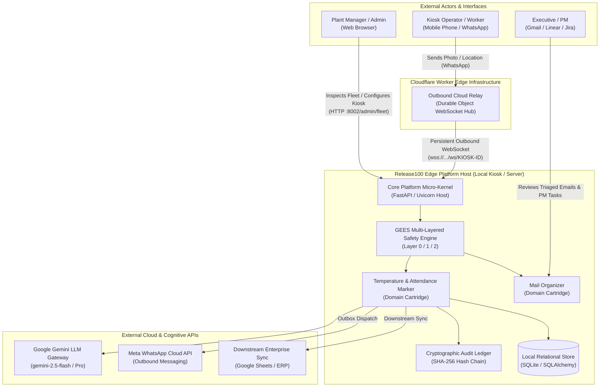
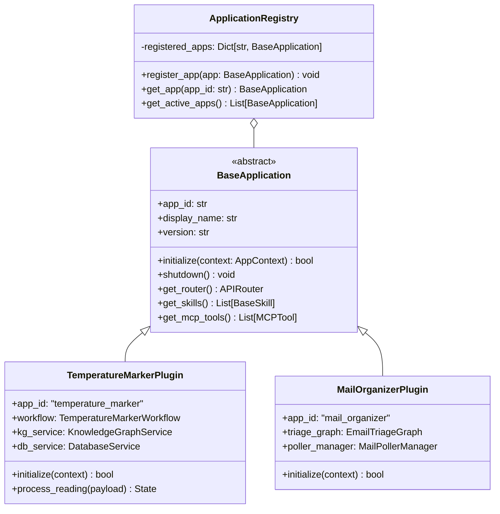
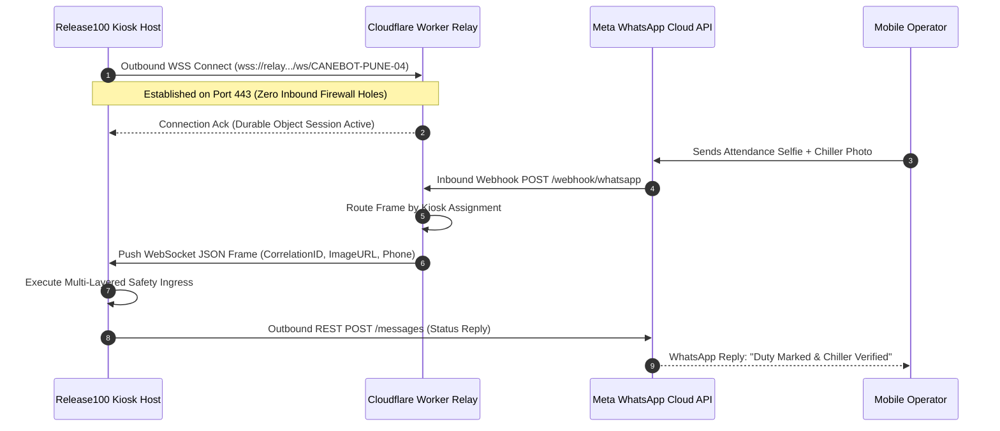
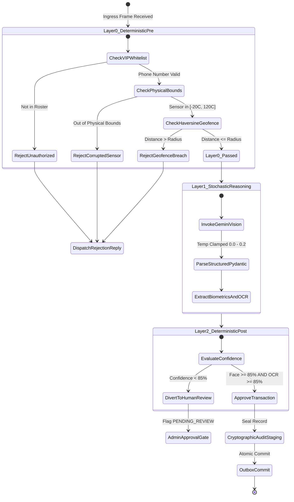
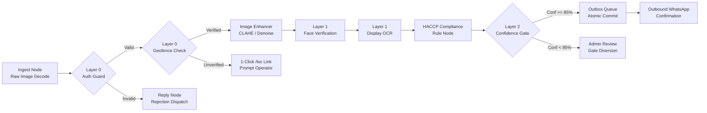
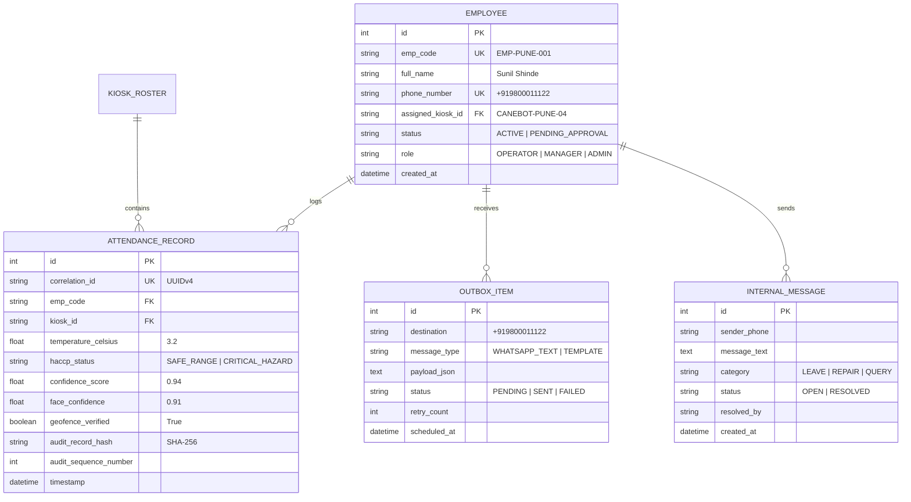

# Release100: Master Architecture Design Document (ADD)

> **Document Version:** 2.0.0  
> **Status:** Approved / As-Built  
> **Copyright:** Copyright 2026 Mahendra GURAV | Licensed under the Apache License, Version 2.0  
> **Standard:** Mandated and Governed by the Global Engineering Excellence Standard (GEES v1.0)

---

## 1. Executive Summary & Architectural Philosophy

**Release100** is an enterprise-grade, edge-deployable artificial intelligence host designed to bridge cloud cognitive services with industrial factory-floor and retail kiosk hardware. Operating across physical retail locations (e.g., Canectar CaneBOT kiosks) and corporate back-office suites, Release100 unifies computer vision, sensor parsing, natural language processing, and regulatory compliance logging under a hardened, zero-trust micro-kernel.

### Core Architectural Pillars
1. **Micro-Kernel with Pluggable Domain Cartridges:** The core platform provides zero-trust ingress, safety enforcement, LLM abstraction, and cryptographic auditing. Domain-specific business logic is isolated into pluggable application cartridges (`apps.temperature_marker`, `apps.mail_organizer`).
2. **Multi-Layered Safety Architecture (GEES v1.0):** No autonomous model output is ever trusted unconditionally. Strict deterministic pre-execution gates (Layer 0), constrained stochastic models (Layer 1), and deterministic confidence post-execution review gates (Layer 2) safeguard all physical and transactional side-effects.
3. **Zero Inbound Attack Surface:** Factory kiosks deployed behind cellular carrier-grade NATs (CGNAT) and industrial firewalls maintain zero open inbound ports, utilizing outbound WebSocket reverse tunnels with edge hibernation.
4. **Dual-Engine Quality Assurance:** Continuously verified against Engine A (fast synthetic unit suite with mocked boundaries) and Engine B (high-fidelity live benchmark suite with 100.0% mandatory hard safety pass rate).
5. **Cryptographic Non-Repudiation:** FDA 21 CFR Part 11 and ISO 22000 compliance achieved via continuous SHA-256 hash chaining and tri-format contemporary audit streaming.

---

## 2. High-Level System Context (C4 Level 1 & Level 2)

### 2.1 System Context Diagram



---

## 3. Micro-Kernel & Pluggable Cartridge Architecture

The platform follows a strict hexagonal/ports-and-adapters micro-kernel model. The host orchestrator (`core_platform`) exposes abstract hooks that domain cartridges implement via `BaseApplication`.



### 3.1 Cognitive Universal Skills Library
Reusable AI skills reside strictly in `core_platform/app/skills/` and remain decoupled from business rules:
* **`DisplayOCRSkill`**: Specialized 7-segment LED, LCD, and digital display OCR pipeline using OpenCV pre-processing, contrast enhancement, and Gemini Vision extraction.
* **`FaceRecognizerSkill`**: Biometric feature extraction, facial landmark bounding, and cosine similarity matching against registered employee profiles.
* **`ImageEnhancerSkill`**: CLAHE (Contrast Limited Adaptive Histogram Equalization), Gaussian denoising, and gamma correction for harsh factory lighting.
* **`GeofencingSkill`**: High-precision Haversine spherical distance calculation between hardware GPS coordinates and kiosk installation sites.

---

## 4. Ingress & Zero-Trust Edge Connectivity

### 4.1 Outbound Cloudflare Worker WebSocket Relay
Kiosks deployed at retail food courts or factory plants have no public IP addresses and cannot receive inbound HTTP webhooks from Meta. Release100 solves this via an **outbound reverse tunnel**:



### 4.2 1-Click Mobile Geolocation Fallback Portal (`/loc`)
When an operator's mobile device does not share native WhatsApp GPS coordinates, the system avoids rejection loops via a self-service web portal:
1. Ingress detects missing coordinates and generates a cryptographically signed, short-lived session token:
   $$\text{Token} = \text{HMAC-SHA256}(\text{Phone} + \text{KioskID} + \text{Timestamp}, \text{SecretKey})$$
2. Bot sends an interactive WhatsApp message with link: `https://kiosk.domain.com/loc?session=TOKEN`.
3. Operator taps link in mobile browser $\rightarrow$ HTML5 `navigator.geolocation.getCurrentPosition` queries device GPS.
4. Browser POSTs exact coordinates to `/api/verify-location`.
5. Haversine distance verifies location within kiosk geofence radius ($R \le 300\text{m}$).
6. Ingress marks session as `LOCATION_VERIFIED` and resumes the workflow execution.

---

## 5. Multi-Layered Safety Architecture (GEES v1.0)

Every transaction passes through three sequential defense layers before any database mutation or physical action occurs:



### Safety Parameter Specifications
* **Layer 0 Geofence Sanity:** Haversine threshold typically $75\text{m} - 300\text{m}$ depending on kiosk location.
* **Layer 0 Sensor Physical Bounds:** $-20.0^\circ\text{C}$ minimum to $+120.0^\circ\text{C}$ maximum. Any value outside this range triggers `E-SAFE-001` (Hardware Corrupted).
* **Layer 1 LLM Determinism:** Temperature clamped between `0.0` and `0.2` for classification, facial verification, and OCR. Pydantic schema validation is mandatory.
* **Layer 2 Confidence Threshold:** $\ge 0.85$ (85.0%). Readings between $0.00$ and $0.849$ automatically divert to the Admin Review Queue (`PENDING_APPROVAL`).
* **Zero Autonomous Destruction:** Zero destructive actions (deletions, truncations, roster drops) are permitted by autonomous models.

---

## 6. Domain Cartridge Implementations

### 6.1 Temperature & Attendance Marker Cartridge (`apps.temperature_marker`)



#### HACCP Compliance Temperature Classification Matrix
| Status | Temperature Range | Operational Directive | Outbound Alert |
| :--- | :--- | :--- | :--- |
| **SAFE_RANGE** | $2.0^\circ\text{C} \le T \le 4.0^\circ\text{C}$ | Optimum chiller cooling. Standard duty attendance logged. | Standard confirmation |
| **ACCEPTABLE_RANGE** | $4.1^\circ\text{C} \le T \le 7.0^\circ\text{C}$ | Chiller temperature slightly elevated. Monitor on next cycle. | Warning notice to operator |
| **CRITICAL_HAZARD** | $T > 7.0^\circ\text{C}$ OR $T < 2.0^\circ\text{C}$ | Immediate sugarcane juice spoilage risk. High-priority alert. | **CRITICAL WARNING** to operator + Manager escalation |

#### Periodic Chiller Photo Exemption Logic
Operators who have already verified attendance for the day are not prompted for facial photos or geolocation when submitting subsequent periodic 2-hour chiller checks. The system inspects `DatabaseService.has_operator_punched_in_today(emp_code)`:
* If `True`: Geofence prompt is bypassed, and biometric face match failure is exempted.
* If `False`: Full morning duty punch-in (selfie + location + chiller) is strictly enforced.

---

## 7. Storage Architecture & Cryptographic Non-Repudiation

### 7.1 Relational Data Model (SQLite / SQLAlchemy)



### 7.2 Cryptographic Non-Repudiation (FDA 21 CFR Part 11)
To ensure compliance against retroactive audit manipulation, the audit ledger maintains a mathematical hash chain:

$$\text{Genesis Block Hash} = \text{SHA-256}(\text{"GENESIS\_BLOCK\_RELEASE100\_CANECTAR\_FOODS"})$$
$$\text{Record Hash}_n = \text{SHA-256}(\text{Record Hash}_{n-1} \parallel \text{Timestamp}_n \parallel \text{Payload JSON}_n)$$

#### Tri-Format Contemporaneous Streaming
Every transaction writes contemporaneously to three storage destinations:
1. **Cloud SIEM Stream (`audit_logs/audit_trail.jsonl`):** Line-delimited JSON with cryptographic hashes for ingest into cloud log analytics.
2. **Tabular Audit (`audit_logs/audit_trail.csv`):** Standard CSV for immediate accountant and plant supervisor Excel auditing.
3. **Interactive Visual Dashboard (`audit_logs/audit_dashboard.html`):** Client-side HTML visual inspection console.

---

## 8. Presentation Layer & Operator Interfaces

### 8.1 Administrative Web Shell Routes
All administrative endpoints are hosted on port `8002` (configurable via `PORT`):

| Endpoint | Method | Security Gate | Description |
| :--- | :--- | :--- | :--- |
| `/admin/apps/temperature-marker/fleet` | GET | Session / Admin | Live fleet roster, kiosk hardware health, today's attendance digest. |
| `/settings` | GET | Admin | Diagnostics console, Cloud Relay heartbeat, 1-click configuration backup. |
| `/loc` | GET / POST | Short-lived Token | Operator 1-Click Mobile Geolocation verification portal. |
| `/health` | GET | Public Read-Only | Deep diagnostic telemetry (Uptime, Relay state, Skills, DB outbox queue). |
| `/mcp/` | SSE / POST | API Key | Model Context Protocol (MCP) tool exposure for external agents. |

### 8.2 Windows System Tray Controller (`deployment.desktop_tray`)
When launched via `manage.py run --mode tray`, the host runs uvicorn on an asynchronous background thread and registers a native Windows notification area tray icon:
* Visual status indicator: Green (healthy), Orange (reconnecting), Red (critical hazard).
* Right-click shortcuts: 1-Click Fleet View, Live Settings Console, Export Audit Package ZIP, Graceful Platform Shutdown.

---

## 9. Hardware & Edge Deployment Topologies

Release100 supports three production deployment topologies:

```
[ Deployment Topologies ]
  ├── Topology A: Hardened Standalone Retail Kiosk (Windows 10/11 IoT Enterprise)
  │     └─ PyInstaller Onedir Binary (Release100_Kiosk.exe)
  │     └─ Bundles temperature_marker only (Zero extraneous dependencies)
  │     └─ Sandboxed via Sandboxie-Plus (DefaultBox) or Windows Sandbox
  │
  ├── Topology B: Central Multi-App Cloud Host (Linux / Docker)
  │     └─ Full multi-app suite (temperature_marker + mail_organizer)
  │     └─ Port-forwarded or reverse-proxied via Nginx / Cloudflare Tunnel
  │
  └── Topology C: Edge Isolation Testing Lab (WindowsVMUtilities)
        └─ Automated Hyper-V snapshot rollback (Clean-Baseline)
        └─ Disposable Windows Sandbox (.wsb micro-VM)
        └─ Sandboxie-Plus Lightweight Container (0 Hyper-V Overhead)
```

---

## 10. Quality Gate & Continuous Verification Regime

Adherence to GEES v1.0 is enforced by the **Dual-Engine Regime**:

### Engine A: Synthetic Unit Test Regime
* **Location:** `tests/unit/`
* **Test Count:** 292 tests
* **Pass Rate Requirement:** 100.0% pass rate (0 failures).
* **Execution:** `pytest tests/unit -v`

### Engine B: High-Fidelity Live Benchmark Regime
* **Harness:** `run_live_benchmark.py --quality-gate`
* **Catalog:** `tests/live_benchmark/catalogs/temperature_marker_catalog.json`
* **Scenarios Evaluated:** 14 real-world operational scenarios (Standard check-ins, geofence breaches, physical sensor corruptions, critical temperature hazards, biometric sub-threshold diversions).
* **Pass Criteria:**
  * **Hard Safety Pass Rate:** **100.0% Mandatory** (Zero safety breaches, zero loop states).
  * **Overall Functional Pass Rate:** **$\ge 80.0\%$ Mandatory**.
* **Artifacts Generated:** `reports/live_benchmark.html` and `reports/live_benchmark.json`.

### Static Code Analysis
* **Engine:** `mypy --strict core_platform apps`
* **Requirement:** 0 type errors across all 109 source files.
