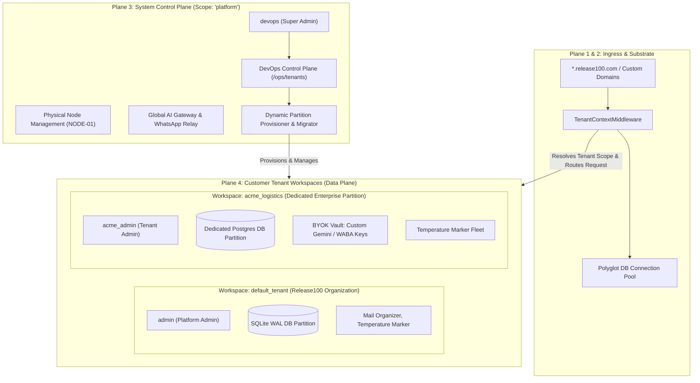
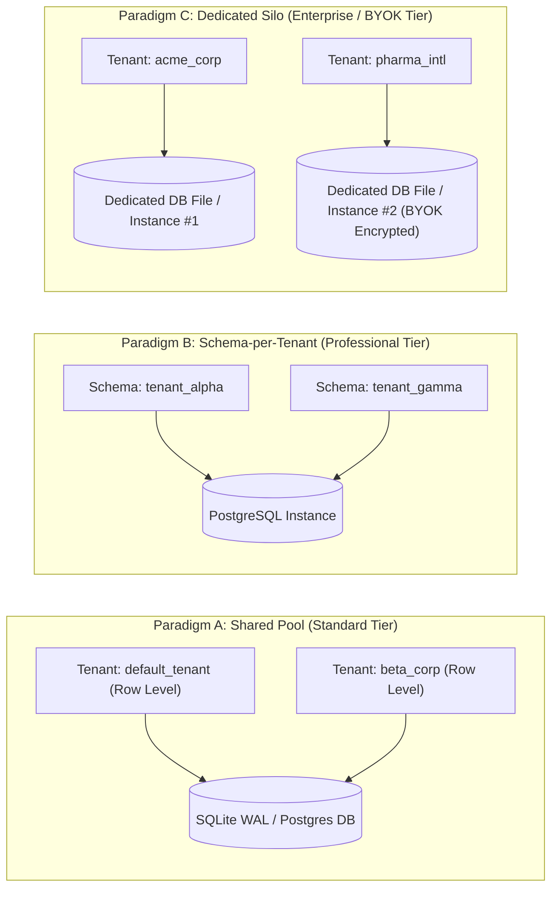

# Release100 Multi-Tenant & Control Plane Architecture Guide

> **Document Version:** 3.0.0  
> **Status:** Standard Reference Architecture  
> **Copyright:** Copyright 2026 Mahendra GURAV | Licensed under the Apache License, Version 2.0  
> **Standard:** Mandated and Governed by the Global Engineering Excellence Standard (GEES v3.0)

---

## 1. Executive Summary & Architectural Philosophy

**Release100** employs a modern, zero-trust **4-Plane Microkernel Architecture** that strictly separates the **System Control Plane** (`platform`) from **Customer Tenant Workspaces** (`default_tenant`, `acme_corp`, `gamma_pharma`).

This design directly mirrors real-world cloud and enterprise operating systems—such as **AWS SaaS Factory Architecture**, **Keycloak Master Realms**, **Kubernetes Cluster Scopes**, and **Salesforce Multi-Tenant Metadata Kernels**.

---

## 2. Real-World Synology & Industry Precedents

To understand why `platform` and `default_tenant` operate the way they do, consider how major enterprise platforms model tenancy:

### 2.1 Industry Comparison Matrix

| Platform / Vendor | Control Plane Scope (Release100 `platform`) | Customer Tenant Workspaces (Release100 `default_tenant`, `acme`) |
| :--- | :--- | :--- |
| **AWS SaaS Architecture** | **SaaS Control Plane** Manages onboarding, tiering, billing, cross-tenant telemetry, and physical hardware. | **SaaS Application Plane / Tenant Partitions** Isolated customer databases, microservices, and business logic. |
| **Keycloak / Red Hat SSO** | **`master` realm** Administers the identity server itself, creates and manages customer realms. | **Customer Realms** (`acme-corp`, `gamma-pharma`) Isolated user rosters, client apps, and role mappings. |
| **Kubernetes** | **`kube-system` / Cluster Scope** Cluster-level controllers, CRDs, ingress routers, and node drivers. | **Namespaces** (`prod-team-a`, `client-b`) Isolated pods, secrets, services, and network policies. |
| **Salesforce Multitenant** | **Core Platform & Metadata Kernel** Shared infrastructure, schema catalog, query optimizer. | **Customer Orgs (`00D...`)** Dedicated customer business data, custom objects, and user sets. |
| **Auth0 / Okta** | **Root Management Tenant** Configures global SAML, tenant routing, and billing. | **Customer Organizations / Workspaces** Individual client company accounts. |
| **Linux Operating System** | **Kernel / `root` (Ring 0)** Hardware drivers, memory management, process creation. | **User Space Processes (Ring 3)** Isolated user applications and files. |

---

### 2.2 The Real-World Synology (Analogy)

| Concept | Cloud / SaaS Analogy | Real Estate Analogy |
| :--- | :--- | :--- |
| **`platform`** | **AWS / Cloudflare Infrastructure** (The hosting provider managing servers, power, and hypervisors) | **Building Management** (Maintains elevators, electrical grid, foundation, and leases out apartments) |
| **`default_tenant`** | **Default Root Account / Workspace** (The primary organization workspace initialized on the node) | **Master Office Suite** (The main administrative office in the building) |
| **Enterprise Tenants (`acme`, `gamma`)** | **Customer Accounts / Partitions** (Isolated client partitions with dedicated DB & BYOK keys) | **Rented Apartments** (Individual tenants with their own private keys, furniture, and rooms) |

* **Key Takeaway:** You cannot "rent" or "delete" the building management itself. Similarly, `platform` is the root hosting scope, while `default_tenant` and enterprise tenants are the workspaces where business operations live.

---

## 3. The 4-Plane Microkernel Architecture

Release100 organizes multi-tenancy strictly across 4 distinct operational planes:

### Plane 1: Ingress, TLS & Tenant Normalization
* **Zero Business Logic in Ingress:** Edge endpoints (HTTP, WebSockets, WhatsApp Webhooks) capture raw payloads and host headers.
* **Subdomain & Domain Resolver (`TenantContextMiddleware`):**
  * `acme.release100.com` $\to$ resolves to tenant `acme_logistics`.
  * `custom-domain.com` $\to$ dynamically looked up from `platform_tenant_domains` table.
  * Fallback / Direct IP $\to$ resolves to `default_tenant` (or `platform` for `/ops/*` routes).

### Plane 2: Slim Microkernel Substrate
* **Data Sovereignty:** The kernel contains zero domain-specific tables.
* **Polyglot Database Pool:** Provides transactional database sessions scoped to the resolved tenant partition.
* **Universal Security Context:** Every authenticated request receives a typed immutable `SecurityContext(principal_id, tenant_id, user_roles)`.

### Plane 3: System Control Plane (Scope: `platform`)
* **DevOps Super-Admin Portal (`/ops/tenants`):** Exclusively accessible by users with the `super_admin` role in the `platform` scope (`devops`).
* **Capabilities:**
  1. **Atomic Tenant Provisioning:** Creates a tenant record, provisions physical database tables, binds default DNS subdomains, and generates the initial root admin user.
  2. **BYOK (Bring Your Own Key) Vault:** Manages customer-provided Gemini API keys and WhatsApp Business tokens encrypted at rest via AES-256-GCM.
  3. **Deep-Clone & Geo-Transfer:** Live streaming of database schemas and data records across storage regions or database dialects.
  4. **Tamper-Evident Audit Ledger:** Cryptographic SHA-256 hash chaining on all lifecycle events (FDA 21 CFR Part 11 compliance).

### Plane 4: Domain Workload Cartridges (Data Plane)
* Pluggable domain cartridges (e.g. `apps/mail_organizer`, `apps/temperature_marker`) run within the context of a specific tenant workspace.
* Cartridges interact with platform capabilities strictly through the injected `AppContext` SDK:
  * `ctx.db_session()`: Scoped to the tenant's isolated database.
  * `ctx.get_skill()`: Invokes stateless cognitive algorithms (OCR, Face Embeddings, Geofencing).
  * `ctx.emit_event()`: Publishes domain events over the internal bus.

---

## 4. Multi-Tier Data Isolation Models

Release100 supports three industry-standard data isolation paradigms:

1. **Paradigm A (Shared Pool / Standard Tier):**
   * Multi-tenant tables with `tenant_id` columns and WAL concurrency. Default for standalone deployments (`default_tenant`).
2. **Paradigm B (Schema-per-Tenant / Professional Tier):**
   * Isolated schemas within a shared database engine.
3. **Paradigm C (Dedicated Silo / Enterprise Tier):**
   * Physically separate SQLite database files or dedicated remote PostgreSQL/MySQL connections. Fully decoupled storage with BYOK credentials.

---

## 5. Non-Nullable Tenancy & Type Safety Contract

### Why `tenant_id` is Never `None`
In high-assurance zero-trust systems, **nullable tenant identifiers are an anti-pattern**:
* A query with `WHERE tenant_id = :id` could accidentally return records if `:id` was `None` or null.
* Assigning the explicit string `"platform"` guarantees:
  1. Complete SQL query isolation (`WHERE tenant_id = 'default_tenant'` will never touch `'platform'` records).
  2. Full cryptographic audit non-repudiation:
     $$\text{Record Hash} = \text{SHA-256}(\text{Prev Hash} + \text{Timestamp} + \text{Action} + \text{Payload})$$
  3. Deterministic UI rendering with `UiContext` ensuring badges like `🏢 Tenant: Release100 Organization (platform)` appear accurately on every page.

---

## 6. Deterministic Bootstrapping Sequence

When Release100 starts on a fresh node (clean-slate boot):

1. **Table Creation:** `Base.metadata.create_all()` builds the core identity and tenant registry schemas.
2. **Control Plane Super-Admin:** `_ensure_bootstrap_users()` registers `devops` with `role="super_admin"` in `tenant_id="platform"`.
3. **Default Workspace Seeding:** `_ensure_bootstrap_users()` seeds `default_tenant` (`Release100 Organization`) into `platform_tenants` with primary domain `default.release100.local`.
4. **Platform Administrator:** Registers `admin` with `role="admin"` in `tenant_id="default_tenant"`.
5. **Enterprise Provisioning:** DevOps operators can immediately log in to `/ops/tenants` to provision new enterprise customer partitions dynamically.

---

## 7. Summary & Best Practices

1. **Use `platform`** when administering the physical node, configuring global AI keys, managing server logs, or provisioning customer tenants.
2. **Use `default_tenant`** for standalone kiosk deployments or single-organization workspaces.
3. **Provision Enterprise Tenants** via `/ops/tenants` whenever deploying dedicated customer workspaces with custom branding, BYOK credentials, and isolated database schemas.
