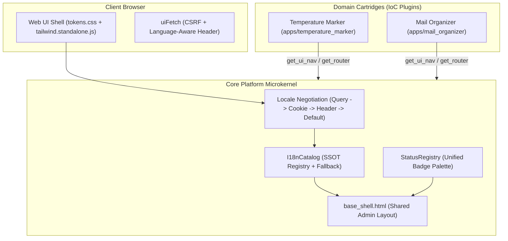

<!--
Copyright 2026 Mahendra GURAV

Licensed under the Apache License, Version 2.0 (the "License");
you may not use this file except in compliance with the License.
You may obtain a copy of the License at

    http://www.apache.org/licenses/LICENSE-2.0

Unless required by applicable law or agreed to in writing, software
distributed under the License is distributed on an "AS IS" BASIS,
WITHOUT WARRANTIES OR CONDITIONS OF ANY KIND, either express or implied.
See the License for the specific language governing permissions and
limitations under the License.
-->

# Unified UI, Content SSOT, and NLS Architecture (Plan 11)

## 1. Overview & Core Philosophy
The IntentRouter Release 100 UI design adheres strictly to the **Global Engineering Excellence Standard (GEES v2.0)**:
- **Strict Microkernel Isolation**: The core platform contains zero domain concepts, keywords, or hardcoded strings.
- **Single Source of Truth (SSOT)**: 100% of user-facing UI copy resides in decentralized, typed JSON translation catalogs (`locales/en_US.json`). No hardcoded English strings exist in Jinja2 templates.
- **Offline Self-Sufficiency**: Air-gapped design with offline Tailwind CSS standalone bundle and zero external CDN/font network dependencies.
- **Zero-Trust Security**: No raw credentials in UI, automatic XSS protection with strict Jinja2 autoescaping, and cryptographic non-repudiation audit trails.

---

## 2. Architecture Diagram



---

## 3. Directory Layout

```
core_platform/
  app/
    locales/
      en_US.json               # Core platform strings (auth, navigation, errors, status)
    ui/
      catalog.py               # I18nCatalog implementation & loader
      negotiation.py           # Request locale resolver (Accept-Language, cookie, query)
      templating.py            # Jinja2 environment builder & t() helper
      status_registry.py       # Centralized lifecycle status registry
      static/
        tokens.css             # Theme design tokens & CSS custom properties
        tailwind.standalone.js # Air-gapped offline Tailwind CSS runtime
        ui.js                  # Frontend client helper (uiFetch, toasts, modal traps)
      templates/
        base_shell.html        # Unified application shell & top/side navigation
        components/macros.html # Standardized reusable UI macros (badges, cards, tables)

apps/
  temperature_marker/
    locales/
      en_US.json               # Temperature Marker localized strings
    ui/
      routes.py                # Cartridge UI routes
      templates/               # Cartridge Jinja2 templates extending base.html
  mail_organizer/
    locales/
      en_US.json               # Mail Organizer localized strings
    ui/
      routes.py                # Cartridge UI routes
      templates/               # Cartridge Jinja2 templates extending base.html
```

---

## 4. Developer Guide: Adding a New Cartridge or Page

### Step 1: Declare Catalog Strings
Create `apps/<cartridge_id>/locales/en_US.json`:
```json
{
  "apps": {
    "my_cartridge": {
      "name": "My New Cartridge",
      "nav": {
        "overview": "📊 Overview"
      },
      "overview": {
        "title_tag": "Overview — My Cartridge",
        "header_title": "Cartridge Metrics",
        "description": "Real-time summary of cartridge actions."
      }
    }
  }
}
```

### Step 2: Implement UI Route & Template
In `apps/<cartridge_id>/ui/routes.py`:
```python
from core_platform.app.ui.templating import build_templates
from core_platform.app.ui.ui_context import build_ui_context

templates = build_templates([Path(__file__).parent / "templates"])

@router.get("/overview", response_class=HTMLResponse)
async def overview_page(request: Request) -> HTMLResponse:
    ctx = build_ui_context(
        request,
        title_key="apps.my_cartridge.overview.title_tag",
        active_app="my_cartridge",
        active_slug="overview",
    )
    return templates.TemplateResponse(request, "overview.html", {"request": request, "ui": ctx})
```

In `apps/<cartridge_id>/ui/templates/overview.html`:
```jinja2


{{ t('apps.my_cartridge.overview.title_tag') }}


<div class="card">
    <h2>{{ t('apps.my_cartridge.overview.header_title') }}</h2>
    <p>{{ t('apps.my_cartridge.overview.description') }}</p>
</div>

```

### Step 3: Register in Guard List & Run Tests
1. Append `apps/<cartridge_id>/ui/templates/overview.html` to `tests/ui_guards/migrated_templates.txt`.
2. Run automated guards:
   ```bash
   pytest tests/unit/test_ui_guards.py -v
   ```
3. Update and verify snapshots:
   ```bash
   python scripts/capture_ui_snapshots.py --update
   pytest tests/unit/test_ui_snapshots.py -v
   ```

---

## 5. Automated Verification & Quality Gates
- **`test_ui_guards.py`**: Validates 100% key parity across core and cartridge locales, prevents unescaped translation markers, and scans templates to reject hardcoded plain text.
- **`test_ui_snapshots.py`**: Renders 20+ pages deterministically to ensure zero unexpected layout drifts.
- **Pseudo-Localization (`en_XA`)**: Automatically brackets strings (`[!!! Title !!!]`) to verify full dynamic text coverage and layout resilience.
