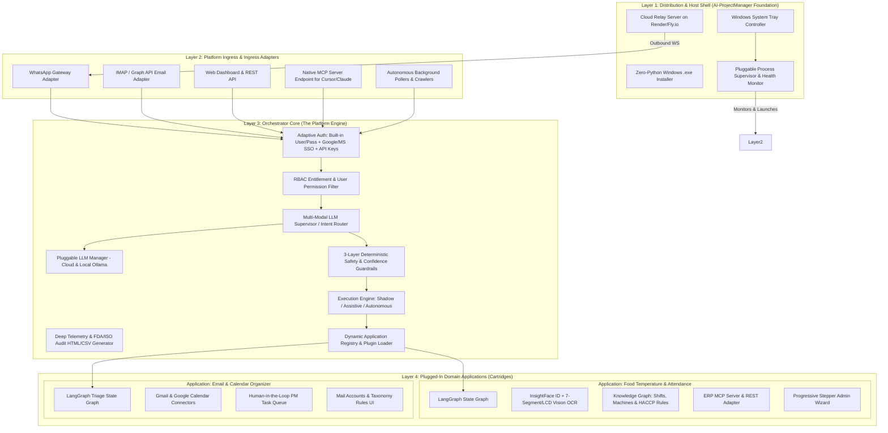
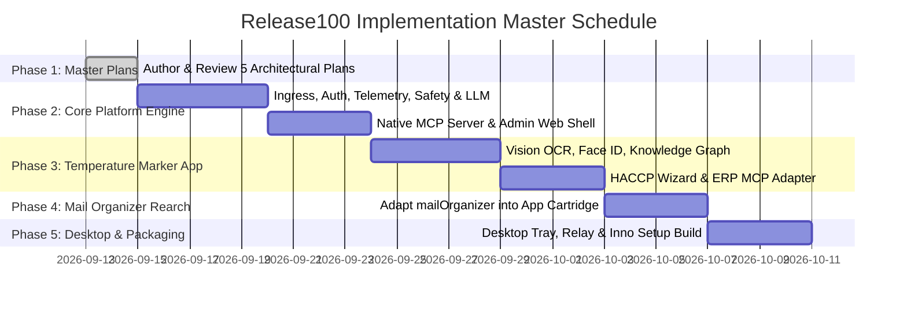

# MASTER PLATFORM ARCHITECTURE SPECIFICATION
## Enterprise Multi-Application Agentic Platform (`Release100`)

**Document ID:** `01_master_platform_architecture`  
**Document Version:** `v1.0.0`  
**Date:** September 13, 2026  
**Status:** DRAFT / UNDER REVIEW  
**Target Repository:** `D:\Release100`  
**Foundational Assets (Untouched Reference Sources):**  
- `D:\AI-ProjectManager` (Desktop Supervisor, Cloud Relay, Packaging Hub)
- `D:\WhatsappClientForMailOrganized` (WhatsApp Webhook Gateway & MCP Client)
- `D:\mailOrganizer` (LangGraph Engine, Telemetry, Safety Rules, SSE MCP Server)

---

## Document Revision History & Changelog

| Version | Date | Author | Description of Changes | Status |
| :--- | :--- | :--- | :--- | :--- |
| **v1.0.0** | 2026-09-13 | AI Architecture Team | Initial Master Platform Architecture: Ecosystem topology, microkernel & cartridges model, multi-customer deployment matrix, reuse strategy for pet projects, and directory layout. | Proposed |

---

## 1. Executive Summary & Strategic Vision

`Release100` is a unified, enterprise-grade AI application hosting platform and distribution runtime. Rather than developing isolated, monolithic automation tools, `Release100` establishes a **decoupled, modular ecosystem** where:

1. **The Core Orchestrator** acts as a channel-agnostic, multi-tenant host providing out-of-the-box (OOTB) infrastructure:
   - Universal multi-channel ingress (WhatsApp, Email, Web, Crawlers, MCP Server).
   - Pluggable LLM Provider Gateway (Cloud: Gemini/Claude/OpenAI; Local: Ollama/DeepSeek).
   - Unified Authentication & RBAC (Built-in credentials, Enterprise Google/Microsoft SSO, API keys).
   - 3-Layer Deterministic Safety & Confidence Guardrails.
   - Deep Telemetry & FDA/ISO 22000-compliant audit logging.
   - Native Model Context Protocol (MCP) Server host for external agents (Cursor, Claude Desktop).

2. **Domain Applications** plug in as isolated, hot-swappable packages ("cartridges"):
   - **App 1: `mail_organizer`**: Autonomous Gmail & Calendar triage, categorization, and meeting assistant.
   - **App 2: `temperature_marker`**: Computer vision operator face verification, 7-segment/LCD temperature readout extraction, HACCP food safety compliance, and ERP telemetry.
   - **Future Apps (`app_inventory`, `app_maintenance`, etc.)**: Seamlessly mountable without modifying core code.

3. **Desktop Supervisor & Packaging Hub** provides zero-friction end-user distribution:
   - Outbound WebSocket Cloud Relay to bypass corporate NATs and firewalls.
   - Windows taskbar system tray control plane.
   - 1-click Windows `.exe` installer generator (PyInstaller + Inno Setup) for Python-free client PCs.

4. **100% Isolation of Existing Pet Projects**:
   - `D:\AI-ProjectManager`, `D:\WhatsappClientForMailOrganized`, and `D:\mailOrganizer` remain completely untouched.
   - Proven, battle-tested components are re-architected and consolidated cleanly inside `D:\Release100`.

---

## 2. Global Ecosystem Topology



---

## 3. Customer Deployment Matrix

The platform must support flexible, customer-specific packaging and licensing without maintaining separate branches:

| Deployment Scenario | Active Config (`enabled_apps`) | Mounted Ingress Channels | Mounted Admin UI Routes | Target Customer Profile |
| :--- | :--- | :--- | :--- | :--- |
| **Scenario 1: Mail Only** | `["mail_organizer"]` | - Email Ingress (IMAP/Gmail)<br>- WhatsApp Query Ingress | `/admin/apps/mail-organizer/` | Corporate executives, sales teams, project managers. |
| **Scenario 2: Factory Only** | `["temperature_marker"]` | - WhatsApp Media Ingress<br>- Factory Tablet Kiosk REST | `/admin/apps/temperature-marker/` | Food processing plants, cold storage warehouses, industrial kitchens. |
| **Scenario 3: Unified Suite** | `["mail_organizer", "temperature_marker"]` | - All channels active<br>- Multi-Modal LLM Router active | Full Admin Portal Shell with dynamic app switchers | Enterprise operations with both office & plant staff. |
| **Scenario 4: Future Extensible** | `["...", "app_inventory"]` | Automatically dynamically registered | New UI tab auto-mounted | Custom industrial expansions. |

---

## 4. Proposed Target Repository Layout (`D:\Release100`)

```text
D:\Release100/
├── plans/                                 # Versioned architecture & implementation plans
│   ├── 01_master_platform_architecture_v1.0.md
│   ├── 02_orchestrator_core_v1.0.md
│   ├── 03_app_temperature_marker_v1.0.md
│   ├── 04_app_mail_organizer_v1.0.md
│   └── 05_desktop_supervisor_and_packaging_v1.0.md
│
├── core_platform/                         # The Core Orchestrator & Platform Services
│   ├── app/
│   │   ├── config/                        # Pydantic platform settings (master config)
│   │   ├── auth/                          # Built-in User/Pass, SSO (Google/MS), API Key manager
│   │   ├── rbac/                          # User roles, app entitlements & permissions
│   │   ├── ingress/                       # Normalized Inbound/Outbound Message Envelopes
│   │   │   ├── whatsapp_adapter.py        # Meta Webhook & Graph Media Downloader
│   │   │   ├── email_adapter.py           # IMAP / Graph API listener
│   │   │   ├── web_adapter.py             # REST / WebSocket endpoints
│   │   │   └── poller_adapter.py          # Scheduled daemon pollers
│   │   ├── routing/                       # Multi-Modal LLM Supervisor & Semantic Router
│   │   ├── llm/                           # Unified LLM Gateway (Gemini, Claude, OpenAI, Ollama)
│   │   ├── safety/                        # 3-Layer deterministic pre-check & confidence guardrails
│   │   ├── telemetry/                     # Deep telemetry, audit schemas & HTML partition reports
│   │   ├── mcp_server/                    # Native SSE MCP Server exposing platform tools to external AI
│   │   ├── admin_shell/                   # FastAPI Web Admin Shell (dynamic nav & theme)
│   │   └── plugin_engine/                 # Dynamic Application Loader & Lifecycle Manager
│   ├── main.py                            # Platform startup bootstrap
│   └── requirements.txt
│
├── apps/                                  # Pluggable Domain Applications ("Cartridges")
│   │
│   ├── temperature_marker/                # App: Food Processing Temperature & Attendance
│   │   ├── plugin.py                      # BaseApplication implementation manifest
│   │   ├── graph/                         # LangGraph workflow (Face ID -> OCR -> HACCP -> ERP)
│   │   ├── skills/                        # InsightFace matcher, 7-Segment & LCD Vision OCR
│   │   ├── knowledge_graph/               # Shift roster inference & HACCP safety rules
│   │   ├── erp/                           # ERP MCP Client & REST connectors
│   │   ├── ui/                            # Progressive Stepper Admin Wizard & Machine Registry
│   │   └── database/                      # SQLAlchemy models for records & audit trails
│   │
│   └── mail_organizer/                    # App: Email & Calendar Organizer (Rearchitected)
│       ├── plugin.py                      # BaseApplication implementation manifest
│       ├── graph/                         # LangGraph triage & drafting state machine
│       ├── connectors/                    # Gmail API & Google Calendar integration
│       ├── pm_tasks/                      # Task queue & Jira/Linear export adapters
│       └── ui/                            # Mail accounts & classification rules dashboard
│
├── desktop_host/                          # Desktop Supervisor & Distribution Hub
│   ├── tray_app/                          # Windows taskbar system tray controller
│   ├── supervisor/                        # Dynamic process supervisor & port health monitor
│   ├── cloud_relay/                       # Standalone WebSocket Cloud Relay service (Render/Fly.io)
│   └── packaging/                         # PyInstaller specs + Inno Setup .exe build scripts
│
└── config/
    ├── platform.env.example               # Master configuration template
    └── factory_machines.example.json      # Sample machine registry & HACCP definitions
```

---

## 5. Phased Step-by-Step Delivery Roadmap

To maintain total clarity and avoid cognitive overload, the system development is partitioned into **5 sequential phases**:



---

## 6. Next Steps

This document establishes **Plan 1 of 5** (`01_master_platform_architecture_v1.0.md`). 

The next document in the sequence is **Plan 2: Core Orchestrator & Platform Services Specification** (`02_orchestrator_core_v1.0.md`), detailing the exact internal interfaces, schemas, and state objects for the universal host engine.
