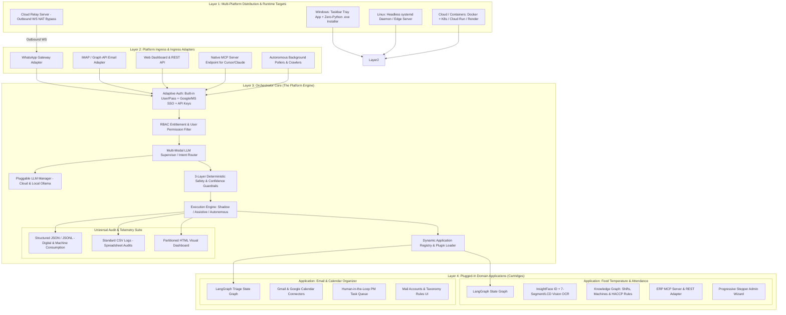
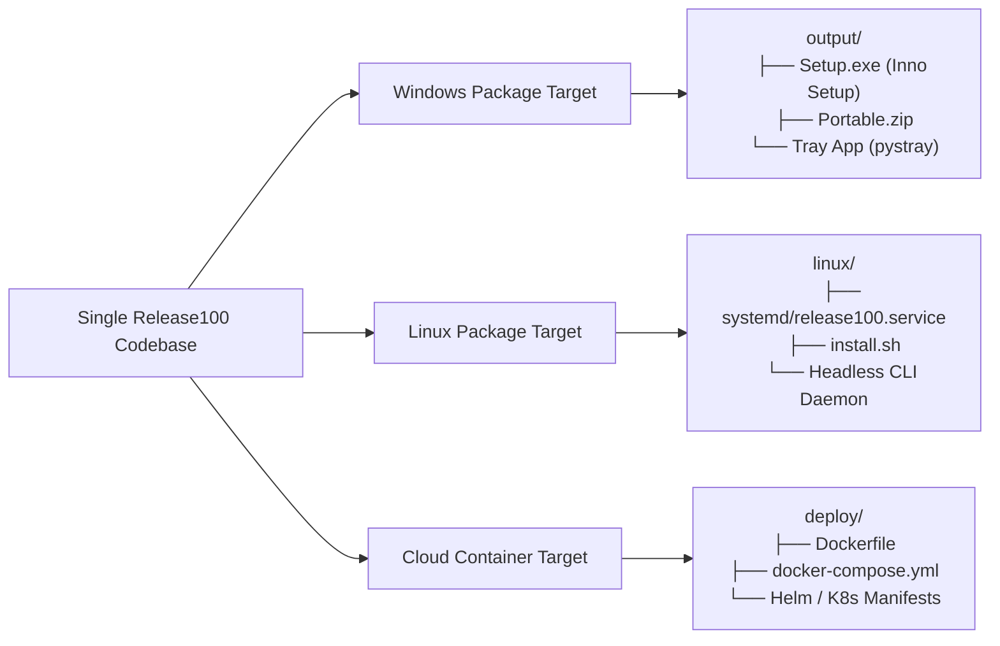

# MASTER PLATFORM ARCHITECTURE SPECIFICATION
## Enterprise Multi-Application Agentic Platform (`Release100`)

**Document ID:** `01_master_platform_architecture`  
**Document Version:** `v1.1.0`  
**Date:** September 13, 2026  
**Status:** DRAFT / UNDER REVIEW  
**Target Repository:** `D:\Release100`  
**Foundational Assets (Untouched Reference Sources):**  
- `D:\AI-ProjectManager` (Desktop Supervisor, Cloud Relay, Packaging Hub)
- `D:\WhatsappClientForMailOrganized` (WhatsApp Webhook Gateway & MCP Client)
- `D:\mailOrganizer` (LangGraph Engine, Telemetry, Safety Rules, SSE MCP Server)

---

## Document Revision History & Changelog

| Version | Date | Author | Description of Changes | Status |
| :--- | :--- | :--- | :--- | :--- |
| **v1.0.0** | 2026-09-13 | AI Architecture Team | Initial Master Platform Architecture: Ecosystem topology, microkernel & cartridges model, multi-customer deployment matrix, and directory layout. | Superseded |
| **v1.1.0** | 2026-09-13 | AI Architecture Team | **Incorporated User Feedback**: <br>1. **Structured JSON Audit Logs**: Added native JSON/JSONL export alongside CSV & HTML for automated digital consumption (SIEM, ERP, BI).<br>2. **Multi-Platform Deployment (Windows + Linux + Cloud)**: Extended distribution beyond Windows `.exe` to include Linux `systemd` edge daemons and Docker/Cloud containerization (Render, Fly.io, AWS, GCP, K8s). | **Current** |

---

## 1. Executive Summary & Strategic Vision

`Release100` is a unified, enterprise-grade AI application hosting platform and distribution runtime. Rather than developing isolated, monolithic automation tools, `Release100` establishes a **decoupled, cross-platform modular ecosystem** where:

1. **The Core Orchestrator** acts as a channel-agnostic, multi-tenant host providing out-of-the-box (OOTB) infrastructure:
   - Universal multi-channel ingress (WhatsApp, Email, Web, Crawlers, MCP Server).
   - Pluggable LLM Provider Gateway (Cloud: Gemini/Claude/OpenAI; Local: Ollama/DeepSeek).
   - Unified Authentication & RBAC (Built-in credentials, Enterprise Google/Microsoft SSO, API keys).
   - 3-Layer Deterministic Safety & Confidence Guardrails.
   - **Deep Telemetry & Multi-Format Audit Engine**: Produces **Structured JSON/JSONL** for automated digital downstream ingestion, CSV for spreadsheet audits, and partitioned HTML dashboards for human inspection.
   - Native Model Context Protocol (MCP) Server host for external agents (Cursor, Claude Desktop).

2. **Domain Applications** plug in as isolated, hot-swappable packages ("cartridges"):
   - **App 1: `mail_organizer`**: Autonomous Gmail & Calendar triage, categorization, and meeting assistant.
   - **App 2: `temperature_marker`**: Computer vision operator face verification, 7-segment/LCD temperature readout extraction, HACCP food safety compliance, and ERP telemetry.
   - **Future Apps (`app_inventory`, `app_maintenance`, etc.)**: Seamlessly mountable without modifying core code.

3. **Multi-Target Distribution & Deployment Hub**:
   - **Windows Desktop / Kiosk**: Windows taskbar system tray control plane + 1-click zero-Python `.exe` installer (PyInstaller + Inno Setup).
   - **Linux Edge / Factory Server**: Headless `systemd` background service or standalone Linux binary for factory edge servers (Ubuntu, Debian, Raspberry Pi).
   - **Cloud & Containers**: Production Docker containers (`Dockerfile` + `docker-compose.yaml`) deployable to cloud platforms (Render, Fly.io, AWS ECS/Fargate, Google Cloud Run, Azure, Kubernetes).
   - **Outbound WebSocket Cloud Relay**: Bypasses corporate NATs, firewalls, and port-forwarding across all environments.

4. **100% Isolation of Existing Pet Projects**:
   - `D:\AI-ProjectManager`, `D:\WhatsappClientForMailOrganized`, and `D:\mailOrganizer` remain completely untouched.
   - Proven, battle-tested components are re-architected and consolidated cleanly inside `D:\Release100`.

---

## 2. Global Ecosystem Topology



---

## 3. Structured JSON Audit Engine Specification

To enable automated downstream digital consumption (by external ERPs, SIEM security tools, automated compliance audits, or business intelligence dashboards), all operational actions emit a strongly-typed **Structured JSON Record**:

```json
{
  "audit_version": "1.1.0",
  "record_id": "aud_20260913_9a8b7c6d",
  "timestamp_iso": "2026-09-13T08:15:22.104Z",
  "tenant_id": "plant_chicago_01",
  "app_id": "temperature_marker",
  "channel": "whatsapp",
  "execution_mode": "AUTONOMOUS",
  "principal": {
    "sender_id": "+15550198234",
    "employee_id": "EMP-1042",
    "employee_name": "Ramesh Kumar",
    "role": "operator"
  },
  "telemetry": {
    "pipeline_latency_ms": 1420,
    "model_used": "gemini-2.5-flash",
    "prompt_tokens": 1250,
    "completion_tokens": 115,
    "traversed_nodes": ["ingest", "face_id", "kg_infer", "temp_ocr", "haccp_check", "erp_sync"]
  },
  "decision_payload": {
    "face_verified": true,
    "face_confidence": 0.94,
    "inferred_machine_id": "PASTEURIZER-02",
    "active_shift": "SHIFT_A_MORNING",
    "extracted_temperature": 74.5,
    "temperature_unit": "C",
    "display_type": "7_segment_led",
    "ocr_confidence": 0.96,
    "haccp_evaluation": {
      "status": "NORMAL",
      "safe_min": 72.0,
      "safe_max": 78.0,
      "is_compliant": true
    }
  },
  "erp_integration": {
    "sync_attempted": true,
    "protocol": "mcp",
    "transaction_id": "ERP_TXN_98214",
    "status": "COMMITTED"
  },
  "security": {
    "image_sha256": "e3b0c44298fc1c149afbf4c8996fb92427ae41e4649b934ca495991b7852b855",
    "signature_verified": true
  }
}
```

### Digital Consumption Endpoints:
1. **Streaming JSONL Files**: Written continuously to `logs/audit_partitions/YYYY-MM-DD.jsonl`.
2. **REST Query API**: `GET /api/v1/audit/logs?format=json&start_date=...&app=temperature_marker`.
3. **Automated SIEM / Webhook Forwarder**: Real-time HTTP push of critical HACCP violation JSON events to plant security or management systems.

---

## 4. Multi-Platform Deployment Architecture



| Deployment Target | Primary Use Case | Runtime Mechanism | Networking & Ingress |
| :--- | :--- | :--- | :--- |
| **Windows Desktop / Kiosk** | Factory supervisor PC, shop-floor Windows kiosk terminal, office managers. | PyInstaller standalone bundle + Inno Setup installer. Sits in taskbar tray via `pystray`. | Outbound WebSocket Cloud Relay connects to cloud webhook receiver without local firewall changes. |
| **Linux Edge Server** | Factory server rack, industrial fanless box (Ubuntu Server), edge IoT gateway. | Python 3.10+ virtualenv supervised by `systemd` daemon (`release100.service`). | Direct Nginx reverse proxy with SSL or Cloud Relay daemon. |
| **Cloud (Docker / Cloud Run)** | Scalable SaaS multi-tenant hosting, enterprise cloud (AWS, GCP, Render, Fly.io). | Multi-stage Docker container (`python:3.11-slim`). | Managed cloud HTTPS endpoint receiving direct Meta webhooks and REST traffic. |

---

## 5. Comprehensive Directory Layout (`D:\Release100`)

```text
D:\Release100/
├── plans/                                 # Versioned architecture & implementation plans
│   ├── 01_master_platform_architecture_v1.0.md
│   ├── 01_master_platform_architecture_v1.1.md  <-- CURRENT MASTER
│   ├── 02_orchestrator_core_v1.0.md
│   ├── 03_app_temperature_marker_v1.0.md
│   ├── 04_app_mail_organizer_v1.0.md
│   └── 05_deployment_and_packaging_hub_v1.0.md
│
├── core_platform/                         # The Core Orchestrator & Platform Services
│   ├── app/
│   │   ├── config/                        # Pydantic platform settings (master config)
│   │   ├── auth/                          # Built-in User/Pass, SSO (Google/MS), API Key manager
│   │   ├── rbac/                          # User roles, app entitlements & permissions
│   │   ├── ingress/                       # Normalized Inbound/Outbound Message Envelopes
│   │   │   ├── whatsapp_adapter.py        # Meta Webhook & Graph Media Downloader
│   │   │   ├── email_adapter.py           # IMAP / Graph API listener
│   │   │   ├── web_adapter.py             # REST / WebSocket endpoints
│   │   │   └── poller_adapter.py          # Scheduled daemon pollers
│   │   ├── routing/                       # Multi-Modal LLM Supervisor & Semantic Router
│   │   ├── llm/                           # Unified LLM Gateway (Gemini, Claude, OpenAI, Ollama)
│   │   ├── safety/                        # 3-Layer deterministic pre-check & confidence guardrails
│   │   ├── telemetry/                     # Deep telemetry, JSON/JSONL, CSV & HTML reports
│   │   │   ├── audit_schema.py            # Pydantic schemas for JSON & CSV audit records
│   │   │   ├── jsonl_writer.py            # High-performance async JSONL streaming logger
│   │   │   ├── csv_writer.py              # Flattened tabular CSV exporter
│   │   │   └── html_generator.py          # Visual partitioned HTML reports
│   │   ├── mcp_server/                    # Native SSE MCP Server exposing platform tools to external AI
│   │   ├── admin_shell/                   # FastAPI Web Admin Shell (dynamic nav & theme)
│   │   └── plugin_engine/                 # Dynamic Application Loader & Lifecycle Manager
│   ├── main.py                            # Platform startup bootstrap
│   └── requirements.txt
│
├── apps/                                  # Pluggable Domain Applications ("Cartridges")
│   │
│   ├── temperature_marker/                # App: Food Processing Temperature & Attendance
│   │   ├── plugin.py                      # BaseApplication implementation manifest
│   │   ├── graph/                         # LangGraph workflow (Face ID -> OCR -> HACCP -> ERP)
│   │   ├── skills/                        # InsightFace matcher, 7-Segment & LCD Vision OCR
│   │   ├── knowledge_graph/               # Shift roster inference & HACCP safety rules
│   │   ├── erp/                           # ERP MCP Client & REST connectors
│   │   ├── ui/                            # Progressive Stepper Admin Wizard & Machine Registry
│   │   └── database/                      # SQLAlchemy models for records & audit trails
│   │
│   └── mail_organizer/                    # App: Email & Calendar Organizer (Rearchitected)
│       ├── plugin.py                      # BaseApplication implementation manifest
│       ├── graph/                         # LangGraph triage & drafting state machine
│       ├── connectors/                    # Gmail API & Google Calendar integration
│       ├── pm_tasks/                      # Task queue & Jira/Linear export adapters
│       └── ui/                            # Mail accounts & classification rules dashboard
│
├── deployment/                            # Multi-Platform Distribution Hub
│   ├── desktop_tray/                      # Windows taskbar system tray controller
│   ├── packaging_windows/                 # PyInstaller specs + Inno Setup .exe build scripts
│   ├── linux_systemd/                     # release100.service unit file & install.sh
│   ├── docker/                            # Dockerfile, docker-compose.yml & entrypoint scripts
│   └── cloud_relay/                       # Standalone WebSocket Cloud Relay service (Render/Fly.io)
│
└── config/
    ├── platform.env.example               # Master configuration template
    └── factory_machines.example.json      # Sample machine registry & HACCP definitions
```

---

## 6. Next Steps

With **Plan 1 updated to `v1.1.0`**, the master foundation covers:
1. Multi-tenant modular ecosystem.
2. Structured JSON / CSV / HTML multi-format auditing.
3. Multi-platform deployment (Windows `.exe` + Linux `systemd` + Cloud Docker).

We are now ready to proceed to **Plan 2: Core Orchestrator & Platform Services Specification** (`02_orchestrator_core_v1.0.md`).
