# MASTER PLATFORM ARCHITECTURE SPECIFICATION
## Enterprise Multi-Application Agentic Platform (`Release100`)

**Document ID:** `01_master_platform_architecture`  
**Document Version:** `v1.3.0`  
**Date:** September 14, 2026  
**Status:** DRAFT / UNDER REVIEW  
**Target Repository:** `D:\Release100`  
**Foundational Assets (Untouched Reference Sources):**  
- `D:\AI-ProjectManager` (Desktop Supervisor, Cloud Relay, Packaging Hub)
- `D:\WhatsappClientForMailOrganized` (WhatsApp Webhook Gateway & MCP Client)
- `D:\mailOrganizer` (LangGraph Engine, Telemetry, Safety Rules, SSE MCP Server)

---

## Document Revision History & Changelog

| Version | Date | Author | Description of Changes | Status |
| :--- | :--- | :--- | :--- | :--- |
| **v1.0.0** | 2026-09-13 | AI Architecture Team | Initial Master Platform Architecture: Ecosystem topology, microkernel & cartridges model, multi-customer deployment matrix, and directory layout. | Superseded |
| **v1.1.0** | 2026-09-13 | AI Architecture Team | Added JSON audit logs and multi-platform Linux/Cloud targets. | Superseded |
| **v1.2.0** | 2026-09-13 | AI Architecture Team | Restored ProcessSupervisor in topology, FDA/ISO compliance, and Phased Roadmap Gantt chart. | Superseded |
| **v1.3.0** | 2026-09-14 | AI Architecture Team | **Promotion of Cognitive Skills to Core Platform**: <br>1. Promoted reusable cognitive skills (Biometric Face Recognition, Display OCR, Image Preprocessing & Mirror Check, Geofencing) into the **Universal Platform Skills Library** (`core_platform/skills/`).<br>2. Domain applications (`apps/`) become ultra-lean business cartridges consuming shared platform skills via `ctx.get_skill()`.<br>3. Incorporated **Canectar Foods & CaneBot** as primary default reference scenario. | **Current** |

---

## 1. Executive Summary & Strategic Vision

`Release100` is a unified, enterprise-grade AI application hosting platform and distribution runtime. Rather than developing isolated, monolithic automation tools, `Release100` establishes a **decoupled, cross-platform modular ecosystem** where:

1. **The Core Orchestrator** acts as a channel-agnostic, multi-tenant host providing out-of-the-box (OOTB) infrastructure:
   - Universal multi-channel ingress (WhatsApp, Email, Web, Crawlers, MCP Server).
   - Pluggable LLM Provider Gateway (Cloud: Gemini/Claude/OpenAI; Local: Ollama/DeepSeek).
   - Unified Authentication & RBAC (Built-in credentials, Enterprise Google/Microsoft SSO, API keys).
   - 3-Layer Deterministic Safety & Confidence Guardrails.
   - **Universal Cognitive Skills Library (`core_platform/skills/`)**: Shared, reusable AI skills (Face Recognition, Meter Display OCR, Image Enhancement, Geofencing) accessible to *all* plugged-in applications.
   - **Regulatory Audit Compliance (FDA 21 CFR Part 11 & ISO 22000)**: Produces Structured JSON/JSONL, CSV, and partitioned HTML dashboards.
   - Native Model Context Protocol (MCP) Server host for external agents (Cursor, Claude Desktop).

2. **Domain Applications** plug in as isolated, ultra-lean packages ("cartridges"):
   - **App 1: `mail_organizer`**: Autonomous Gmail & Calendar triage, categorization, and meeting assistant.
   - **App 2: `temperature_marker`**: Canectar Foods CaneBot sugarcane juice machine chiller verification, operator attendance, HACCP compliance, and downstream telemetry.
   - **Future Apps (`app_inventory`, `app_boiler_monitor`, etc.)**: Seamlessly mountable without modifying core code, immediately inheriting all platform cognitive skills.

3. **Multi-Target Distribution & Process Supervision**:
   - **Process Supervisor (`supervisor/`)**: Dynamic lifecycle manager monitoring listening ports and services.
   - **Windows Desktop / Kiosk**: Windows taskbar system tray control plane (`tray_app/`) + 1-click zero-Python `.exe` installer (PyInstaller + Inno Setup).
   - **Linux Edge / Factory Server**: Headless `systemd` background service (`release100.service`).
   - **Cloud & Containers**: Production Docker containers (`Dockerfile` + `docker-compose.yaml`).
   - **Outbound WebSocket Cloud Relay**: Bypasses corporate NATs and firewalls.

---

## 2. Global Ecosystem Topology

```mermaid
graph TD
    subgraph "Layer 1: Multi-Platform Distribution & Supervision"
        TrayApp[Windows System Tray Controller]
        LinuxDaemon[Linux systemd Daemon Service]
        CloudContainer[Cloud Container Runner]
        
        ProcessSupervisor[Pluggable Process Supervisor & Health Monitor]
        CloudRelay[Cloud Relay Server - Outbound WS NAT Bypass]
        WinInstaller[Zero-Python Windows .exe Installer]
    end

    subgraph "Layer 2: Platform Ingress & Ingress Adapters"
        WA_Adapter[WhatsApp Gateway Adapter]
        Email_Adapter[IMAP / Graph API Email Adapter]
        Web_Adapter[Web Dashboard & REST API]
        MCP_Server[Native MCP Server Endpoint for Cursor/Claude]
        Poller_Adapter[Autonomous Background Pollers & Crawlers]
    end

    subgraph "Layer 3: Orchestrator Core & Universal Skills Library"
        AuthEngine[Adaptive Auth: Built-in User/Pass + Google/MS SSO + API Keys]
        RBACFilter[RBAC Entitlement & User Permission Filter]
        SemanticRouter[Multi-Modal LLM Supervisor / Intent Router]
        LLMManager[Pluggable LLM Manager - Cloud & Local Ollama]
        SafetyEngine[3-Layer Deterministic Safety & Confidence Guardrails]
        
        subgraph "Universal Cognitive Skills Library (OOTB Platform Assets)"
            SkillFace[Face Recognition Skill - InsightFace]
            SkillOCR[Display & Gauge OCR Skill - Vision Model]
            SkillEnhance[Image Enhancer & Mirror Check - CLAHE]
            SkillGeo[Geofencing & Distance Skill - Haversine]
        end
        
        AuditSuite[Regulatory Audit Suite - JSONL / CSV / HTML]
        ExecutionModes[Execution Engine: Shadow / Assistive / Autonomous]
        AppRegistry[Dynamic Application Registry & Plugin Loader]
    end

    subgraph "Layer 4: Plugged-In Domain Applications (Ultra-Lean Cartridges)"
        subgraph "App: CaneBot Temperature & Attendance (Canectar Foods)"
            TempGraph[LangGraph State Graph]
            FoodKG[Knowledge Graph: Kiosks, Shifts & Chiller Rules]
            UniversalGateway[Universal Downstream Gateway: REST / DB / Sheets / ERP]
            TempWizard[Progressive Stepper Admin Wizard]
        end

        subgraph "App: Email & Calendar Organizer"
            MailGraph[LangGraph Triage State Graph]
            GmailCalendar[Gmail & Google Calendar Connectors]
            PMQueue[Human-in-the-Loop PM Task Queue]
            MailAdminUI[Mail Accounts & Taxonomy Rules UI]
        end
    end

    TrayApp --> ProcessSupervisor
    LinuxDaemon --> ProcessSupervisor
    CloudContainer --> ProcessSupervisor
    CloudRelay -->|Outbound WS Stream| WA_Adapter
    ProcessSupervisor -->|Monitors & Launches| Layer2
    
    WA_Adapter & Email_Adapter & Web_Adapter & MCP_Server & Poller_Adapter --> AuthEngine
    AuthEngine --> RBACFilter --> SemanticRouter
    SemanticRouter --> LLMManager & SafetyEngine
    SafetyEngine --> ExecutionModes --> AppRegistry
    
    AppRegistry --> TempGraph
    AppRegistry --> MailGraph
    
    TempGraph -.->|Consumes via ctx.get_skill| SkillFace & SkillOCR & SkillEnhance & SkillGeo
    MailGraph -.->|Consumes via ctx.get_skill| LLMManager
```



---

## 3. Comprehensive Directory Layout (`D:\Release100`)

```text
D:\Release100/
├── plans/                                 # Versioned architecture & implementation plans
│   ├── 01_master_platform_architecture_v1.3.md  <-- CURRENT MASTER SPECIFICATION
│   ├── 02_orchestrator_core_v1.2.md
│   ├── 03_app_temperature_marker_v1.2.md
│   ├── 04_app_mail_organizer_v1.0.md
│   └── 05_deployment_and_packaging_hub_v1.0.md
│
├── core_platform/                         # The Core Orchestrator & Platform Services
│   ├── app/
│   │   ├── config/                        # Pydantic platform settings (master config)
│   │   ├── auth/                          # Built-in User/Pass, SSO (Google/MS), API Key manager
│   │   ├── rbac/                          # User roles, app entitlements & permissions
│   │   ├── ingress/                       # Normalized Inbound/Outbound Message Envelopes
│   │   │   ├── whatsapp_adapter.py        # Meta Webhook & Graph Media Downloader
│   │   │   ├── email_adapter.py           # IMAP / Graph API listener
│   │   │   ├── web_adapter.py             # REST / WebSocket endpoints
│   │   │   └── poller_adapter.py          # Scheduled daemon pollers
│   │   ├── routing/                       # Multi-Modal LLM Supervisor & Semantic Router
│   │   ├── llm/                           # Unified LLM Gateway (Gemini, Claude, OpenAI, Ollama)
│   │   │
│   │   ├── skills/                        # Universal Cognitive Skills Library (Promoted to Core)
│   │   │   ├── __init__.py
│   │   │   ├── registry.py                # Central SkillRegistry & ctx.get_skill() dispatcher
│   │   │   ├── face_recognizer.py         # InsightFace 512-dim embedding & cosine matcher
│   │   │   ├── display_ocr.py             # Dual-mode 7-segment LED & LCD vision extractor
│   │   │   ├── image_enhancer.py          # CLAHE contrast, glare reduction & mirror check
│   │   │   └── geofencing.py              # Haversine distance & geofence validator
│   │   │
│   │   ├── safety/                        # 3-Layer deterministic pre-check & confidence guardrails
│   │   ├── telemetry/                     # Compliance Audit Suite (JSONL, CSV & HTML)
│   │   ├── mcp_server/                    # Native SSE MCP Server exposing platform tools to external AI
│   │   ├── admin_shell/                   # FastAPI Web Admin Shell (dynamic nav & theme)
│   │   └── plugin_engine/                 # Dynamic Application Loader & Lifecycle Manager
│   ├── main.py                            # Platform startup bootstrap
│   └── requirements.txt
│
├── apps/                                  # Pluggable Domain Applications ("Cartridges")
│   │
│   ├── temperature_marker/                # App: Canectar CaneBot Temperature & Attendance
│   │   ├── plugin.py                      # BaseApplication implementation manifest
│   │   ├── graph/                         # LangGraph workflow (consumes platform skills)
│   │   ├── knowledge_graph/               # CaneBot kiosk rosters & 2°C-4°C chiller rules
│   │   ├── downstream/                    # Universal Downstream Gateway (REST / DB / Sheets / ERP)
│   │   ├── ui/                            # Progressive Stepper Admin Wizard & Approval Queue
│   │   └── database/                      # SQLAlchemy models for records & audit trails
│   │
│   └── mail_organizer/                    # App: Email & Calendar Organizer (Rearchitected)
│       ├── plugin.py                      # BaseApplication implementation manifest
│       ├── graph/                         # LangGraph triage & drafting state machine
│       ├── connectors/                    # Gmail API & Google Calendar integration
│       ├── pm_tasks/                      # Task queue & Jira/Linear export adapters
│       └── ui/                            # Mail accounts & classification rules dashboard
│
├── deployment/                            # Multi-Platform Distribution & Supervision Hub
│   ├── supervisor/                        # Dynamic process supervisor & port health monitor
│   ├── desktop_tray/                      # Windows taskbar system tray controller
│   ├── packaging_windows/                 # PyInstaller specs + Inno Setup .exe build scripts
│   ├── linux_systemd/                     # release100.service unit file & install.sh
│   ├── docker/                            # Dockerfile, docker-compose.yml & entrypoint scripts
│   └── cloud_relay/                       # Standalone WebSocket Cloud Relay service (Render/Fly.io)
│
└── config/
    ├── platform.env.example               # Master configuration template
    └── canebot_kiosks.example.json        # Sample CaneBot kiosk registry & chiller thresholds
```

---

## 4. Next Steps

With **Plan 1 updated to `v1.3.0`**, we immediately update **Plan 2 (`02_orchestrator_core_v1.2.md`)** to specify the implementation details of the `core_platform/skills/` library, followed by **Plan 3 (`03_app_temperature_marker_v1.2.md`)** to consume these shared skills.
