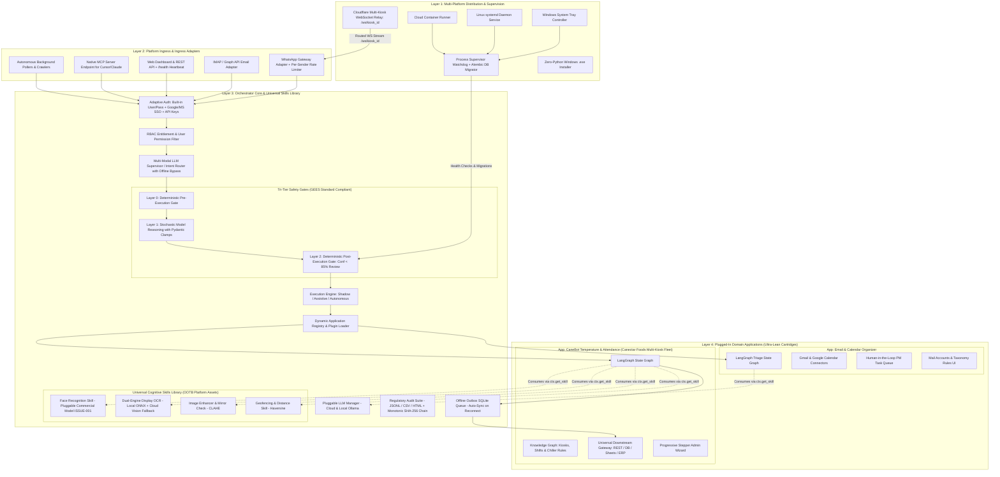

# MASTER PLATFORM ARCHITECTURE SPECIFICATION
## Enterprise Multi-Application Agentic Platform (`Release100`)

**Document ID:** `01_master_platform_architecture`  
**Document Version:** `v1.4.0`  
**Date:** September 14, 2026  
**Status:** APPROVED FOR IMPLEMENTATION  
**Target Repository:** `D:\Release100`  
**Foundational Assets (Untouched Reference Sources):**  
- `D:\AI-ProjectManager` (Desktop Supervisor, Cloud Relay, Packaging Hub)
- `D:\WhatsappClientForMailOrganized` (WhatsApp Webhook Gateway & MCP Client)
- `D:\mailOrganizer` (LangGraph Engine, Telemetry, Safety Rules, SSE MCP Server)

---

## Document Revision History & Changelog

| Version | Date | Author | Description of Changes | Status |
| :--- | :--- | :--- | :--- | :--- |
| **v1.0.0** | 2026-09-13 | AI Architecture Team | Initial Master Platform Architecture: Ecosystem topology, microkernel & cartridges model, multi-customer deployment matrix, and directory layout. | Superseded |
| **v1.1.0** | 2026-09-13 | AI Architecture Team | Added JSON audit logs and multi-platform Linux/Cloud targets. | Superseded |
| **v1.2.0** | 2026-09-13 | AI Architecture Team | Restored ProcessSupervisor in topology, FDA/ISO compliance, and Phased Roadmap Gantt chart. | Superseded |
| **v1.3.0** | 2026-09-14 | AI Architecture Team | Promoted reusable cognitive skills to Core Platform (`core_platform/skills/`). Lean domain cartridges. Incorporated Canectar Foods & CaneBot baseline. | Superseded |
| **v1.4.0** | 2026-09-14 | AI Architecture Team | **Architectural Hardening & Commercial Production Readiness**: <br>1. Standardized safety layer terminology to **Layer 0 (Deterministic Pre-Gate), Layer 1 (Stochastic AI), and Layer 2 (Deterministic Post-Gate)**.<br>2. Added **Multi-Kiosk Fleet Architecture from Day 1** with per-kiosk dynamic routing via Cloudflare Durable Objects.<br>3. Added **Dual-Engine OCR** (Local ONNX 7-segment detector + Cloud Vision LLM fallback).<br>4. Added **Edge Resilience & Offline Outbox Pattern** (local SQLite cache for kiosk internet dropouts).<br>5. Upgraded SHA-256 Non-Repudiation Audit Chain with **Monotonic Sequence Numbering**.<br>6. Added **Alembic Database Migration Engine** into Core Platform lifecycle.<br>7. Added Commercial Licensing Compliance Strategy for Face Recognition (`ISSUE-001`). | **Current** |

---

## 1. Executive Summary & Strategic Vision

`Release100` is a unified, enterprise-grade AI application hosting platform and distribution runtime. Rather than developing isolated, monolithic automation tools, `Release100` establishes a **decoupled, cross-platform modular ecosystem** where:

1. **The Core Orchestrator** acts as a channel-agnostic, multi-tenant host providing out-of-the-box (OOTB) infrastructure:
   - Universal multi-channel ingress (WhatsApp, Email, Web, Crawlers, MCP Server).
   - Pluggable LLM Provider Gateway (Cloud: Gemini/Claude/OpenAI; Local: Ollama/DeepSeek).
   - Unified Authentication & RBAC (Built-in credentials, Enterprise Google/Microsoft SSO, API keys).
   - **Multi-Layered Safety Architecture**:
     - **Layer 0**: Deterministic Pre-Execution Gate (Hard sanity, VIP checks, GPS Haversine verification).
     - **Layer 1**: Stochastic Reasoning Engine (Schema-enforced Pydantic contracts, temperature clamps).
     - **Layer 2**: Deterministic Post-Execution Boundary (Confidence $< 85\%$ diverts to human review, zero destructive actions).
   - **Universal Cognitive Skills Library (`core_platform/skills/`)**: Shared, reusable AI skills (Face Recognition with commercial compliance, Dual-Engine Display OCR, Image Enhancement, Geofencing) accessible to *all* plugged-in applications.
   - **Regulatory Audit Compliance (FDA 21 CFR Part 11 & ISO 22000)**: Produces Structured JSONL, CSV, and partitioned HTML dashboards with **tamper-evident SHA-256 hash chaining and monotonic sequence numbering**.
   - **Database Migration Subsystem**: Automated schema evolution via **Alembic** managed by the Process Supervisor.
   - Native Model Context Protocol (MCP) Server host for external agents (Cursor, Claude Desktop).

2. **Domain Applications** plug in as isolated, ultra-lean packages ("cartridges"):
   - **App 1: `temperature_marker`**: Canectar Foods CaneBot sugarcane juice machine chiller verification ($2.0^\circ\text{C} - 4.0^\circ\text{C}$), multi-kiosk fleet attendance, HACCP compliance, and universal downstream telemetry.
   - **App 2: `mail_organizer`**: Autonomous Gmail & Calendar triage, categorization, and meeting assistant.
   - **Future Apps (`app_inventory`, `app_boiler_monitor`, etc.)**: Seamlessly mountable without modifying core code, immediately inheriting all platform cognitive skills.

3. **Multi-Target Distribution & Process Supervision**:
   - **Process Supervisor (`supervisor/`)**: Dynamic lifecycle manager running database migrations, monitoring listening ports, and health endpoints.
   - **Windows Desktop / Kiosk**: Windows taskbar system tray control plane (`tray_app/`) + 1-click zero-Python `.exe` installer (PyInstaller + Inno Setup).
   - **Linux Edge / Factory Server**: Headless `systemd` background service (`release100.service`).
   - **Cloud & Containers**: Production Docker containers (`Dockerfile` + `docker-compose.yaml`).
   - **Outbound Multi-Kiosk Cloud Relay (`cloud_relay/`)**: Cloudflare Workers with Durable Objects routing events to specific kiosk sessions (`/ws/{kiosk_id}`).

---

## 2. Global Ecosystem Topology



---

## 3. Comprehensive Directory Layout (`D:\Release100`)

```text
D:\Release100/
├── ENGINEERING_EXCELLENCE_STANDARD_v1.0.md  <-- Global Engineering Standard
├── GEMINI.md                                <-- Agentic Operating Directives
├── AGENTS.md                                <-- Multi-Agent Operating Directives
├── LICENSE                                  <-- Apache License 2.0
├── pyproject.toml                           <-- Ruff, Black, Mypy strict settings
│
├── plans/                                   # Versioned architecture & implementation plans
│   ├── 01_master_platform_architecture_v1.4.md  <-- CURRENT MASTER SPECIFICATION
│   ├── 02_orchestrator_core_v1.3.md
│   ├── 03_app_temperature_marker_v1.3.md
│   ├── 04_app_mail_organizer_v1.0.md
│   ├── 05_deployment_and_packaging_hub_v1.2.md
│   └── 06_engineering_excellence_standards_v1.0.md
│
├── issues/                                  # Architectural Decision Records (ADRs)
│   └── ISSUE-001_face_model_commercial_licensing.md
│
├── core_platform/                           # The Core Orchestrator & Platform Services
│   ├── app/
│   │   ├── config/                          # Pydantic platform settings (master config)
│   │   ├── errors.py                        # PlatformErrorCode structured error taxonomy
│   │   ├── auth/                            # Built-in User/Pass, SSO (Google/MS), API Key manager
│   │   ├── rbac/                            # User roles, app entitlements & permissions
│   │   ├── ingress/                         # Normalized Inbound/Outbound Message Envelopes
│   │   │   ├── envelope.py                  # InteractionEnvelope with correlation_id
│   │   │   ├── rate_limiter.py              # Per-sender token bucket rate limiting
│   │   │   ├── whatsapp_adapter.py          # Meta Webhook & Graph Media Downloader
│   │   │   ├── email_adapter.py             # IMAP / Graph API listener
│   │   │   ├── web_adapter.py               # REST / WebSocket endpoints + /health API
│   │   │   └── poller_adapter.py            # Scheduled daemon pollers
│   │   ├── routing/                         # Multi-Modal LLM Supervisor & Semantic Router
│   │   ├── llm/                             # Unified LLM Gateway (Gemini, Claude, OpenAI, Ollama)
│   │   │
│   │   ├── skills/                          # Universal Cognitive Skills Library
│   │   │   ├── __init__.py
│   │   │   ├── base.py                      # BaseSkill abstract lifecycle & thread-safe contract
│   │   │   ├── registry.py                  # Central SkillRegistry & ctx.get_skill() dispatcher
│   │   │   ├── face_recognizer.py           # Pluggable Face Recognition (ISSUE-001 compliant)
│   │   │   ├── display_ocr.py               # Dual-Engine 7-segment Local ONNX + Cloud Vision
│   │   │   ├── image_enhancer.py            # CLAHE contrast, glare reduction & mirror check
│   │   │   └── geofencing.py                # Haversine distance & geofence validator
│   │   │
│   │   ├── safety/                          # 3-Tier GEES Deterministic Guardrails
│   │   │   ├── layer0_pre_gate.py           # Layer 0: Hard sanity, bounds & tamper rules
│   │   │   ├── layer1_stochastic_clamp.py   # Layer 1: Schema constraints & temperature clamps
│   │   │   └── layer2_post_gate.py          # Layer 2: Confidence < 85% review & zero-destruction
│   │   │
│   │   ├── telemetry/                       # Compliance Audit Suite (JSONL, CSV & HTML)
│   │   │   ├── audit_schema.py              # AuditRecord with monotonic sequence_number
│   │   │   ├── audit_engine.py              # SHA-256 hash chaining writer
│   │   │   └── reporters/                   # Partitioned visual HTML dashboards
│   │   │
│   │   ├── outbox/                          # Edge Resilience Outbox Engine
│   │   │   ├── queue.py                     # SQLite-backed offline transaction queue
│   │   │   └── synchronizer.py              # Auto-sync worker on network restoration
│   │   │
│   │   ├── migrations/                      # Alembic Database Migration Subsystem
│   │   │   ├── env.py
│   │   │   └── versions/
│   │   │
│   │   ├── mcp_server/                      # Native SSE MCP Server exposing tools
│   │   ├── admin_shell/                     # FastAPI Web Admin Shell (dynamic nav & theme)
│   │   └── plugin_engine/                   # Dynamic Application Loader & Lifecycle Manager
│   ├── main.py                              # Platform startup bootstrap & /health router
│   └── requirements.txt
│
├── apps/                                    # Pluggable Domain Applications ("Cartridges")
│   │
│   ├── temperature_marker/                  # App: Canectar CaneBot Multi-Kiosk Fleet
│   │   ├── plugin.py                        # BaseApplication implementation manifest
│   │   ├── graph/                           # LangGraph workflow (consumes platform skills)
│   │   ├── knowledge_graph/                 # CaneBot kiosk rosters & 2°C-4°C chiller rules
│   │   ├── downstream/                      # Universal Downstream Gateway (REST / DB / Sheets / ERP)
│   │   ├── ui/                              # Progressive Stepper Admin Wizard & Approval Queue
│   │   └── database/                        # SQLAlchemy models for records & audit trails
│   │
│   └── mail_organizer/                      # App: Email & Calendar Organizer (Rearchitected)
│       ├── plugin.py                        # BaseApplication implementation manifest
│       ├── graph/                           # LangGraph triage & drafting state machine
│       ├── connectors/                      # Gmail API & Google Calendar integration
│       ├── pm_tasks/                        # Task queue & Jira/Linear export adapters
│       └── ui/                              # Mail accounts & classification rules dashboard
│
├── deployment/                              # Multi-Platform Distribution & Supervision Hub
│   ├── supervisor/                          # Dynamic process supervisor, Alembic migrator & health
│   ├── desktop_tray/                        # Windows taskbar system tray controller
│   ├── packaging_windows/                   # PyInstaller specs + Inno Setup .exe build scripts
│   ├── linux_systemd/                       # release100.service unit file & install.sh
│   ├── docker/                              # Dockerfile, docker-compose.yml & entrypoint scripts
│   └── cloud_relay/                         # Cloudflare Worker + Durable Objects multi-kiosk relay
│
└── config/
    ├── platform.env.example                 # Master configuration template
    └── canebot_kiosks.example.json          # Multi-kiosk fleet registry & chiller thresholds
```

---

## 4. Next Steps

With **Plan 1 updated to `v1.4.0`**, we immediately update:
1. **Plan 02 (`02_orchestrator_core_v1.3.md`)**: Update Orchestrator Core with Layer 0/1/2, `BaseSkill` lifecycle contract, error taxonomy, `/health` endpoint, and monotonic SHA-256 sequence numbering.
2. **Plan 03 (`03_app_temperature_marker_v1.3.md`)**: Update Temperature Marker with Dual-Engine OCR, multi-kiosk registry, and offline SQLite outbox pattern.
3. **Plan 05 (`05_deployment_and_packaging_hub_v1.2.md`)**: Update Cloudflare Durable Object multi-kiosk routing (`/ws/:kiosk_id`) and Alembic migrations.
4. **Issue 001 (`issues/ISSUE-001_face_model_commercial_licensing.md`)**: Document Face Model Commercial Licensing mitigation.
