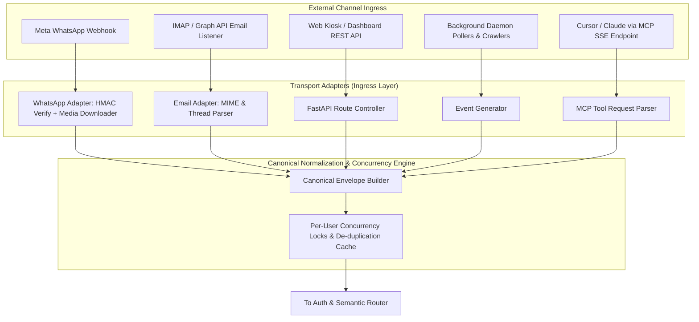
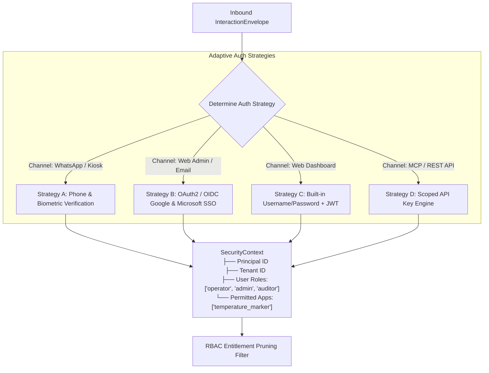
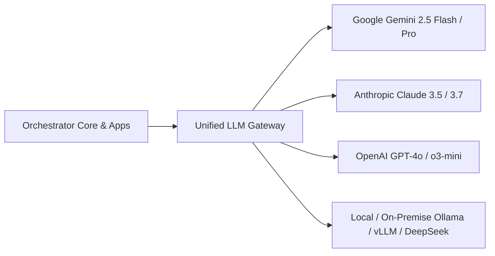
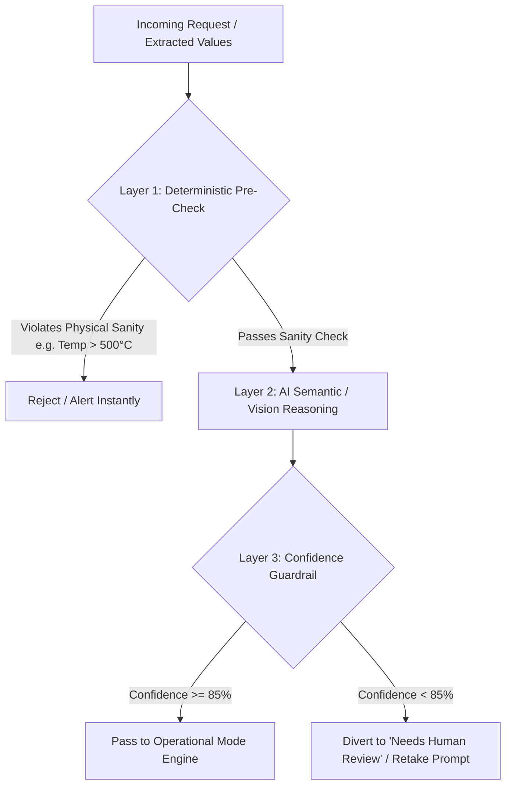
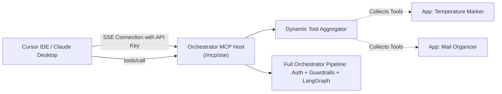

# CORE ORCHESTRATOR & PLATFORM SERVICES SPECIFICATION
## The Universal Agentic Host & Gateway (`Release100`)

**Document ID:** `02_orchestrator_core`  
**Document Version:** `v1.0.0`  
**Date:** September 13, 2026  
**Status:** DRAFT / UNDER REVIEW  
**Target Subsystem:** `D:\Release100\core_platform`  
**Master Plan Reference:** `D:\Release100\plans\01_master_platform_architecture_v1.2.md`  

---

## Document Revision History & Changelog

| Version | Date | Author | Description of Changes | Status |
| :--- | :--- | :--- | :--- | :--- |
| **v1.0.0** | 2026-09-13 | AI Architecture Team | Initial Core Orchestrator Specification: Ingress normalization, Adaptive Auth/SSO, RBAC, Pluggable LLM Manager, Multi-Modal Semantic Router, 3-Layer Safety, Tri-Format FDA/ISO Audit Engine, Native MCP Server Host, and Admin Shell. | Proposed |

---

## 1. Subsystem Mission & Scope

The **Core Orchestrator** is the foundational operating engine of `Release100`. It provides all common infrastructure, security, intelligence routing, and external connectivity as **Out-of-the-Box (OOTB) Platform Services**.

### Core Guarantees:
1. **Zero Boilerplate for Applications**: Domain applications (e.g., `temperature_marker`, `mail_organizer`) contain strictly business logic and LangGraph state graphs. They never implement their own authentication, WhatsApp parsers, LLM wrappers, or MCP servers.
2. **Channel-Agnostic Core**: The orchestrator operates exclusively on a normalized **`InteractionEnvelope`**. It has zero hardcoded dependencies on WhatsApp or any single chat channel.
3. **Pluggable & Vendor-Agnostic**: LLM providers (Gemini, Claude, OpenAI, Local Ollama), Auth providers (Local User/Pass, Google/Microsoft SSO, API Keys), and storage backends are interchangeable via clean interfaces.
4. **Strict Safety & Compliance**: Implements the 3-layer deterministic safety guardrail engine and tri-format (JSON/CSV/HTML) FDA 21 CFR Part 11 / ISO 22000 telemetry borrowed and elevated from `mailOrganizer`.

---

## 2. Ingress Normalization & Transport Adapters



### 2.1. The Canonical `InteractionEnvelope` (Universal Contract)

Regardless of where an event originates, the transport adapters convert the raw payload into a standard `InteractionEnvelope`:

```python
from enum import Enum
from typing import Optional, List, Dict, Any
from pydantic import BaseModel, Field
from datetime import datetime

class ChannelType(str, Enum):
    WHATSAPP = "whatsapp"
    EMAIL = "email"
    WEB_KIOSK = "web_kiosk"
    MCP_AGENT = "mcp_agent"
    BACKGROUND_POLLER = "background_poller"

class MediaAttachment(BaseModel):
    media_id: Optional[str] = None
    media_type: str                  # "image/jpeg", "image/png", "application/pdf"
    raw_bytes: Optional[bytes] = None
    media_url: Optional[str] = None
    sha256_hash: Optional[str] = None

class InteractionEnvelope(BaseModel):
    envelope_id: str = Field(description="Unique UUID for distributed tracing")
    tenant_id: str = Field(default="default_plant", description="Multi-tenant plant identifier")
    timestamp: datetime = Field(default_factory=datetime.utcnow)
    channel: ChannelType
    sender_id: str = Field(description="Normalized sender ID (phone number, email, or API key ID)")
    
    # Payload content
    text_content: Optional[str] = None
    attachments: List[MediaAttachment] = []
    metadata: Dict[str, Any] = Field(default_factory=dict, description="Channel-specific headers & tokens")
    
    # Concurrency key
    session_id: str = Field(description="Lock key: tenant:channel:sender_id")
```

### 2.2. WhatsApp Adapter Specifications
- **Webhook GET**: Responds to Meta `hub.challenge` using configured `WHATSAPP_VERIFY_TOKEN`.
- **Webhook POST**: Verifies cryptographic `X-Hub-Signature-256` header against `WHATSAPP_APP_SECRET` using `hmac.compare_digest` to prevent timing attacks.
- **Media Downloader**: When `message_type == "image"`, retrieves media URL from Meta Graph API (`GET /v20.0/{media_id}`) and downloads binary bytes directly into a `MediaAttachment` with calculated SHA-256 hash.
- **Deduplication**: In-memory LRU cache / Redis storing `message_id` for 30 minutes to drop duplicate Meta retry events.

---

## 3. Adaptive Identity, Authentication & RBAC Engine



### 3.1. RBAC Entitlement Pruning
Before invoking any LLM, the system dynamically calculates the candidate applications for the current user:

$$\text{Candidate Apps} = \text{Tenant.EnabledApps} \;\cap\; \text{Principal.PermittedApps}$$

* **Single App Match**: If the user is only permitted access to 1 app (e.g., Shop Floor Worker only has `temperature_marker`), the router bypasses LLM semantic classification and routes directly to that app’s workflow (**0 latency, 0 token cost**).
* **Zero App Match**: Returns immediate 403 Forbidden / Access Denied message without consuming LLM tokens.
* **Multiple App Match**: Advances to the Multi-Modal Semantic Router.

### 3.2. Scoped API Key Lifecycle
- External AI clients (Cursor, Claude Desktop) and ERP systems authenticate via HTTP Header `Authorization: Bearer ak_live_...`.
- Keys are hashed with SHA-256 at rest; raw keys are presented only once at creation.
- Keys specify explicit scopes (e.g., `['temp_marker:read', 'temp_marker:write']`, `max_requests_per_min: 60`).

---

## 4. Pluggable LLM Provider Gateway

The Orchestrator provides a unified, vendor-neutral LLM service (`BaseLLMProvider`) supporting both public cloud APIs and on-premise air-gapped local models:



### Task-Based Model Routing:
The platform configuration assigns distinct models optimized for cost, speed, and privacy:
```yaml
llm_routing:
  default_provider: "gemini"
  tasks:
    intent_routing:
      provider: "gemini"
      model: "gemini-2.5-flash"      # Ultra-fast, low-cost classification
    vision_ocr:
      provider: "gemini"
      model: "gemini-2.5-flash"      # Superior 7-segment LED & LCD reading
    private_local_logs:
      provider: "local_ollama"
      model: "deepseek-r1:14b"       # On-premise air-gapped processing
```

Apps request models abstractly via the context: `ctx.get_llm(task="vision_ocr")`.

---

## 5. Multi-Modal LLM Supervisor & Semantic Router

When a user has access to multiple applications, the **Semantic Router** inspects the multi-modal payload (text, image, or document) using Gemini 2.5 Flash with structured JSON output:

```json
{
  "system_instruction": "You are the Executive Router for Release100. Evaluate the user payload against the candidate application descriptors and route to the correct application.",
  "candidate_applications": [
    {
      "app_id": "temperature_marker",
      "description": "Processes selfies with food processing machine meters, digital 7-segment LEDs, LCD displays, and HACCP temperature logging."
    },
    {
      "app_id": "mail_organizer",
      "description": "Processes emails, inbox categorization, meeting requests, calendar schedules, and communication summaries."
    }
  ]
}
```

### Structured Routing Decision Schema:
```json
{
  "selected_app": "temperature_marker",
  "confidence": 0.98,
  "reasoning": "Image contains a human face and a glowing digital 7-segment display on an industrial machine.",
  "intent_category": "duty_temperature_log",
  "requires_disambiguation": false
}
```

* **Disambiguation Loop**: If `confidence < 0.75`, the router generates an interactive quick-reply button prompt back to the user (WhatsApp buttons or Web modal) asking them to select the intended action.

---

## 6. 3-Layer Deterministic Safety & Confidence Guardrails

Borrowed and elevated from `mailOrganizer/app/pipeline/safety_rules.py`:



1. **Layer 1: Deterministic Pre-Checks (Pre-AI)**:
   - Evaluates hard boundaries before invoking AI (e.g., sender whitelist, blacklist, physically impossible values like `-100°C` or `+800°C` for food processing, corrupt image files).
2. **Layer 2: AI Semantic & Vision Reasoning**:
   - Performs facial embedding similarity, display OCR, and domain analysis.
3. **Layer 3: Post-AI Confidence Guardrails**:
   - If face match confidence `< 0.85` or OCR confidence `< 0.85`, the system **refuses to guess**. It diverts the transaction to `NEEDS_SUPERVISOR_REVIEW` or prompts the worker for a clearer retake.

---

## 7. Operational Execution Modes

To ensure safe production rollouts in enterprise environments, the platform supports three execution modes:

```python
class ExecutionMode(str, Enum):
    SHADOW = "shadow"          # AI reasons & logs full audit trail, but performs ZERO real-world mutations
    ASSISTIVE = "assistive"    # AI prepares action; requires 1-click human supervisor approval before commit
    AUTONOMOUS = "autonomous"  # AI commits directly to ERP, DB, and notifications
```

- **Week 1 Staging (Shadow Mode)**: Operators send photos via WhatsApp; the system extracts temperature, checks HACCP, and writes audit logs, but does not commit to the corporate ERP. Allows QA managers to verify model precision.
- **Week 2 Transition (Assistive Mode)**: Results are queued for 1-click supervisor sign-off.
- **Week 3 Production (Autonomous Mode)**: Direct end-to-end synchronization.

---

## 8. Universal FDA / ISO 22000 Audit & Telemetry Suite

Produces three synchronized outputs for every single interaction:

```
logs/audit_partitions/
├── 2026-09-13.jsonl      <-- High-performance streaming JSONL (Machine & SIEM ingest)
├── 2026-09-13.csv        <-- Flattened tabular CSV (Spreadsheet inspection)
└── html/
    └── 2026-09-13.html   <-- Self-contained visual HTML report with search & filter
```

### Digital Query API:
- `GET /api/v1/audit/records?start_date=2026-09-13&app=temperature_marker&format=json`
- Implements SHA-256 cryptographic hashing of the original input payload to guarantee non-repudiation during food safety audits.

---

## 9. Native Model Context Protocol (MCP) Server Host

The Orchestrator exposes an SSE-based **Model Context Protocol (MCP) Server** on `/mcp/sse` and `/mcp/messages`.



### Strict Encapsulation Guarantee:
External agents (Cursor, Claude) **never** bypass the orchestrator:
1. When Cursor invokes `tools/call`, the request is intercepted by the Orchestrator.
2. The Orchestrator validates the API key, checks rate limits, executes the application's complete LangGraph workflow, logs the FDA audit record, and returns only the verified result.
3. No direct database or internal application API is ever exposed to the external agent.

---

## 10. Dynamic Admin Shell & Stepper Wizard Host

The Orchestrator hosts a unified FastAPI web dashboard on `/admin/`:
- **Shell Features**: Authentication login page, dynamic navigation sidebar reflecting only enabled apps, system health metrics, and API key management.
- **Progressive Stepper Engine**: Provides an auto-save drafting engine for multi-step configuration wizards:
  - `POST /admin/drafts/save` (Auto-saves partial wizard state every 5 seconds or on field blur).
  - `GET /admin/drafts/resume` (Restores unfinished machine/worker configurations if session disconnects).

---

## 11. Directory & Package Layout (`core_platform/`)

```text
D:\Release100\core_platform/
├── app/
│   ├── __init__.py
│   ├── config.py                      # Pydantic Settings (Environment & defaults)
│   ├── auth/                          # Identity & Authentication
│   │   ├── __init__.py
│   │   ├── strategies.py              # User/Pass, Google/MS SSO, Phone, API Key strategies
│   │   └── api_keys.py                # API Key generation, SHA-256 hashing, scope verification
│   ├── rbac/
│   │   ├── __init__.py
│   │   └── permissions.py             # Role definitions & candidate app pruning
│   ├── ingress/                       # Transport Normalization
│   │   ├── __init__.py
│   │   ├── envelope.py                # Canonical InteractionEnvelope definition
│   │   ├── whatsapp_adapter.py        # Meta Webhook, HMAC-SHA256, Graph media downloader
│   │   ├── email_adapter.py           # IMAP / Graph API email listener
│   │   ├── web_adapter.py             # REST / WebSocket endpoints
│   │   ├── poller_adapter.py          # Scheduled daemon pollers
│   │   └── session_manager.py         # Async per-user mutex locks & deduplication
│   ├── llm/                           # Pluggable LLM Gateway
│   │   ├── __init__.py
│   │   ├── base.py                    # BaseLLMProvider interface
│   │   ├── gemini_provider.py         # Google Gemini 2.5 Flash / Pro
│   │   ├── claude_provider.py         # Anthropic Claude 3.5 / 3.7
│   │   ├── openai_provider.py         # OpenAI GPT-4o
│   │   └── ollama_provider.py         # Local on-premise Ollama / vLLM
│   ├── routing/                       # Multi-Modal Semantic Routing
│   │   ├── __init__.py
│   │   ├── semantic_router.py         # Gemini-powered intent classification
│   │   └── disambiguation.py          # Interactive clarification loops
│   ├── safety/                        # 3-Layer Deterministic Guardrails
│   │   ├── __init__.py
│   │   ├── pre_checks.py              # Layer 1: Deterministic sanity rules
│   │   └── confidence_guardrails.py   # Layer 3: Post-AI confidence thresholding
│   ├── telemetry/                     # FDA/ISO Audit Suite
│   │   ├── __init__.py
│   │   ├── audit_schema.py            # Strongly typed audit record schemas
│   │   ├── jsonl_writer.py            # High-performance async JSONL streaming
│   │   ├── csv_writer.py              # Flattened tabular CSV exporter
│   │   └── html_generator.py          # Partitioned visual HTML dashboards
│   ├── mcp_server/                    # Native SSE MCP Server Host
│   │   ├── __init__.py
│   │   ├── server.py                  # SSE MCP protocol server (:8001 / :8002)
│   │   └── tool_aggregator.py         # Dynamic tool registration from apps
│   ├── admin_shell/                   # Central Web Dashboard Shell
│   │   ├── __init__.py
│   │   ├── routes.py                  # /admin routes (auth, system, drafts)
│   │   ├── templates/                 # Jinja2 / Tailwind shell templates
│   │   └── static/                    # CSS, JS, branding assets
│   └── plugin_engine/                 # Dynamic Application Lifecycle Manager
│       ├── __init__.py
│       ├── base_plugin.py             # BaseApplication interface definition
│       └── loader.py                  # Dynamic module importer & router mounting
├── main.py                            # Clean platform bootstrap (< 60 lines)
└── requirements.txt                   # Platform core dependencies
```

---

## 12. Next Steps

With **Plan 2 (`02_orchestrator_core_v1.0.md`)** established, the universal platform services are fully specified.

We will now proceed to **Plan 3: Food Temperature & Attendance Marker Application Specification** (`03_app_temperature_marker_v1.0.md`), detailing the domain LangGraph workflow, face recognition, dual-mode 7-segment/LCD vision OCR, Knowledge Graph shift inference, and ERP MCP integration.
