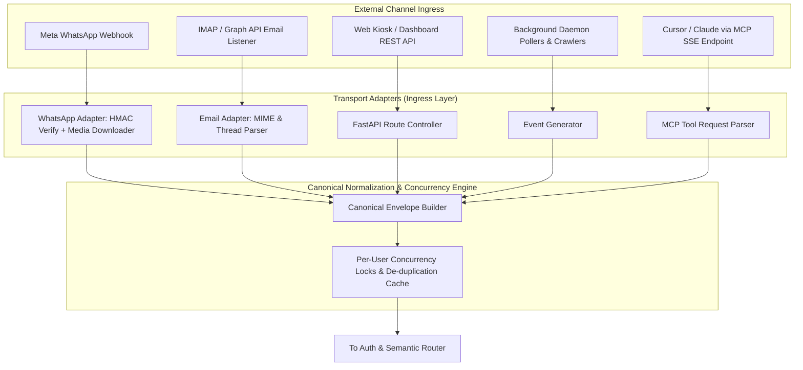
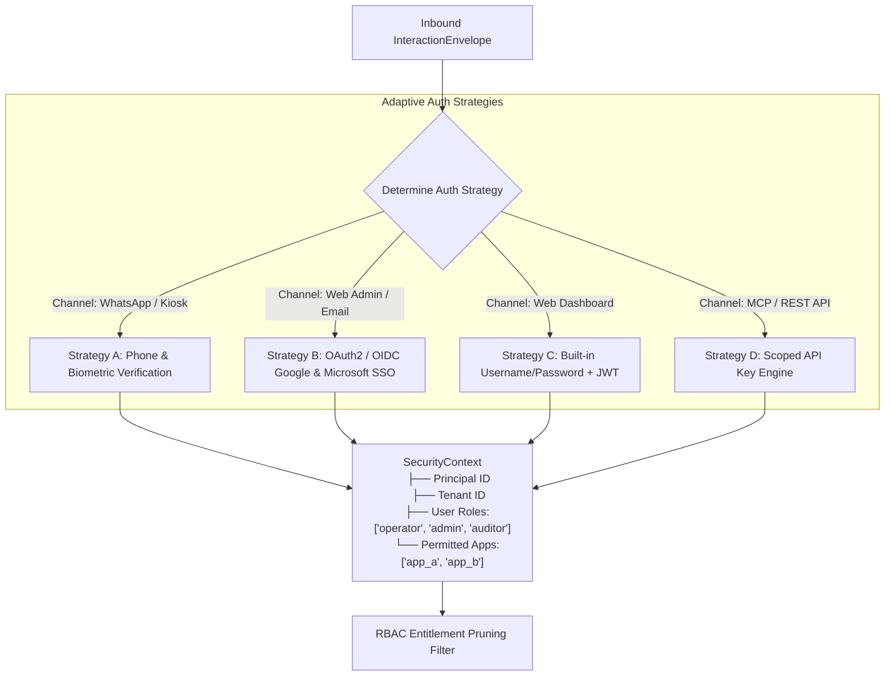
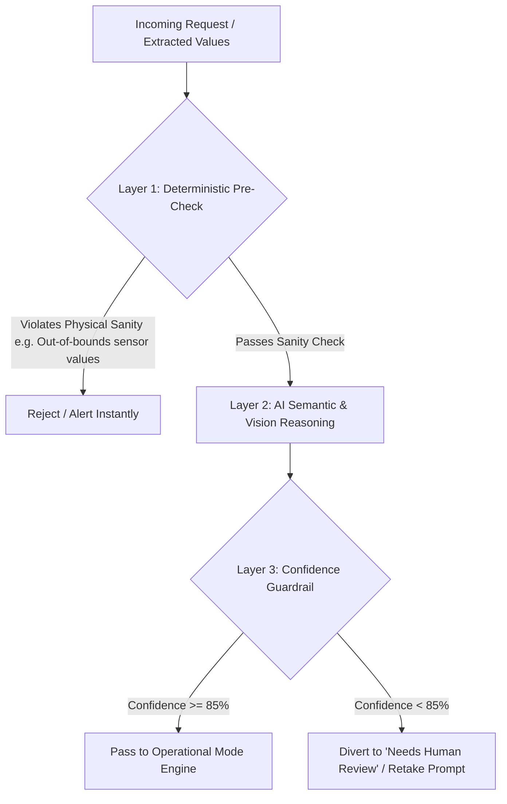

# CORE ORCHESTRATOR & PLATFORM SERVICES SPECIFICATION
## The Universal Agentic Host & Gateway (`Release100`)

**Document ID:** `02_orchestrator_core`  
**Document Version:** `v1.2.0`  
**Date:** September 14, 2026  
**Status:** DRAFT / UNDER REVIEW  
**Target Subsystem:** `D:\Release100\core_platform`  
**Master Plan Reference:** `D:\Release100\plans\01_master_platform_architecture_v1.3.md`  

---

## Document Revision History & Changelog

| Version | Date | Author | Description of Changes | Status |
| :--- | :--- | :--- | :--- | :--- |
| **v1.0.0** | 2026-09-13 | AI Architecture Team | Initial Core Orchestrator Specification: Ingress, Auth, RBAC, Pluggable LLM, Safety, and MCP Server. | Superseded |
| **v1.1.0** | 2026-09-13 | AI Architecture Team | Removed domain leaks; made LLM model names dynamically configurable (defaulting to latest Gemini Flash). | Superseded |
| **v1.2.0** | 2026-09-14 | AI Architecture Team | **Promotion of Cognitive Skills to Core Platform**: <br>1. Added Section 5: **Universal Cognitive Skills Library** (`core_platform/app/skills/`) featuring Face Recognition, Display OCR, Image Preprocessing & Mirror Check, and Geofencing.<br>2. Implemented `SkillRegistry` & `ctx.get_skill()` contract enabling all plugged-in applications to share capabilities without code duplication. | **Current** |

---

## 1. Subsystem Mission & Scope

The **Core Orchestrator** is the foundational operating engine of `Release100`. It provides all common infrastructure, security, cognitive intelligence, and external connectivity as **Out-of-the-Box (OOTB) Platform Services**.

### Core Guarantees:
1. **Zero Boilerplate for Applications**: Domain applications contain strictly business logic and LangGraph state graphs.
2. **Universal Cognitive Skills Library**: Cognitive capabilities (Face Recognition, Meter Display OCR, Image Enhancement, Geofencing) live at the platform level and are shared across all current and future applications.
3. **Channel-Agnostic Core**: The orchestrator operates exclusively on a normalized **`InteractionEnvelope`**.
4. **Pluggable & Vendor-Agnostic**: Configurable LLM providers (Gemini, Claude, OpenAI, Local Ollama), Auth providers (Local User/Pass, Google/Microsoft SSO, API Keys), and storage backends.
5. **Strict Safety & Compliance**: 3-layer deterministic safety guardrails and tri-format (JSONL/CSV/HTML) regulatory compliance telemetry.

---

## 2. Ingress Normalization & Transport Adapters



### 2.1. The Canonical `InteractionEnvelope`
```python
from enum import Enum
from typing import Optional, List, Dict, Any
from pydantic import BaseModel, Field
from datetime import datetime

class ChannelType(str, Enum):
    WHATSAPP = "whatsapp"
    EMAIL = "email"
    WEB_KIOSK = "web_kiosk"
    MCP_AGENT = "mcp_agent"
    BACKGROUND_POLLER = "background_poller"

class MediaAttachment(BaseModel):
    media_id: Optional[str] = None
    media_type: str                  # "image/jpeg", "image/png", "application/pdf"
    raw_bytes: Optional[bytes] = None
    media_url: Optional[str] = None
    sha256_hash: Optional[str] = None

class InteractionEnvelope(BaseModel):
    envelope_id: str = Field(description="Unique UUID for distributed tracing")
    tenant_id: str = Field(default="default_tenant", description="Multi-tenant identifier")
    timestamp: datetime = Field(default_factory=datetime.utcnow)
    channel: ChannelType
    sender_id: str = Field(description="Normalized sender ID (phone number, email, or API key ID)")
    text_content: Optional[str] = None
    attachments: List[MediaAttachment] = []
    metadata: Dict[str, Any] = Field(default_factory=dict)
    session_id: str = Field(description="Lock key: tenant:channel:sender_id")
```

---

## 3. Adaptive Identity, Authentication & RBAC Engine



### RBAC Entitlement Pruning:
$$\text{Candidate Apps} = \text{Tenant.EnabledApps} \;\cap\; \text{Principal.PermittedApps}$$
* Single app match routes instantly with **0 latency and 0 token cost**.

---

## 4. Pluggable LLM Provider Gateway

Unified vendor-neutral interface (`BaseLLMProvider`) supporting cloud and local models:

```yaml
llm_routing:
  default_provider: "gemini"
  tasks:
    intent_routing:
      provider: "gemini"
      model: "${GEMINI_ROUTING_MODEL:gemini-flash-latest}"
    vision_processing:
      provider: "gemini"
      model: "${GEMINI_VISION_MODEL:gemini-flash-latest}"
    private_local_logs:
      provider: "local_ollama"
      model: "${LOCAL_LLM_MODEL:deepseek-r1:14b}"
```

---

## 5. Universal Cognitive Skills Library (`core_platform/app/skills/`)

Cognitive capabilities are promoted to first-class **Platform Services** managed by the `SkillRegistry`:

```mermaid
graph LR
    subgraph "Core Platform Skills Catalog"
        SkillRegistry[SkillRegistry]
        SkillRegistry --> FaceSkill[FaceRecognizerSkill]
        SkillRegistry --> OCRSkill[DisplayOCRSkill]
        SkillRegistry --> EnhanceSkill[ImageEnhancerSkill]
        SkillRegistry --> GeoSkill[GeofencingSkill]
    end

    subgraph "Applications Consuming Skills"
        AppTemp[App: KioskNode Temperature Marker]
        AppFuture[App: Future Machine / Access App]
    end

    AppTemp -.->|ctx.get_skill('face_recognizer')| FaceSkill
    AppTemp -.->|ctx.get_skill('display_ocr')| OCRSkill
    AppTemp -.->|ctx.get_skill('geofencing')| GeoSkill
    AppFuture -.->|ctx.get_skill('face_recognizer')| FaceSkill
```

### 5.1. `FaceRecognizerSkill` (`skills/face_recognizer.py`)
- **Engine**: InsightFace / FaceNet vector embedding generator (512-dim).
- **Functions**:
  - `compute_embedding(image_bytes: bytes) -> tuple[bool, Optional[np.ndarray], str]`
  - `verify_similarity(embedding_a: np.ndarray, embedding_b: np.ndarray) -> float` (Cosine similarity score: 0.0 – 1.0).
  - `check_image_hygiene(image_bytes: bytes) -> tuple[bool, str]` (Validates single face, eyes open, lighting quality, no occlusions).

### 5.2. `DisplayOCRSkill` (`skills/display_ocr.py`)
- **Engine**: Configured vision model (default: latest Gemini Flash) with structured JSON output.
- **Functions**:
  - `extract_display_readout(image_bytes: bytes, target_types: list[str]) -> DisplayReadingResult`
  - Extracts value (float), unit ("C" | "F"), display category (`"7_segment_led"` | `"lcd_screen"` | `"analog_dial"`), and confidence score.

### 5.3. `ImageEnhancerSkill` (`skills/image_enhancer.py`)
- **Engine**: OpenCV + CLAHE (Contrast Limited Adaptive Histogram Equalization).
- **Functions**:
  - `detect_and_correct_mirroring(image: Image) -> tuple[Image, bool]` (Analyzes text orientation and flips selfie photos horizontally if inverted).
  - `suppress_glare(image: Image) -> Image` (Attenuates bright reflections from machine acrylic panels).

### 5.4. `GeofencingSkill` (`skills/geofencing.py`)
- **Engine**: High-precision Haversine mathematical distance validator.
- **Functions**:
  - `calculate_distance_meters(coord_user: tuple[float, float], coord_target: tuple[float, float]) -> float`
  - `is_within_geofence(coord_user, coord_target, allowed_radius_meters) -> tuple[bool, float]`

---

## 6. Multi-Modal LLM Supervisor & Semantic Router

Evaluates multi-modal payloads (text, image, or document) using the configured routing model:

```json
{
  "selected_app": "app_sample_a",
  "confidence": 0.98,
  "reasoning": "Image contains operational machinery and operator verification request.",
  "intent_category": "operational_duty_log",
  "requires_disambiguation": false
}
```

---

## 7. 3-Layer Deterministic Safety & Confidence Guardrails



---

## 8. Operational Execution Modes

```python
class ExecutionMode(str, Enum):
    SHADOW = "shadow"          # AI reasons & logs full audit trail, zero real-world mutations
    ASSISTIVE = "assistive"    # AI prepares action; requires 1-click supervisor sign-off
    AUTONOMOUS = "autonomous"  # AI commits directly to downstream systems, DB, and notifications
```

---

## 9. Universal Compliance Audit & Telemetry Suite

Produces three synchronized outputs for every single interaction to satisfy regulatory compliance standards (FDA 21 CFR Part 11, ISO standards, SOC 2):
```
logs/audit_partitions/
├── 2026-09-14.jsonl      <-- High-performance streaming JSONL (Machine & SIEM ingest)
├── 2026-09-14.csv        <-- Flattened tabular CSV (Spreadsheet inspection)
└── html/
    └── 2026-09-14.html   <-- Self-contained visual HTML report with search & filter
```

---

## 10. Native Model Context Protocol (MCP) Server Host

Runs an SSE-based **Model Context Protocol (MCP) Server** on `/mcp/sse` and `/mcp/messages`:
- Exposes tools to external AI agents (Cursor, Claude Desktop).
- External agents execute through the complete Orchestrator security, guardrails, and LangGraph pipeline.

---

## 11. Directory & Package Layout (`core_platform/`)

```text
D:\Release100\core_platform/
├── app/
│   ├── __init__.py
│   ├── config.py                      # Pydantic Settings (Configurable models, defaults)
│   ├── auth/                          # Identity & Authentication
│   │   ├── __init__.py
│   │   ├── strategies.py              # User/Pass, Google/MS SSO, Phone, API Key strategies
│   │   └── api_keys.py                # API Key generation, SHA-256 hashing, scope verification
│   ├── rbac/
│   │   ├── __init__.py
│   │   └── permissions.py             # Role definitions & candidate app pruning
│   ├── ingress/                       # Transport Normalization
│   │   ├── __init__.py
│   │   ├── envelope.py                # Canonical InteractionEnvelope definition
│   │   ├── whatsapp_adapter.py        # Meta Webhook, HMAC-SHA256, Graph media downloader
│   │   ├── email_adapter.py           # IMAP / Graph API email listener
│   │   ├── web_adapter.py             # REST / WebSocket endpoints
│   │   ├── poller_adapter.py          # Scheduled daemon pollers
│   │   └── session_manager.py         # Async per-user mutex locks & deduplication
│   ├── llm/                           # Pluggable LLM Gateway
│   │   ├── __init__.py
│   │   ├── base.py                    # BaseLLMProvider interface
│   │   ├── gemini_provider.py         # Google Gemini (Configurable Flash/Pro)
│   │   ├── claude_provider.py         # Anthropic Claude 3.5 / 3.7
│   │   ├── openai_provider.py         # OpenAI GPT-4o
│   │   └── ollama_provider.py         # Local on-premise Ollama / vLLM
│   │
│   ├── skills/                        # Universal Cognitive Skills Library (Promoted to Core)
│   │   ├── __init__.py
│   │   ├── registry.py                # SkillRegistry & ctx.get_skill() dispatcher
│   │   ├── face_recognizer.py         # InsightFace 512-dim embedding & cosine matcher
│   │   ├── display_ocr.py             # Dual-mode 7-segment LED & LCD vision extractor
│   │   ├── image_enhancer.py          # CLAHE contrast, glare reduction & mirror check
│   │   └── geofencing.py              # Haversine distance & geofence validator
│   │
│   ├── routing/                       # Multi-Modal Semantic Routing
│   │   ├── __init__.py
│   │   ├── semantic_router.py         # Configurable model intent classification
│   │   └── disambiguation.py          # Interactive clarification loops
│   ├── safety/                        # 3-Layer Deterministic Guardrails
│   │   ├── __init__.py
│   │   ├── pre_checks.py              # Layer 1: Deterministic sanity rules
│   │   └── confidence_guardrails.py   # Layer 3: Post-AI confidence thresholding
│   ├── telemetry/                     # Compliance Audit Suite (JSONL, CSV, HTML)
│   │   ├── __init__.py
│   │   ├── audit_schema.py            # Strongly typed audit record schemas
│   │   ├── jsonl_writer.py            # High-performance async JSONL streaming
│   │   ├── csv_writer.py              # Flattened tabular CSV exporter
│   │   └── html_generator.py          # Partitioned visual HTML dashboards
│   ├── mcp_server/                    # Native SSE MCP Server Host
│   │   ├── __init__.py
│   │   ├── server.py                  # SSE MCP protocol server (:8001 / :8002)
│   │   └── tool_aggregator.py         # Dynamic tool registration from apps
│   ├── admin_shell/                   # Central Web Dashboard Shell
│   │   ├── __init__.py
│   │   ├── routes.py                  # /admin routes (auth, system, drafts)
│   │   ├── templates/                 # Jinja2 / Tailwind shell templates
│   │   └── static/                    # CSS, JS, branding assets
│   └── plugin_engine/                 # Dynamic Application Lifecycle Manager
│       ├── __init__.py
│       ├── base_plugin.py             # BaseApplication interface definition
│       └── loader.py                  # Dynamic module importer & router mounting
├── main.py                            # Clean platform bootstrap (< 60 lines)
└── requirements.txt                   # Platform core dependencies
```

---

## 12. Next Steps

With **Plan 2 updated to `v1.2.0`**, the universal skills library is formally anchored in the Core Platform.

We now update **Plan 3 (`03_app_temperature_marker_v1.2.md`)** to reflect that the KioskNode application consumes these platform cognitive skills.
