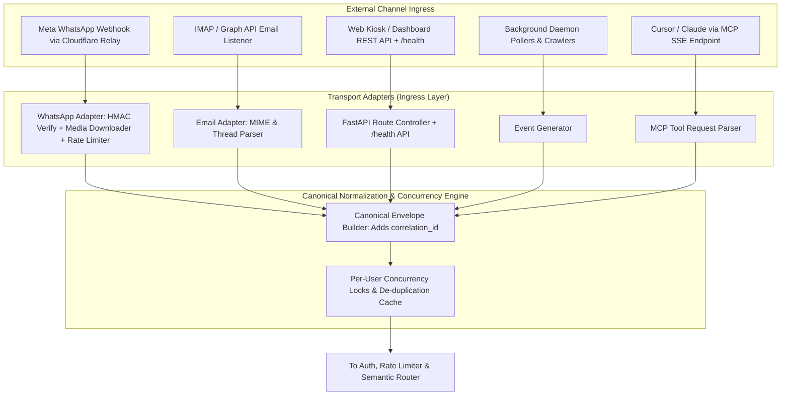
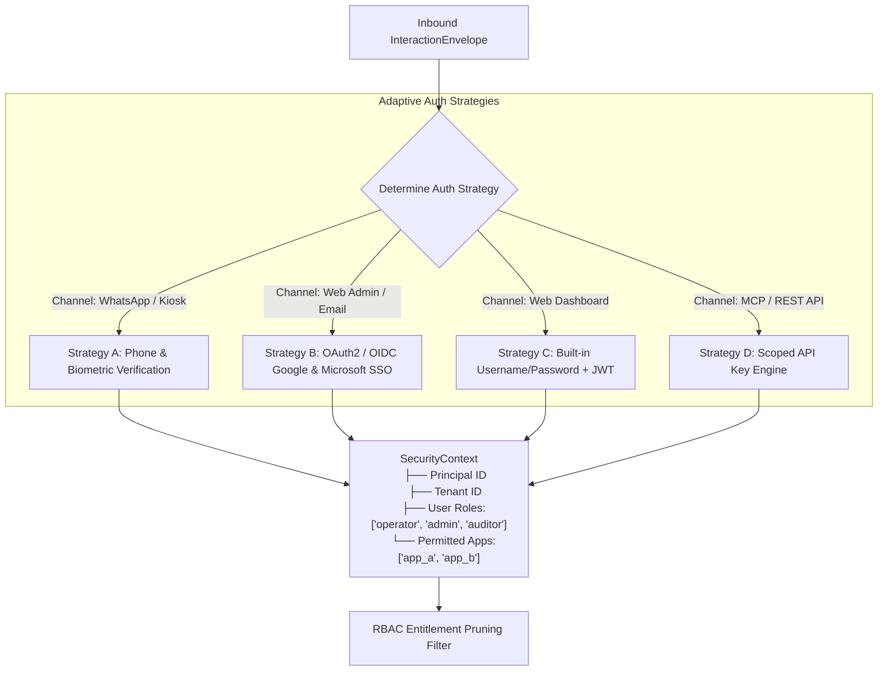
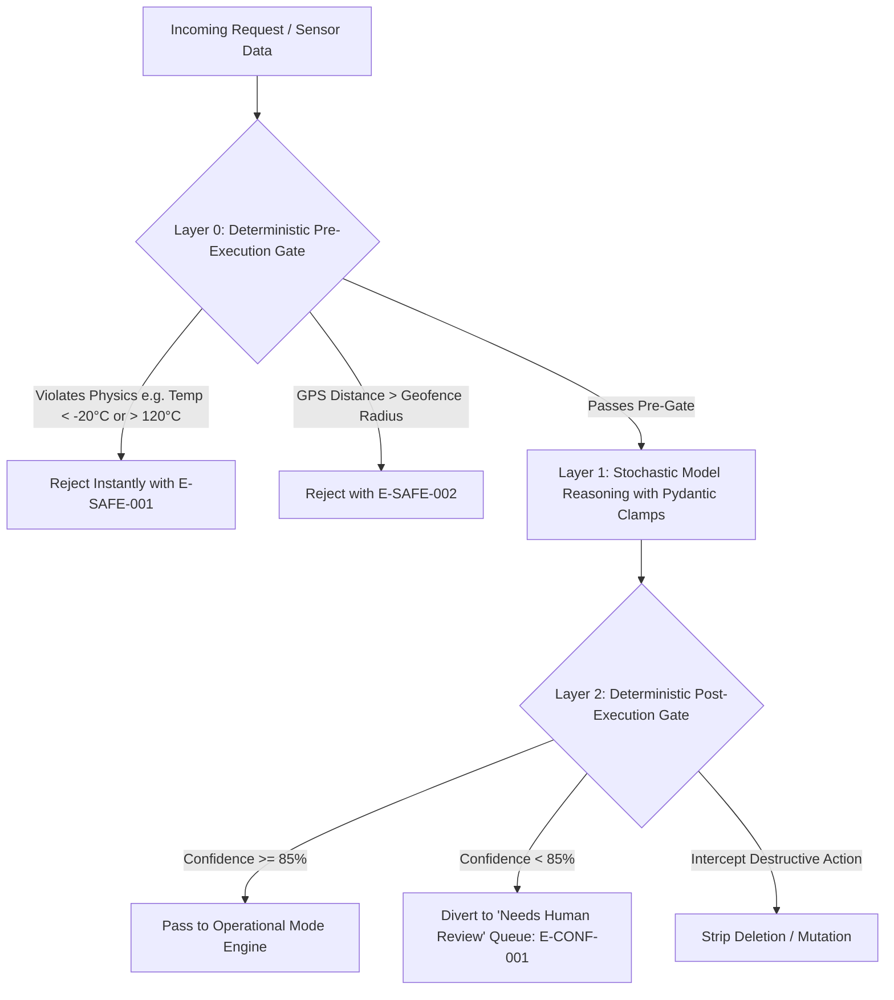

# CORE ORCHESTRATOR & PLATFORM SERVICES SPECIFICATION
## The Universal Agentic Host & Gateway (`Release100`)

**Document ID:** `02_orchestrator_core`  
**Document Version:** `v1.3.0`  
**Date:** September 14, 2026  
**Status:** APPROVED FOR IMPLEMENTATION  
**Target Subsystem:** `D:\Release100\core_platform`  
**Master Plan Reference:** `D:\Release100\plans\01_master_platform_architecture_v1.4.md`  

---

## Document Revision History & Changelog

| Version | Date | Author | Description of Changes | Status |
| :--- | :--- | :--- | :--- | :--- |
| **v1.0.0** | 2026-09-13 | AI Architecture Team | Initial Core Orchestrator Specification: Ingress, Auth, RBAC, Pluggable LLM, Safety, and MCP Server. | Superseded |
| **v1.1.0** | 2026-09-13 | AI Architecture Team | Removed domain leaks; made LLM model names dynamically configurable. | Superseded |
| **v1.2.0** | 2026-09-14 | AI Architecture Team | Promoted Cognitive Skills to Core Platform (`core_platform/app/skills/`). | Superseded |
| **v1.3.0** | 2026-09-14 | AI Architecture Team | **Architectural Hardening & Review Recommendations Adoption**: <br>1. Aligned safety gate terminology strictly to **Layer 0 (Pre-Execution), Layer 1 (Stochastic Reasoning), and Layer 2 (Post-Execution Gate)**.<br>2. Formalized the **`BaseSkill` Lifecycle Contract** (singleton, lazy initialization, `is_available()`, and `asyncio.Lock` thread safety).<br>3. Upgraded `DisplayOCRSkill` to **Dual-Engine Architecture** (Local ONNX 7-segment primary + Cloud Vision LLM fallback).<br>4. Added **`PlatformErrorCode` Structured Error Taxonomy**.<br>5. Added **`correlation_id`** to `InteractionEnvelope` for distributed tracing.<br>6. Upgraded SHA-256 Non-Repudiation Audit Chain with **Monotonic Sequence Numbering** and NTP sync.<br>7. Added comprehensive **`/health` JSON Heartbeat Endpoint** specification.<br>8. Integrated **Alembic Database Migration Engine** into bootstrap lifecycle. | **Current** |

---

## 1. Subsystem Mission & Scope

The **Core Orchestrator** is the foundational operating engine of `Release100`. It provides common infrastructure, security, cognitive intelligence, and external connectivity as **Out-of-the-Box (OOTB) Platform Services**.

### Core Guarantees:
1. **Zero Boilerplate for Applications**: Domain applications contain strictly business logic and LangGraph state graphs.
2. **Universal Cognitive Skills Library**: Cognitive capabilities (Face Recognition, Meter Display OCR, Image Enhancement, Geofencing) live at the platform level as managed, thread-safe singletons.
3. **Channel-Agnostic Core**: The orchestrator operates exclusively on a normalized **`InteractionEnvelope`** carrying an end-to-end `correlation_id`.
4. **Resilient Dual-Engine AI Execution**: Local-first offline inference for critical tasks (7-segment OCR) backed by cloud vision models for edge cases.
5. **Strict Safety & Compliance**: GEES v1.0 standard-compliant 3-tier safety guardrails (Layer 0, Layer 1, Layer 2) and tri-format (JSONL/CSV/HTML) regulatory compliance telemetry with monotonic SHA-256 hash chaining.

---

## 2. Ingress Normalization & Transport Adapters



### 2.1. The Canonical `InteractionEnvelope`
```python
from enum import Enum
from typing import Optional, List, Dict, Any
from pydantic import BaseModel, Field
from datetime import datetime
import uuid

class ChannelType(str, Enum):
    WHATSAPP = "whatsapp"
    EMAIL = "email"
    WEB_KIOSK = "web_kiosk"
    MCP_AGENT = "mcp_agent"
    BACKGROUND_POLLER = "background_poller"

class MediaAttachment(BaseModel):
    media_id: Optional[str] = None
    media_type: str                  # "image/jpeg", "image/png", "application/pdf"
    raw_bytes: Optional[bytes] = None
    media_url: Optional[str] = None
    sha256_hash: Optional[str] = None

class InteractionEnvelope(BaseModel):
    envelope_id: str = Field(default_factory=lambda: str(uuid.uuid4()), description="Unique envelope UUID")
    correlation_id: str = Field(default_factory=lambda: str(uuid.uuid4()), description="End-to-end trace ID across all logs & downstream sinks")
    tenant_id: str = Field(default="default_tenant", description="Multi-tenant identifier")
    kiosk_id: Optional[str] = Field(default=None, description="Originating physical kiosk/station identifier")
    timestamp: datetime = Field(default_factory=datetime.utcnow)
    channel: ChannelType
    sender_id: str = Field(description="Normalized sender ID (phone number, email, or API key ID)")
    text_content: Optional[str] = None
    attachments: List[MediaAttachment] = []
    metadata: Dict[str, Any] = Field(default_factory=dict)
    session_id: str = Field(description="Lock key: tenant:channel:sender_id")
```

### 2.2. Structured Error Taxonomy (`core_platform/app/errors.py`)
To ensure clear triage across logs, UI badges, and audit exports, all platform errors inherit from a standardized taxonomy:

```python
from enum import Enum

class PlatformErrorCode(str, Enum):
    # Layer 0: Pre-Execution Safety Violations
    SAFETY_PHYSICAL_BOUND_VIOLATION = "E-SAFE-001"  # Sensor reading physically impossible
    SAFETY_GEOFENCE_VIOLATION       = "E-SAFE-002"  # GPS distance exceeds permitted radius
    SAFETY_TAMPER_DETECTED          = "E-SAFE-003"  # Hash chain or timestamp manipulation
    SAFETY_RATE_LIMIT_EXCEEDED      = "E-SAFE-004"  # Per-sender token bucket limit exceeded
    
    # Layer 1 & Vision / AI Errors
    LLM_PROVIDER_UNREACHABLE        = "E-LLM-001"   # Network timeout or quota exhaustion
    LLM_SCHEMA_VALIDATION_FAILED    = "E-LLM-002"   # Output failed Pydantic schema validation
    OCR_READING_UNREADABLE          = "E-OCR-001"   # Both local and cloud OCR failed to resolve digits
    BIOMETRIC_NO_FACE_DETECTED      = "E-BIO-001"   # Zero faces detected in registration selfie
    BIOMETRIC_MULTIPLE_FACES        = "E-BIO-002"   # More than one face in reference frame
    
    # Layer 2: Post-Execution Gate Dispositions
    CONFIDENCE_BELOW_THRESHOLD      = "E-CONF-001"  # Confidence < 85%, diverted to Admin Approval
    UNAUTHORIZED_ACTION_ATTEMPT     = "E-AUTH-001"  # Role or app permission denied by RBAC
    
    # Storage & Downstream Sync
    DOWNSTREAM_SYNC_FAILURE         = "E-DOWN-001"  # External REST/DB/Sheets offline (queued in Outbox)
    DATABASE_MIGRATION_ERROR        = "E-DB-001"    # Alembic schema upgrade failed
```

---

## 3. Adaptive Identity, Authentication & RBAC Engine



---

## 4. Pluggable LLM Provider Gateway

Unified vendor-neutral interface (`BaseLLMProvider`) supporting cloud and local models with automatic fallback:

```yaml
llm_routing:
  default_provider: "gemini"
  tasks:
    intent_routing:
      provider: "gemini"
      model: "${GEMINI_ROUTING_MODEL:gemini-flash-latest}"
      fallback: "single_app_bypass"  # If 1 app enabled, bypass router on network failure
    vision_processing:
      provider: "gemini"
      model: "${GEMINI_VISION_MODEL:gemini-flash-latest}"
      fallback: "local_onnx"         # Fallback to local ONNX 7-segment model
    private_local_logs:
      provider: "local_ollama"
      model: "${LOCAL_LLM_MODEL:deepseek-r1:14b}"
```

---

## 5. Universal Cognitive Skills Library & Lifecycle Contract

All cognitive skills inherit from `BaseSkill`, ensuring predictable initialization, lazy model loading, thread safety, and standardized error handling.

### 5.1. The `BaseSkill` Lifecycle Contract (`skills/base.py`)
```python
from abc import ABC, abstractmethod
import asyncio
from typing import Optional, Dict, Any

class BaseSkill(ABC):
    """
    Abstract base for platform cognitive skills.
    Guarantees:
    - Lazy-loaded singleton pattern (models load only when first requested).
    - Concurrency safety via asyncio.Lock.
    - Explicit health check capability via is_available().
    """
    def __init__(self, skill_name: str):
        self.skill_name = skill_name
        self._initialized = False
        self._lock = asyncio.Lock()

    @abstractmethod
    async def initialize(self) -> None:
        """Loads weights, initializes ONNX runtimes, or verifies API credentials."""
        pass

    @abstractmethod
    def is_available(self) -> bool:
        """Returns True if the skill is operational and ready for inference."""
        pass

    async def ensure_initialized(self) -> None:
        if not self._initialized:
            async with self._lock:
                if not self._initialized:
                    await self.initialize()
                    self._initialized = True
```

### 5.2. `DisplayOCRSkill` Dual-Engine Architecture (`skills/display_ocr.py`)
To protect kiosk operations against factory internet outages:
1. **Engine A (Local ONNX 7-Segment Detector):**
   - Lightweight (~30MB) ONNX model running locally on CPU.
   - Extracts digits, decimal point, and unit in $< 45\text{ms}$ with zero network dependency.
   - Computes bounding box and local confidence score ($0.0 - 1.0$).
2. **Engine B (Cloud Vision LLM - Gemini Flash Fallback):**
   - Invoked only if:
     - Local confidence $< 0.85$, OR
     - Display is complex (multi-line LCD screen, analog dial, heavy glare).
3. **Auditing:** Emits `ocr_engine_used: "local_onnx" | "cloud_gemini_vision"` in the audit record.

### 5.3. `FaceRecognizerSkill` with Commercial Licensing Compliance (`skills/face_recognizer.py`)
- In accordance with **`issues/ISSUE-001`**, model backends are pluggable:
  - `face_model_source: "mobilefacenet_open"` (Commercially permissive weights under Apache 2.0 / CC BY 4.0).
  - `face_model_source: "insightface_custom"` (Customer-provided fine-tuned embeddings).
  - `face_model_source: "cloud_vision"` (Enterprise cloud API fallback).
- Thread-safe inference using `asyncio.Lock()` to prevent GPU/ONNX concurrency collisions.
- Local biometric vectors encrypted at rest using **AES-256-GCM**.

### 5.4. `ImageEnhancerSkill` (`skills/image_enhancer.py`)
- CLAHE (Contrast Limited Adaptive Histogram Equalization) for reflection and shadow suppression.
- Front-camera selfie mirror detection and horizontal correction.

### 5.5. `GeofencingSkill` (`skills/geofencing.py`)
- High-precision Haversine distance calculation against kiosk coordinates.
- Returns `(is_within_geofence: bool, distance_meters: float)`.

---

## 6. Multi-Modal LLM Supervisor & Semantic Router

```python
class RoutingDecision(BaseModel):
    selected_app: str
    confidence: float
    reasoning: str
    intent_category: str
    requires_disambiguation: bool
```
* **Offline Resilience:** If only one application is enabled in `platform.env` (e.g. `temperature_marker`), the orchestrator bypasses LLM intent routing completely, operating with **0 token cost, 0 latency, and 100% offline reliability**.

---

## 7. Tri-Tier Deterministic Safety Architecture (GEES Standard Aligned)



* **Layer 0 (Deterministic Pre-Execution Gate):** Pure code execution before model invocation (VIP whitelists, rate limiting, physical sensor bounds, GPS Haversine verification).
* **Layer 1 (Stochastic Reasoning Engine):** Pydantic-constrained schemas, grounded context, temperature clamps ($0.0 - 0.2$).
* **Layer 2 (Deterministic Post-Execution Gate):** Confidence threshold clamp ($<85\% \rightarrow$ Review Queue), zero destructive command filter, Dry-Run / Shadow Mode default (`DRY_RUN=True`).

---

## 8. Regulatory Compliance Audit Suite with Monotonic SHA-256 Chaining

Every transaction contemporaneously streams to `.jsonl`, `.csv`, and visual `.html`:

$$\text{Record Hash} = \text{SHA-256}(\text{Previous Hash} + \text{Sequence Number} + \text{Timestamp UTC} + \text{Payload JSON})$$

* **Sequence Number:** Monotonically auto-incrementing integer ($1, 2, 3, \dots$). Guarantees strict mathematical ordering and non-repudiation even across kiosks with slight clock skew.
* **NTP Synchronization:** Process Supervisor verifies system time synchronization with standard NTP servers on boot.
* **Thread Safety:** Single-writer mutex ensures atomic appends without interleaved records.

---

## 9. Comprehensive Health Heartbeat API (`/health`)

FastAPI endpoint polled by the Windows Tray App, systemd watchdog, and cloud load balancers:

```json
{
  "status": "healthy",
  "timestamp_utc": "2026-09-14T03:50:00.123Z",
  "uptime_seconds": 4512,
  "tenant_id": "canectar_foods",
  "kiosk_id": "CANEBOT-PUNE-04",
  "enabled_apps": ["temperature_marker"],
  "skills": {
    "display_ocr": { "status": "operational", "local_engine": "onnx_ready", "cloud_fallback": "connected" },
    "face_recognizer": { "status": "operational", "model_backend": "mobilefacenet_open", "commercial_compliant": true },
    "image_enhancer": { "status": "operational", "engine": "opencv_clahe" },
    "geofencing": { "status": "operational", "engine": "haversine_math" }
  },
  "llm_gateway": {
    "primary_provider": "gemini",
    "primary_reachable": true,
    "last_latency_ms": 340
  },
  "audit_engine": {
    "current_partition": "2026-09-14",
    "total_records_today": 142,
    "last_sequence_number": 142,
    "last_record_hash": "e3b0c44298fc1c149afbf4c8996fb92427ae41e4649b934ca495991b7852b855"
  },
  "outbox_queue": {
    "pending_sync_count": 0,
    "last_sync_utc": "2026-09-14T03:49:12.000Z"
  }
}
```

---

## 10. Database Migration Subsystem (Alembic Integration)

- Located in `core_platform/app/migrations/`.
- Governs schema changes for both platform tables (`tenants`, `users`, `audit_ledger`) and dynamic domain application models.
- **Process Supervisor Lifecycle Integration:** On service start, `process_supervisor.py` executes `alembic upgrade head` before binding listening sockets, ensuring zero downtime and zero manual SQL on edge kiosks.

---

## 11. Directory & Package Layout (`core_platform/`)

```text
D:\Release100\core_platform/
├── app/
│   ├── __init__.py
│   ├── config.py                      # Pydantic Settings (Master config)
│   ├── errors.py                      # PlatformErrorCode structured error taxonomy
│   ├── auth/                          # Identity & Authentication
│   │   ├── __init__.py
│   │   ├── strategies.py              # User/Pass, Google/MS SSO, Phone, API Key strategies
│   │   └── api_keys.py                # API Key generation, SHA-256 hashing, scope verification
│   ├── rbac/
│   │   ├── __init__.py
│   │   └── permissions.py             # Role definitions & candidate app pruning
│   ├── ingress/                       # Transport Normalization
│   │   ├── __init__.py
│   │   ├── envelope.py                # InteractionEnvelope with correlation_id
│   │   ├── rate_limiter.py            # Per-sender token bucket rate limiting
│   │   ├── whatsapp_adapter.py        # Meta Webhook, HMAC-SHA256, Graph media downloader
│   │   ├── email_adapter.py           # IMAP / Graph API email listener
│   │   ├── web_adapter.py             # REST / WebSocket endpoints + /health API
│   │   ├── poller_adapter.py          # Scheduled daemon pollers
│   │   └── session_manager.py         # Async per-user mutex locks & deduplication
│   ├── llm/                           # Pluggable LLM Gateway
│   │   ├── __init__.py
│   │   ├── base.py                    # BaseLLMProvider interface
│   │   ├── gemini_provider.py         # Google Gemini (Configurable Flash/Pro)
│   │   ├── claude_provider.py         # Anthropic Claude 3.5 / 3.7
│   │   ├── openai_provider.py         # OpenAI GPT-4o
│   │   └── ollama_provider.py         # Local on-premise Ollama / vLLM
│   │
│   ├── skills/                        # Universal Cognitive Skills Library
│   │   ├── __init__.py
│   │   ├── base.py                    # BaseSkill abstract lifecycle & thread-safe contract
│   │   ├── registry.py                # SkillRegistry & ctx.get_skill() dispatcher
│   │   ├── face_recognizer.py         # Pluggable Face Recognition (ISSUE-001 compliant)
│   │   ├── display_ocr.py             # Dual-Engine 7-segment Local ONNX + Cloud Vision
│   │   ├── image_enhancer.py          # CLAHE contrast, glare reduction & mirror check
│   │   └── geofencing.py              # Haversine distance & geofence validator
│   │
│   ├── routing/                       # Multi-Modal Semantic Routing
│   │   ├── __init__.py
│   │   ├── semantic_router.py         # Configurable model intent classification (with offline bypass)
│   │   └── disambiguation.py          # Interactive clarification loops
│   ├── safety/                        # 3-Tier GEES Deterministic Guardrails
│   │   ├── __init__.py
│   │   ├── layer0_pre_gate.py         # Layer 0: Hard sanity, bounds & tamper rules
│   │   ├── layer1_stochastic_clamp.py # Layer 1: Schema constraints & temperature clamps
│   │   └── layer2_post_gate.py        # Layer 2: Confidence < 85% review & zero-destruction
│   ├── telemetry/                     # Compliance Audit Suite (JSONL, CSV, HTML)
│   │   ├── __init__.py
│   │   ├── audit_schema.py            # Strongly typed audit record with sequence_number
│   │   ├── audit_engine.py            # Monotonic SHA-256 hash chaining writer
│   │   ├── csv_writer.py              # Flattened tabular CSV exporter
│   │   └── html_generator.py          # Partitioned visual HTML dashboards
│   ├── outbox/                        # Edge Resilience Outbox Engine
│   │   ├── __init__.py
│   │   ├── queue.py                   # SQLite-backed offline transaction queue
│   │   └── synchronizer.py            # Auto-sync worker on network restoration
│   ├── migrations/                    # Alembic Database Migration Subsystem
│   │   ├── env.py
│   │   ├── script.py.mako
│   │   └── versions/
│   ├── mcp_server/                    # Native SSE MCP Server Host
│   │   ├── __init__.py
│   │   ├── server.py                  # SSE MCP protocol server (:8001 / :8002)
│   │   └── tool_aggregator.py         # Dynamic tool registration from apps
│   ├── admin_shell/                   # Central Web Dashboard Shell
│   │   ├── __init__.py
│   │   ├── routes.py                  # /admin routes (auth, system, drafts)
│   │   ├── templates/                 # Jinja2 / Tailwind shell templates
│   │   └── static/                    # CSS, JS, branding assets
│   └── plugin_engine/                 # Dynamic Application Lifecycle Manager
│       ├── __init__.py
│       ├── base_plugin.py             # BaseApplication interface definition
│       └── loader.py                  # Dynamic module importer & router mounting
├── main.py                            # Clean platform bootstrap & /health router (< 70 lines)
└── requirements.txt                   # Platform core dependencies
```

---

## 12. Next Steps

With **Plan 2 updated to `v1.3.0`**, we immediately update:
1. **Plan 03 (`03_app_temperature_marker_v1.3.md`)**: Align with Layer 0/1/2, integrate Dual-Engine OCR and multi-kiosk fleet Knowledge Graph.
2. **Plan 05 (`05_deployment_and_packaging_hub_v1.2.md`)**: Add multi-kiosk Cloudflare Durable Object routing and Alembic boot step.
3. **Issue 001 (`issues/ISSUE-001_face_model_commercial_licensing.md`)**: Formalize Face Model Licensing ADR.
