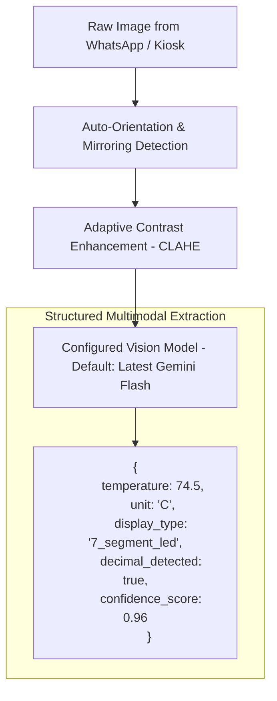
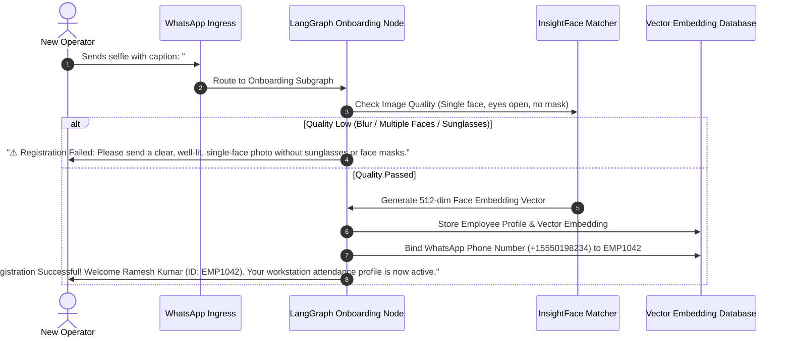
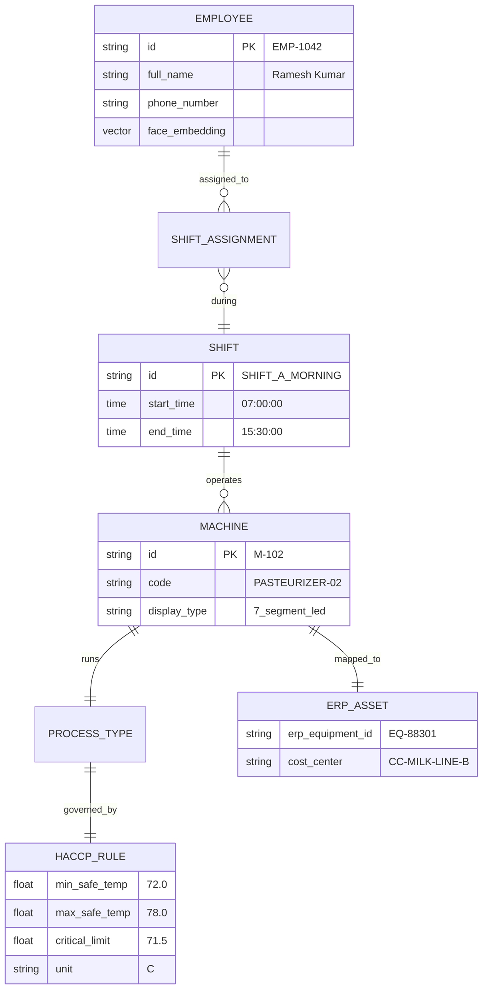
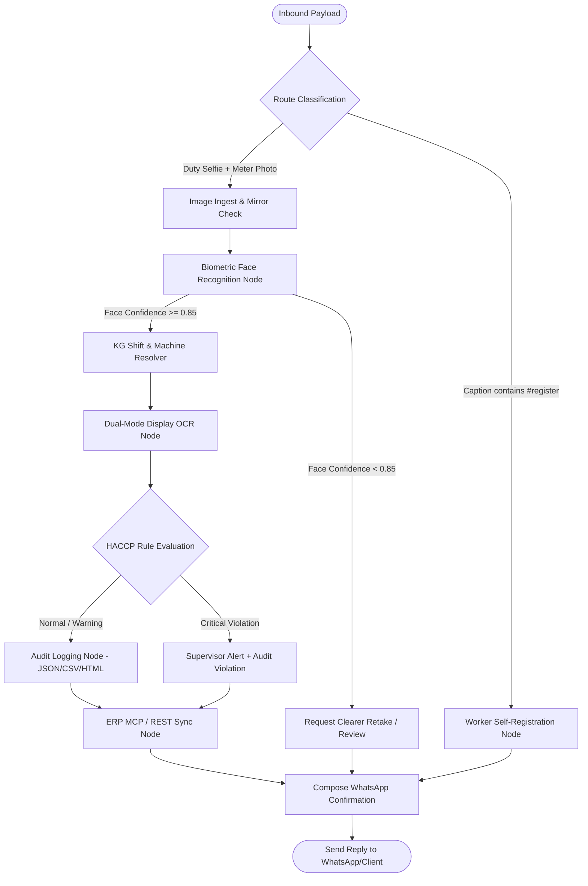
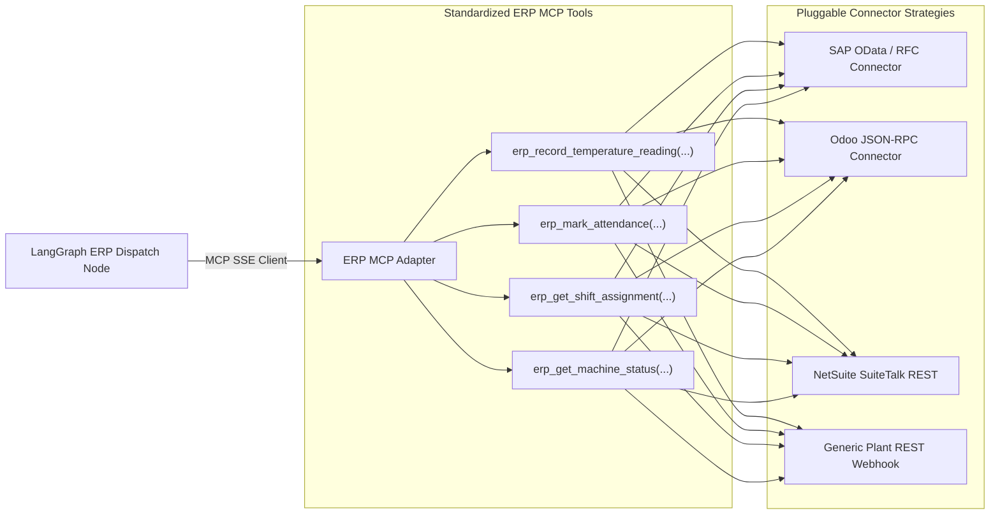

# APPLICATION SPECIFICATION: FOOD TEMPERATURE & ATTENDANCE MARKER
## Domain Application Cartridge (`Release100`)

**Document ID:** `03_app_temperature_marker`  
**Document Version:** `v1.0.0`  
**Date:** September 13, 2026  
**Status:** DRAFT / UNDER REVIEW  
**Target Package:** `D:\Release100\apps\temperature_marker`  
**Master Plan Reference:** `D:\Release100\plans\01_master_platform_architecture_v1.2.md`  
**Core Orchestrator Reference:** `D:\Release100\plans\02_orchestrator_core_v1.1.md`  

---

## Document Revision History & Changelog

| Version | Date | Author | Description of Changes | Status |
| :--- | :--- | :--- | :--- | :--- |
| **v1.0.0** | 2026-09-13 | AI Architecture Team | Initial Domain Specification: Plugin contract, LangGraph state machine, dual-mode 7-segment/LCD OCR, face recognition, WhatsApp self-onboarding, Knowledge Graph shift inference, Progressive Stepper Admin Wizard, and ERP MCP Adapter. | Proposed |

---

## 1. Application Mission & Business Context

The **Food Temperature & Attendance Marker** (`temperature_marker`) is an intelligent industrial automation cartridge that plugs into `Release100`. It automates the routine operational duty checks in food processing plants (dairy, meat processing, industrial bakeries, cold chains, breweries).

### Business Problem Solved:
1. **Attendance & Biometric Proof of Presence**: Eliminates proxy attendance and manual punch cards by verifying the operator's live face at their designated workstation.
2. **Contactless Machine Telemetry**: Digitizes analog/digital machine readings (ovens, pasteurizers, blast freezers) directly from operator selfies without expensive IoT retrofits on legacy machinery.
3. **Automated Food Safety (HACCP) Compliance**: Validates temperatures in real-time against Critical Control Point (CCP) thresholds to prevent batch spoilage.
4. **Instant ERP Synchronization**: Commits immutable attendance and quality telemetry into the enterprise ERP (SAP, Odoo, NetSuite) via the Model Context Protocol (MCP) or direct REST.

---

## 2. Application Plugin Contract (`plugin.py`)

The application integrates with the core platform by implementing the `BaseApplication` interface:

```python
from pydantic import BaseModel
from fastapi import APIRouter
from langgraph.graph import StateGraph
from core_platform.app.plugin_engine.base_plugin import BaseApplication
from .graph.state_graph import build_temperature_marker_graph
from .ui.routes import router as ui_router
from .erp.mcp_tools import get_temperature_marker_mcp_tools

class TemperatureMarkerConfig(BaseModel):
    default_temperature_unit: str = "C"
    default_fever_threshold: float = 37.5
    haccp_alert_recipients: list[str] = []
    enable_erp_sync: bool = True
    erp_connection_type: str = "mcp"   # "mcp" | "rest"
    auto_save_draft_interval_sec: int = 5

class TemperatureMarkerApplication(BaseApplication):
    app_id: str = "temperature_marker"
    name: str = "Food Processing Temperature & Attendance Marker"
    version: str = "1.0.0"
    config_schema = TemperatureMarkerConfig
    required_roles = ["operator", "supervisor", "admin"]
    supported_channels = ["whatsapp", "web_kiosk", "mcp_agent"]

    def get_workflow_graph(self) -> StateGraph:
        return build_temperature_marker_graph()

    def get_ui_router(self) -> APIRouter:
        return ui_router

    def get_mcp_tools(self) -> list:
        return get_temperature_marker_mcp_tools()
```

---

## 3. Dual-Mode Computer Vision OCR Engine (7-Segment LED & LCD)

Food processing machines present distinct optical challenges:
- **7-Segment LEDs (Red/Green)**: Prone to optical blooming, lens glare, flickering, and faint decimal points.
- **LCD Displays (Grey Backlit/Reflective)**: Prone to low contrast, ambient factory shadows, and viewing angle distortion.
- **Front Camera Mirroring**: Smartphone selfie cameras often horizontally mirror numbers (e.g., `74.5` becomes inverted `24.Γ`).



### 3.1. Vision Extraction Structured Schema
```json
{
  "type": "object",
  "properties": {
    "temperature_value": { 
      "type": "number", 
      "description": "The exact numeric temperature reading extracted from the display." 
    },
    "unit": { 
      "type": "string", 
      "enum": ["C", "F", "UNKNOWN"],
      "description": "Temperature unit displayed on the meter or panel." 
    },
    "display_type": { 
      "type": "string", 
      "enum": ["7_segment_led", "lcd_screen", "analog_dial", "other"] 
    },
    "decimal_point_present": { "type": "boolean" },
    "confidence_score": { 
      "type": "number", 
      "minimum": 0.0, 
      "maximum": 1.0 
    },
    "readability_issues": { 
      "type": "string", 
      "description": "Notes on glare, steam, occlusion, or blur if detected." 
    }
  },
  "required": ["temperature_value", "unit", "display_type", "confidence_score"]
}
```

---

## 4. Biometric Face Recognition & WhatsApp Self-Onboarding Flow



### Biometric Safeguards:
- **Phone Binding**: Ties the operator's verified WhatsApp phone number to their employee ID, preventing identity spoofing.
- **Cosine Distance Threshold**: Matches live faces against registered vectors with a cosine similarity threshold of $\ge 0.85$.
- **Audit Thumbnail**: Stores a small, secure face crop hash for verification history.

---

## 5. Knowledge Graph: Shift Scheduling & HACCP Rule Inference

The **Knowledge Graph** acts as the single source of truth connecting employees, active shift rosters, factory equipment, and food safety standards.

### 5.1. Graph Ontology & Relationships



### 5.2. Dynamic Shift Inference Algorithm
When operator `EMP-1042` submits an image at `08:15 AM`:
1. The system resolves the employee profile from the face embedding.
2. It queries the active shift matching `start_time <= 08:15 <= end_time` (`SHIFT_A_MORNING`).
3. It resolves the machine assigned to this worker for this shift (`PASTEURIZER-02`).
4. It loads the HACCP thresholds for `PASTEURIZER-02` (Safe: 72.0°C – 78.0°C, Critical Limit: 71.5°C).
5. **Zero User Guesswork**: The worker never has to type the machine name or search a menu.

---

## 6. LangGraph Stateful Workflow Architecture



### The Strongly-Typed `TemperatureMarkerState`
```python
from typing import TypedDict, Optional
from PIL import Image

class TemperatureMarkerState(TypedDict):
    # Ingestion & Session
    sender_phone: str
    envelope_id: str
    raw_image_bytes: bytes
    raw_image: Optional[Image.Image]
    is_mirrored: bool
    
    # Biometric Identification
    employee_id: Optional[str]
    employee_name: Optional[str]
    face_confidence: float
    face_verified: bool
    
    # Knowledge Graph Shift Resolution
    active_shift_id: Optional[str]
    assigned_machine_id: Optional[str]
    assigned_machine_name: Optional[str]
    haccp_min_temp: Optional[float]
    haccp_max_temp: Optional[float]
    haccp_critical_limit: Optional[float]
    haccp_unit: str
    
    # Vision OCR Readout
    temperature_value: Optional[float]
    temperature_unit: Optional[str]
    display_type: Optional[str]
    ocr_confidence: float
    
    # Compliance & Evaluation
    haccp_status: str             # "NORMAL" | "WARNING" | "CRITICAL_VIOLATION"
    is_compliant: bool
    
    # ERP Synchronization
    erp_transaction_id: Optional[str]
    erp_sync_status: str          # "COMMITTED" | "QUEUED" | "FAILED"
    
    # Output
    reply_message: str
    supervisor_alert_message: Optional[str]
```

---

## 7. Progressive Stepper Admin Wizard UI

The application mounts a clean, step-by-step setup wizard directly into the Orchestrator's web shell at `/admin/apps/temperature-marker/wizard`:

```
[Step 1: Machine] ──> [Step 2: AI HACCP Limits] ──> [Step 3: Assign Operator] ──> [Step 4: ERP & Review]
     (Draft)                    (Draft)                      (Draft)                    (Live)
```

### The 4 Progressive Steps:

#### Step 1: Register Machine
- **Machine Name & Code**: e.g., `Milk Pasteurizer Line B` (`PASTEURIZER-02`).
- **Display Type**: `[🔘 Red/Green 7-Segment LED]` or `[🔘 Grey LCD Screen]`.
- **Process Type**: Dropdown (Pasteurization, Blast Freezing, Fermentation, Baking).

#### Step 2: AI-Assisted HACCP Recommendations
- When the process type is selected, the system queries the configured LLM for **standard industry food safety baselines**:
  > **AI Recommendation for HTST Milk Pasteurization:**  
  > Safe Band: **72.0°C – 75.0°C** | Critical Minimum: **71.5°C** | Unit: **Celsius (°C)**  
  > *Citation: US FDA Grade 'A' Pasteurized Milk Ordinance (PMO) & Codex Alimentarius.*
- **Admin Control**: Admin clicks `[Accept Recommendation]` or uses sliders to adjust values to plant-specific SOPs.

#### Step 3: Assign Operator ("One Person, One Machine" Baseline)
- **Operator Name & Employee Code**: e.g., `Ramesh Kumar` (`EMP-1042`).
- **WhatsApp Phone Number**: `+1 555 019 8234`.
- **Enrollment Action**:
  - `[Upload Reference Photo]` OR
  - `[Send WhatsApp Invite Link]` (Bot invites the worker to send an onboarding selfie).

#### Step 4: ERP Connection & Activation
- Select target ERP mapping: Equipment Code in SAP/Odoo (`EQ-88301`).
- Supervisor phone number for instant HACCP violation alerts.
- Final one-click `[Activate Workstation]` button.

### Auto-Save & Resume Engine:
Every keystroke and dropdown selection auto-saves to the local `draft_configurations` table via `POST /admin/drafts/save`. If an admin closes their browser or loses Wi-Fi on the plant floor, an instant prompt offers to resume the unfinished workstation setup.

---

## 8. Dedicated ERP MCP Server Adapter

The application features a modular ERP MCP Adapter exposing four standardized tools:



### Tool Contracts:
1. `erp_record_temperature_reading`: Commits machine ID, operator ID, temperature, unit, HACCP status, timestamp, and image SHA-256 hash. Returns `transaction_id`.
2. `erp_mark_attendance`: Clocks the operator in for the scheduled shift. Returns `attendance_id`.
3. `erp_get_shift_assignment`: Queries scheduled equipment for a worker at a specific timestamp.
4. `erp_get_machine_status`: Retrieves maintenance status and active product batch.

---

## 9. Package & Directory Layout (`apps/temperature_marker/`)

```text
D:\Release100\apps\temperature_marker/
├── plugin.py                          # BaseApplication implementation manifest
├── requirements.txt                   # App-specific dependencies (insightface, opencv-python)
│
├── graph/                             # LangGraph Stateful Workflow
│   ├── __init__.py
│   ├── state.py                       # TemperatureMarkerState TypedDict
│   ├── state_graph.py                 # Graph assembly & conditional edges
│   └── nodes/                         # Discrete execution nodes
│       ├── __init__.py
│       ├── ingest_node.py             # Orientation, mirroring check & CLAHE
│       ├── face_node.py               # Biometric face matching
│       ├── onboarding_node.py         # #register conversational self-onboarding
│       ├── kg_inference_node.py       # Shift & machine lookup
│       ├── ocr_node.py                # Dual-mode 7-segment / LCD vision extraction
│       ├── haccp_node.py              # Food safety rule evaluation
│       ├── audit_node.py              # Tri-format compliance logging
│       ├── erp_node.py                # ERP MCP dispatch
│       └── reply_node.py              # WhatsApp & supervisor notification composer
│
├── skills/                            # Computer Vision Engines
│   ├── __init__.py
│   ├── face_recognizer.py             # InsightFace embedding extractor & cosine matcher
│   ├── display_ocr.py                 # Gemini Flash structured vision extractor
│   └── image_enhancer.py              # CLAHE contrast & glare reduction
│
├── knowledge_graph/                   # Factory Topology & HACCP Rules
│   ├── __init__.py
│   ├── schema.py                      # Node & Edge type definitions
│   ├── service.py                     # Shift traversal & rule lookup service
│   └── default_factory_graph.json     # Initial machine roster & HACCP thresholds
│
├── erp/                               # ERP MCP Adapter & Connectors
│   ├── __init__.py
│   ├── mcp_tools.py                   # Tool definitions exposed to MCP
│   ├── base_connector.py              # Abstract ERP connector strategy
│   ├── sap_connector.py               # SAP OData integration
│   ├── odoo_connector.py              # Odoo JSON-RPC integration
│   └── rest_connector.py              # Generic REST webhook fallback
│
├── ui/                                # Progressive Stepper Admin Wizard
│   ├── __init__.py
│   ├── routes.py                      # FastAPI routes for /admin/apps/temperature-marker
│   ├── templates/                     # Jinja2 templates (Stepper Wizard, Logs Table)
│   └── static/                        # CSS, machine icon badges, JS auto-save logic
│
└── database/                          # Local Storage & Biometric Vectors
    ├── __init__.py
    ├── models.py                      # SQLAlchemy models: Employee, Machine, AttendanceRecord
    └── db_service.py                  # CRUD operations & vector search
```

---

## 10. Next Steps

With **Plan 3 (`03_app_temperature_marker_v1.0.md`)** established, the domain specifications for the food processing temperature and attendance marker are complete.

We will now proceed to **Plan 4: Re-architected Mail Organizer Application Specification** (`04_app_mail_organizer_v1.0.md`), detailing how `D:\mailOrganizer` is modularized into a clean plug-in cartridge without regressing its Gmail/Calendar capabilities.
