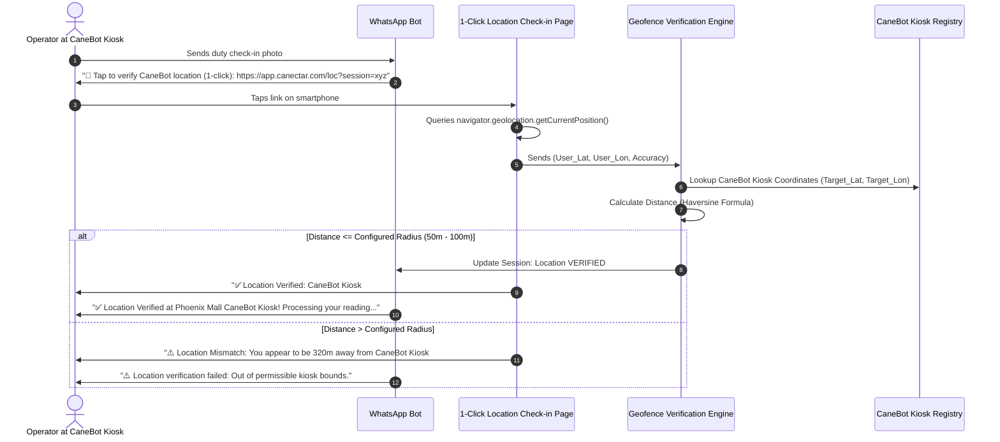
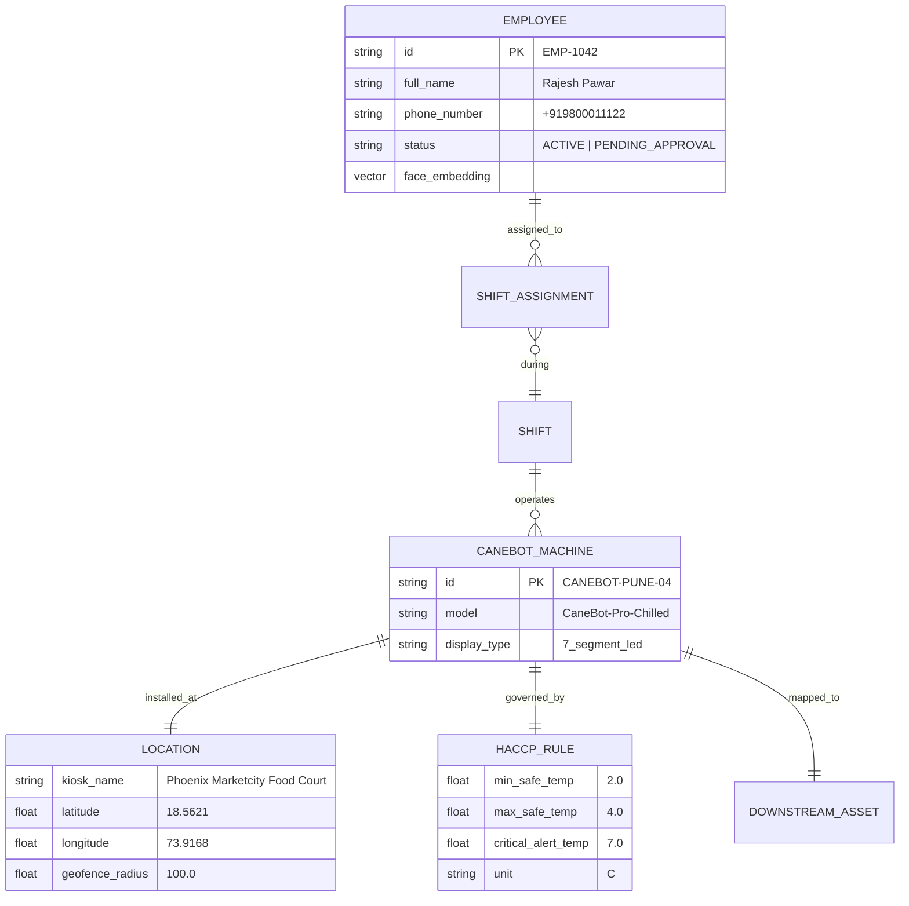
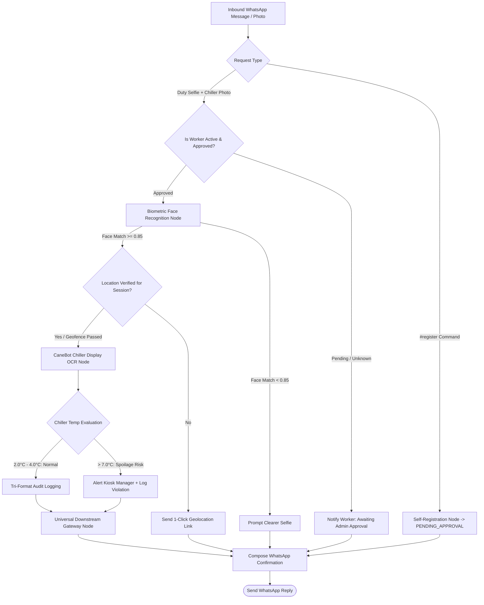
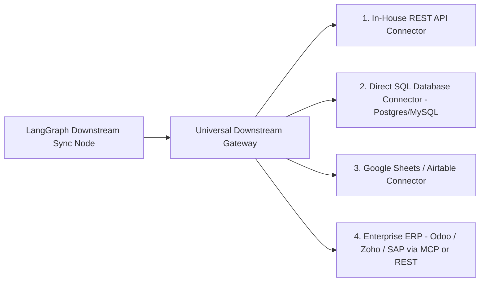

# APPLICATION SPECIFICATION: FOOD TEMPERATURE & ATTENDANCE MARKER
## Domain Application Cartridge (`Release100`)

**Document ID:** `03_app_temperature_marker`  
**Document Version:** `v1.1.0`  
**Date:** September 14, 2026  
**Status:** DRAFT / UNDER REVIEW  
**Target Package:** `D:\Release100\apps\temperature_marker`  
**Master Plan Reference:** `D:\Release100\plans\01_master_platform_architecture_v1.2.md`  
**Core Orchestrator Reference:** `D:\Release100\plans\02_orchestrator_core_v1.1.md`  

---

## Document Revision History & Changelog

| Version | Date | Author | Description of Changes | Status |
| :--- | :--- | :--- | :--- | :--- |
| **v1.0.0** | 2026-09-13 | AI Architecture Team | Initial Domain Specification: Plugin contract, LangGraph state machine, dual-mode 7-segment/LCD OCR, face recognition, WhatsApp self-onboarding, Knowledge Graph shift inference, Progressive Stepper Admin Wizard, and ERP MCP Adapter. | Superseded |
| **v1.1.0** | 2026-09-14 | AI Architecture Team | **Incorporated Operational Decisions**: <br>1. **Default Reference**: Grounded in **Canectar Foods Pvt Ltd** and the **CaneBot sugarcane juice machine** as the primary indicator and default reference template.<br>2. **Location Verification (Option 4)**: Added 1-Click Web Geolocation Link (Browser HTML5 GPS) with Haversine geofencing (50m default, 100m indoor tolerance).<br>3. **Two-Track Registration with Admin Approval Gate**: Added direct Admin Employee Registration alongside WhatsApp self-onboarding requiring mandatory Admin verification (`PENDING_APPROVAL`).<br>4. **Universal Downstream Gateway**: Expanded beyond ERP to support In-House REST APIs, Direct Databases, Cloud Spreadsheets, and ERP/MCP connectors. | **Current** |

---

## 1. Application Mission & Business Context

The **Food Temperature & Attendance Marker** (`temperature_marker`) is an intelligent industrial automation cartridge that plugs into `Release100`. 

### Primary Reference & Default Implementation:
The platform uses **Canectar Foods Pvt Ltd** and its **CaneBot sugarcane crushing juice machines** as the primary operational template and indicator:
* **Perishability Challenge**: Freshly crushed sugarcane juice ferments and oxidizes rapidly if not chilled immediately. Maintaining the juice chiller/dispenser temperature within **2.0°C to 4.0°C** (with warning at **> 7.0°C**) is mission-critical for food hygiene, FSSAI compliance, and beverage quality.
* **Retail Footprint**: CaneBot machines are deployed across retail kiosks, malls, metro stations, and food courts.
* **Extensibility**: While Canectar Foods and CaneBot serve as the concrete default, all parameters (process types, temperature limits, equipment codes) are fully configurable, enabling any food processing organization (dairy, bakeries, cold storages) to deploy the same cartridge.

### Core Automated Capabilities:
1. **Biometric Attendance Verification**: Operator identity verified at the machine via facial recognition.
2. **Contactless Display OCR**: Reads the digital temperature display (7-segment LED or LCD) from operator selfies.
3. **1-Click GPS Geofencing (Option 4)**: Validates physical proximity to the registered CaneBot kiosk location within 50–100 meters.
4. **Automated HACCP / Safety Evaluation**: Checks temperature thresholds in real time.
5. **Universal Downstream Dispatch**: Transmits validated telemetry to In-House REST backends, central databases, cloud spreadsheets, or enterprise ERPs.

---

## 2. Application Plugin Contract (`plugin.py`)

The application implements the `BaseApplication` interface:

```python
from pydantic import BaseModel, Field
from fastapi import APIRouter
from langgraph.graph import StateGraph
from core_platform.app.plugin_engine.base_plugin import BaseApplication
from .graph.state_graph import build_temperature_marker_graph
from .ui.routes import router as ui_router
from .downstream.mcp_tools import get_temperature_marker_mcp_tools

class TemperatureMarkerConfig(BaseModel):
    # Reference organization & machine
    organization_name: str = "Canectar Foods Pvt Ltd"
    default_machine_type: str = "CaneBot Sugarcane Crushing Machine"
    
    # Temperature defaults (Canectar Chiller baseline)
    default_unit: str = "C"
    safe_min_temp: float = 2.0
    safe_max_temp: float = 4.0
    critical_alert_temp: float = 7.0
    
    # Geofence parameters
    default_geofence_radius_meters: float = 50.0
    indoor_tolerance_radius_meters: float = 100.0
    location_verification_method: str = "web_geolocation"  # Option 4
    
    # Downstream target strategy
    downstream_target_type: str = "in_house_rest"  # "in_house_rest" | "direct_db" | "google_sheets" | "erp_mcp"
    downstream_endpoint_url: Optional[str] = None
    
    # Admin approval flag
    require_admin_approval_for_onboarding: bool = True

class TemperatureMarkerApplication(BaseApplication):
    app_id: str = "temperature_marker"
    name: str = "Canectar CaneBot Temperature & Attendance Marker"
    version: str = "1.1.0"
    config_schema = TemperatureMarkerConfig
    required_roles = ["operator", "supervisor", "admin"]
    supported_channels = ["whatsapp", "web_kiosk", "mcp_agent"]

    def get_workflow_graph(self) -> StateGraph:
        return build_temperature_marker_graph()

    def get_ui_router(self) -> APIRouter:
        return ui_router

    def get_mcp_tools(self) -> list:
        return get_temperature_marker_mcp_tools()
```

---

## 3. Location Verification & Geofencing (Option 4: 1-Click Web Geolocation)

To guarantee that the operator is physically present at the specific CaneBot kiosk without forcing them to manually attach WhatsApp location pins with every message, the application implements **1-Click Web Geolocation Link**:



### Mathematical Geofence Specification:
The distance between the user’s browser coordinates $(\phi_1, \lambda_1)$ and the CaneBot machine’s registered coordinates $(\phi_2, \lambda_2)$ is computed via the **Haversine Formula**:

$$a = \sin^2\left(\frac{\Delta\phi}{2}\right) + \cos(\phi_1)\cos(\phi_2)\sin^2\left(\frac{\Delta\lambda}{2}\right)$$
$$c = 2 \cdot \text{atan2}\left(\sqrt{a}, \sqrt{1-a}\right)$$
$$d = R \cdot c \quad (\text{where } R = 6,371,000 \text{ meters})$$

* **Base Outdoor Permissible Range**: **50 meters**.
* **Indoor Mall / Basement Metro Tolerance**: Configurable up to **100 meters** (accounts for smartphone multipath GPS degradation indoors).

---

## 4. Two-Track Employee Registration & Admin Approval Workflow

To prevent unauthorized attendance logging or fraudulent self-registration, the system enforces strict administrative oversight:

```mermaid
graph TD
    subgraph "Track 1: Direct Admin Registration (Primary)"
        AdminUI[Admin Dashboard /admin] --> AddOperatorForm[Admin Enters: Name, EMP Code, Phone, CaneBot ID]
        AddOperatorForm --> UploadPhoto[Admin Uploads Reference Face Photo]
        UploadPhoto --> SetActiveImmediate[Operator Status: ACTIVE immediately]
    end

    subgraph "Track 2: Field Self-Onboarding via WhatsApp (Secondary)"
        FieldWorker[Worker on WhatsApp] --> SendRegister[Sends: #register EMP-101 Rajesh Pawar + Selfie]
        SendRegister --> QualityCheck{Image Quality Check}
        QualityCheck -->|Failed| PromptRetake[Prompt Clearer Photo]
        QualityCheck -->|Passed| GenVector[Generate Face Embedding Vector]
        GenVector --> SetPendingApproval[Operator Status: PENDING_ADMIN_APPROVAL]
        
        SetPendingApproval --> AdminNotification[Admin Dashboard Badge: New Operator Approval Request]
        AdminNotification --> AdminReview{Admin Decision}
        AdminReview -->|Approved| MarkActive[Operator Status: ACTIVE]
        AdminReview -->|Rejected| MarkRejected[Operator Status: REJECTED]
    end
```



### Operational Rules:
1. **Unapproved Guardrail**: If an operator with status `PENDING_ADMIN_APPROVAL` attempts to log temperature or attendance, the bot responds:
   > *"⏳ Your profile for CaneBot Kiosk is awaiting Supervisor Approval. Please contact your manager to activate your account."*
2. **Phone Number Binding**: The operator's WhatsApp phone number is permanently bound to their employee profile upon activation.

---

## 5. Dual-Mode Computer Vision OCR Engine (CaneBot Display)

CaneBot machines feature digital temperature indicators monitoring juice chilling:
- Red/Green 7-segment illuminated LED digits or backlit LCD screens.
- Front camera mirroring auto-detection & horizontal flip.
- Adaptive histogram equalization (CLAHE) to suppress shop-floor reflections and acrylic panel glare.

```json
{
  "machine_context": "Canectar CaneBot Sugarcane Chiller",
  "temperature_reading": {
    "value": 3.4,
    "unit": "C",
    "display_type": "7_segment_led",
    "decimal_detected": true,
    "confidence": 0.97
  },
  "haccp_evaluation": {
    "status": "NORMAL",
    "safe_band": "2.0°C - 4.0°C",
    "is_compliant": true
  }
}
```

---

## 6. Knowledge Graph: Kiosk Rosters & HACCP Thresholds



---

## 7. LangGraph Stateful Workflow Architecture



---

## 8. Progressive Stepper Admin Wizard UI

Hosted on `/admin/apps/temperature-marker/wizard`:

```
[Step 1: CaneBot Kiosk] ──> [Step 2: Chiller Temp Limits] ──> [Step 3: Assign Operator] ──> [Step 4: Downstream & Review]
        (Draft)                       (Draft)                         (Draft)                      (Live)
```

### Step 1: Register CaneBot Kiosk
- **Machine Code**: e.g., `CANEBOT-PUNE-04`.
- **Location Name**: e.g., `Phoenix Marketcity Mall, Viman Nagar`.
- **GPS Coordinates**: Latitude: `18.5621`, Longitude: `73.9168`.
- **Geofence Radius**: `[🔘 50m (Street/Kiosk)]` or `[🔘 100m (Indoor Mall)]`.
- **Display Meter**: `[🔘 Red 7-Segment LED]` or `[🔘 Grey LCD Screen]`.

### Step 2: Temperature & Food Safety Limits
- Pre-filled with Canectar CaneBot defaults:
  - Minimum Safe Chiller Temp: **2.0°C**
  - Maximum Safe Chiller Temp: **4.0°C**
  - Critical Alert Limit: **7.0°C**
- Configurable alert recipient phone number (Kiosk Operations Lead).

### Step 3: Assign Operator & Manage Approvals
- Option A: Add new operator directly with photo upload (instantly `ACTIVE`).
- Option B: Review field self-onboarding queue (`[Approve]` / `[Reject]`).

### Step 4: Universal Downstream Gateway Setup
- Choose Destination Type from dropdown:
  - `[🔘 In-House REST API]` (Enter Webhook URL + Bearer token)
  - `[🔘 Direct Database]` (Enter PostgreSQL/MySQL connection string)
  - `[🔘 Google Sheets]` (Enter Service Account JSON + Sheet ID)
  - `[🔘 Enterprise ERP]` (Enter Odoo/Zoho/SAP endpoint or MCP Server)
- One-click `[Activate Kiosk]` button.

---

## 9. Pluggable Universal Downstream Gateway

The application does not assume a single ERP vendor. It implements a pluggable `BaseDownstreamConnector` strategy:



### Standardized Payload Schema Dispatched Downstream:
```json
{
  "event_type": "canebot_duty_log",
  "timestamp_iso": "2026-09-14T08:30:15.000Z",
  "organization": "Canectar Foods Pvt Ltd",
  "machine_id": "CANEBOT-PUNE-04",
  "kiosk_location": "Phoenix Marketcity Food Court",
  "operator": {
    "employee_id": "EMP-1042",
    "name": "Rajesh Pawar",
    "phone": "+919800011122"
  },
  "telemetry": {
    "chiller_temperature_celsius": 3.4,
    "display_type": "7_segment_led",
    "haccp_status": "NORMAL",
    "is_within_safe_band": true
  },
  "verification": {
    "face_confidence": 0.96,
    "location_verified": true,
    "geofence_distance_meters": 34.2,
    "image_sha256": "e3b0c44298fc1c149afbf4c8996fb92427ae41e4649b934ca495991b7852b855"
  }
}
```

---

## 10. Package & Directory Layout (`apps/temperature_marker/`)

```text
D:\Release100\apps\temperature_marker/
├── plugin.py                          # BaseApplication implementation manifest
├── requirements.txt                   # insightface, opencv-python, geopy
│
├── graph/                             # LangGraph Stateful Workflow
│   ├── __init__.py
│   ├── state.py                       # TemperatureMarkerState TypedDict
│   ├── state_graph.py                 # Graph assembly & conditional edges
│   └── nodes/                         # Discrete execution nodes
│       ├── __init__.py
│       ├── ingest_node.py             # Orientation, mirroring check & CLAHE
│       ├── auth_guard_node.py         # Verify ACTIVE vs PENDING_APPROVAL status
│       ├── face_node.py               # Biometric face matching
│       ├── onboarding_node.py         # #register conversational self-onboarding
│       ├── location_node.py           # 1-Click web geolocation verification
│       ├── kg_inference_node.py       # CaneBot kiosk & roster lookup
│       ├── ocr_node.py                # Dual-mode 7-segment / LCD vision extraction
│       ├── haccp_node.py              # CaneBot 2°C-4°C safety evaluation
│       ├── audit_node.py              # Tri-format compliance logging
│       ├── downstream_node.py         # Universal downstream gateway dispatch
│       └── reply_node.py              # WhatsApp & supervisor notification composer
│
├── skills/                            # Computer Vision Engines
│   ├── __init__.py
│   ├── face_recognizer.py             # InsightFace embedding extractor & cosine matcher
│   ├── display_ocr.py                 # Configurable vision model display reader
│   └── image_enhancer.py              # CLAHE contrast & glare reduction
│
├── location/                          # Location & Geofencing Engine
│   ├── __init__.py
│   ├── haversine.py                   # Distance calculation & geofence validation
│   └── web_checkin.py                 # FastAPI endpoints for 1-click HTML5 GPS check-in
│
├── knowledge_graph/                   # Factory Topology & HACCP Rules
│   ├── __init__.py
│   ├── schema.py                      # Node & Edge type definitions
│   ├── service.py                     # Kiosk roster & rule lookup service
│   └── default_canectar_graph.json    # CaneBot machine roster & chiller thresholds
│
├── downstream/                        # Pluggable Downstream Gateway
│   ├── __init__.py
│   ├── base_connector.py              # Abstract DownstreamConnector interface
│   ├── in_house_rest.py               # In-House Webhook/REST JSON POST
│   ├── direct_database.py             # Direct PostgreSQL/MySQL insert
│   ├── google_sheets.py               # Google Sheets API append
│   ├── erp_connector.py               # Odoo/Zoho/SAP connector
│   └── mcp_tools.py                   # Standardized MCP tools
│
├── ui/                                # Progressive Stepper Admin Wizard
│   ├── __init__.py
│   ├── routes.py                      # FastAPI routes for /admin/apps/temperature-marker
│   ├── templates/                     # Jinja2 templates (CaneBot Stepper, Approvals Tab)
│   └── static/                        # CSS, CaneBot badges, JS auto-save & GPS scripts
│
└── database/                          # Local Storage & Biometric Vectors
    ├── __init__.py
    ├── models.py                      # SQLAlchemy models: Employee, CaneBotMachine, AttendanceRecord
    └── db_service.py                  # CRUD operations, approvals & vector search
```

---

## 11. Next Steps

With **Plan 3 updated to `v1.1.0`**, the Food Temperature & Attendance Marker application is fully specified with:
1. **Canectar Foods & CaneBot** as the primary indicator and default template.
2. **Option 4 Web Geolocation** with 50m–100m geofencing.
3. **Two-track employee registration** with Admin verification gate.
4. **Pluggable Universal Downstream Gateway** supporting In-House REST, Direct DB, Spreadsheets, and ERP/MCP.

We are now ready to proceed to **Plan 4: Re-architected Mail Organizer Application Specification** (`04_app_mail_organizer_v1.0.md`).
