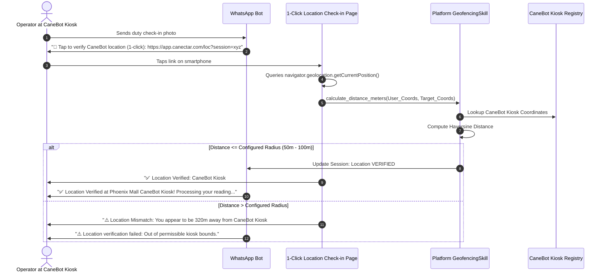
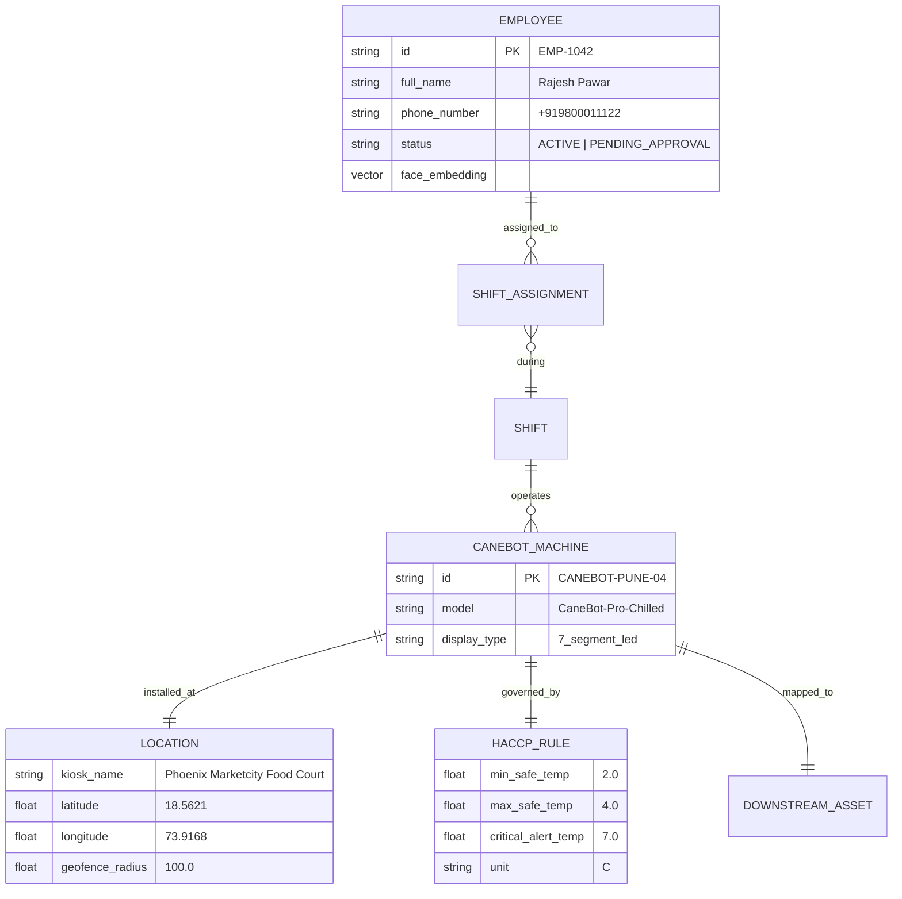
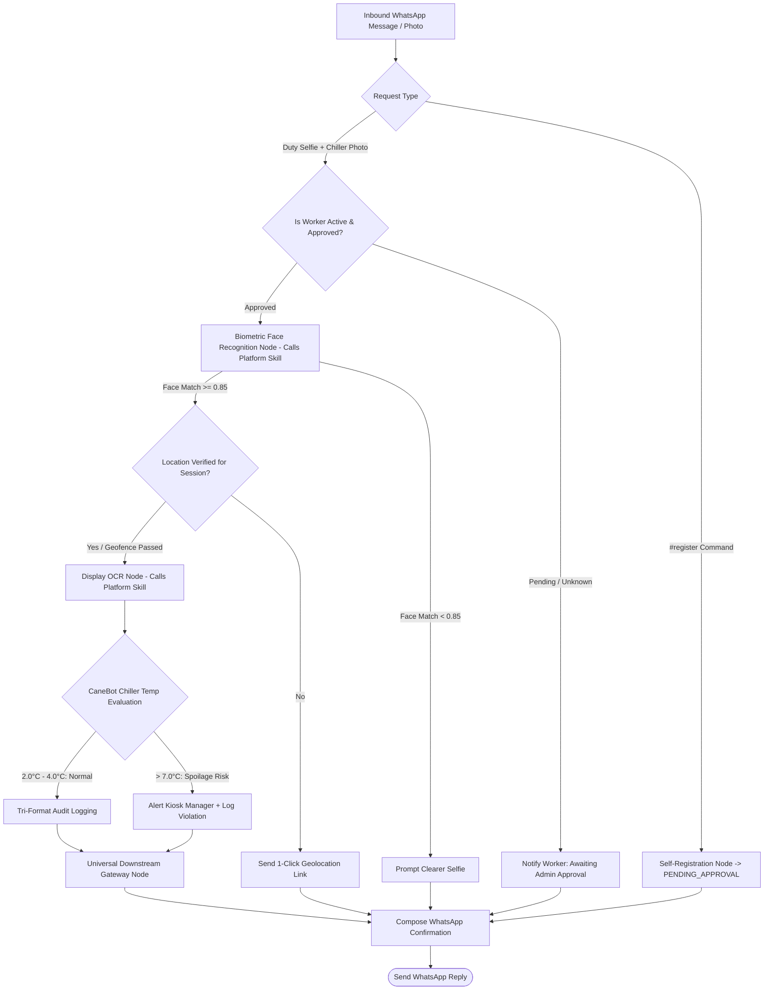
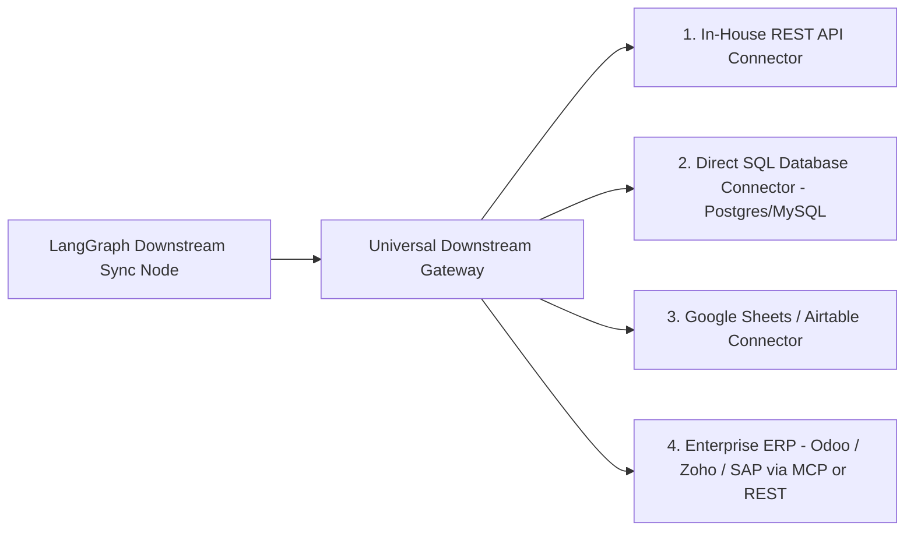

# APPLICATION SPECIFICATION: FOOD TEMPERATURE & ATTENDANCE MARKER
## Domain Application Cartridge (`Release100`)

**Document ID:** `03_app_temperature_marker`  
**Document Version:** `v1.2.0`  
**Date:** September 14, 2026  
**Status:** DRAFT / UNDER REVIEW  
**Target Package:** `D:\Release100\apps\temperature_marker`  
**Master Plan Reference:** `D:\Release100\plans\01_master_platform_architecture_v1.3.md`  
**Core Orchestrator Reference:** `D:\Release100\plans\02_orchestrator_core_v1.2.md`  

---

## Document Revision History & Changelog

| Version | Date | Author | Description of Changes | Status |
| :--- | :--- | :--- | :--- | :--- |
| **v1.0.0** | 2026-09-13 | AI Architecture Team | Initial Domain Specification: Plugin contract, LangGraph state machine, dual-mode 7-segment/LCD OCR, face recognition, WhatsApp self-onboarding, Knowledge Graph shift inference, Progressive Stepper Admin Wizard, and ERP MCP Adapter. | Superseded |
| **v1.1.0** | 2026-09-14 | AI Architecture Team | Grounded in Canectar CaneBot defaults, Option 4 Web Geolocation, Two-Track Registration with Admin Approval, and Universal Downstream Gateway. | Superseded |
| **v1.2.0** | 2026-09-14 | AI Architecture Team | **Refactored to Consume Platform Cognitive Skills**: <br>1. Removed redundant local `skills/` directory; application now consumes `FaceRecognizerSkill`, `DisplayOCRSkill`, `ImageEnhancerSkill`, and `GeofencingSkill` directly from `core_platform/skills/` via `ctx.get_skill()`.<br>2. Kept application ultra-lean, focusing strictly on Canectar CaneBot business rules, Knowledge Graph kiosk rosters, and downstream dispatching. | **Current** |

---

## 1. Application Mission & Business Context

The **Food Temperature & Attendance Marker** (`temperature_marker`) is an intelligent industrial automation cartridge that plugs into `Release100`. 

### Primary Reference & Default Implementation:
The platform uses **Canectar Foods Pvt Ltd** and its **CaneBot sugarcane crushing juice machines** as the primary operational template:
* **Perishability Challenge**: Freshly crushed sugarcane juice ferments and oxidizes rapidly if not chilled immediately. Maintaining the juice chiller/dispenser temperature within **2.0°C to 4.0°C** (with alert at **> 7.0°C**) is mission-critical for food hygiene, FSSAI compliance, and beverage quality.
* **Retail Footprint**: CaneBot machines are deployed across retail kiosks, malls, metro stations, and food courts.
* **Extensibility**: While Canectar Foods and CaneBot serve as the concrete default, all parameters are fully configurable for other organizations.

### Shared Platform Skills Consumed:
Instead of bundling its own computer vision libraries, the application borrows cognitive capabilities OOTB from the Orchestrator:
- `FaceRecognizerSkill` (Identity verification)
- `DisplayOCRSkill` (7-segment LED / LCD temperature readout extraction)
- `ImageEnhancerSkill` (CLAHE contrast & front-camera mirror auto-detection)
- `GeofencingSkill` (Haversine 50m–100m kiosk distance check)

---

## 2. Application Plugin Contract (`plugin.py`)

```python
from pydantic import BaseModel
from fastapi import APIRouter
from langgraph.graph import StateGraph
from core_platform.app.plugin_engine.base_plugin import BaseApplication
from .graph.state_graph import build_temperature_marker_graph
from .ui.routes import router as ui_router
from .downstream.mcp_tools import get_temperature_marker_mcp_tools

class TemperatureMarkerConfig(BaseModel):
    # Reference organization & machine
    organization_name: str = "Canectar Foods Pvt Ltd"
    default_machine_type: str = "CaneBot Sugarcane Crushing Machine"
    
    # Temperature defaults (Canectar Chiller baseline)
    default_unit: str = "C"
    safe_min_temp: float = 2.0
    safe_max_temp: float = 4.0
    critical_alert_temp: float = 7.0
    
    # Geofence parameters
    default_geofence_radius_meters: float = 50.0
    indoor_tolerance_radius_meters: float = 100.0
    location_verification_method: str = "web_geolocation"  # Option 4
    
    # Downstream target strategy
    downstream_target_type: str = "in_house_rest"  # "in_house_rest" | "direct_db" | "google_sheets" | "erp_mcp"
    downstream_endpoint_url: Optional[str] = None
    
    # Admin approval flag
    require_admin_approval_for_onboarding: bool = True

class TemperatureMarkerApplication(BaseApplication):
    app_id: str = "temperature_marker"
    name: str = "Canectar CaneBot Temperature & Attendance Marker"
    version: str = "1.2.0"
    config_schema = TemperatureMarkerConfig
    required_roles = ["operator", "supervisor", "admin"]
    supported_channels = ["whatsapp", "web_kiosk", "mcp_agent"]

    def get_workflow_graph(self) -> StateGraph:
        return build_temperature_marker_graph()

    def get_ui_router(self) -> APIRouter:
        return ui_router

    def get_mcp_tools(self) -> list:
        return get_temperature_marker_mcp_tools()
```

---

## 3. Location Verification & Geofencing (Option 4: 1-Click Web Geolocation)



---

## 4. Two-Track Employee Registration & Admin Approval Workflow

```mermaid
graph TD
    subgraph "Track 1: Direct Admin Registration (Primary)"
        AdminUI[Admin Dashboard /admin] --> AddOperatorForm[Admin Enters: Name, EMP Code, Phone, CaneBot ID]
        AddOperatorForm --> UploadPhoto[Admin Uploads Reference Face Photo]
        UploadPhoto --> SetActiveImmediate[Operator Status: ACTIVE immediately]
    end

    subgraph "Track 2: Field Self-Onboarding via WhatsApp (Secondary)"
        FieldWorker[Worker on WhatsApp] --> SendRegister[Sends: #register EMP-101 Rajesh Pawar + Selfie]
        SendRegister --> QualityCheck{Image Quality Check via Platform Skill}
        QualityCheck -->|Failed| PromptRetake[Prompt Clearer Photo]
        QualityCheck -->|Passed| GenVector[Generate Face Vector via FaceRecognizerSkill]
        GenVector --> SetPendingApproval[Operator Status: PENDING_ADMIN_APPROVAL]
        
        SetPendingApproval --> AdminNotification[Admin Dashboard Badge: New Operator Approval Request]
        AdminNotification --> AdminReview{Admin Decision}
        AdminReview -->|Approved| MarkActive[Operator Status: ACTIVE]
        AdminReview -->|Rejected| MarkRejected[Operator Status: REJECTED]
    end
```



---

## 5. Knowledge Graph: Kiosk Rosters & HACCP Thresholds



---

## 6. LangGraph Stateful Workflow Architecture



---

## 7. Progressive Stepper Admin Wizard UI

Hosted on `/admin/apps/temperature-marker/wizard`:

```
[Step 1: CaneBot Kiosk] ──> [Step 2: Chiller Temp Limits] ──> [Step 3: Assign Operator] ──> [Step 4: Downstream & Review]
        (Draft)                       (Draft)                         (Draft)                      (Live)
```

1. **Step 1: Register CaneBot Kiosk**: Machine Code, Location, GPS Coordinates, Geofence Radius (50m/100m).
2. **Step 2: Chiller Temp Limits**: Default 2.0°C – 4.0°C, Critical Alert at 7.0°C.
3. **Step 3: Assign Operator & Manage Approvals**: Direct registration or pending approvals queue.
4. **Step 4: Universal Downstream Gateway Setup**: Select target (In-House REST, Direct DB, Google Sheets, ERP/MCP).

---

## 8. Pluggable Universal Downstream Gateway



---

## 9. Package & Directory Layout (`apps/temperature_marker/`)

Notice how clean and ultra-lean the application package is now that cognitive skills are hosted at the platform level:

```text
D:\Release100\apps\temperature_marker/
├── plugin.py                          # BaseApplication implementation manifest
├── requirements.txt                   # App dependencies (geopy, jinja2)
│
├── graph/                             # LangGraph Stateful Workflow
│   ├── __init__.py
│   ├── state.py                       # TemperatureMarkerState TypedDict
│   ├── state_graph.py                 # Graph assembly & conditional edges
│   └── nodes/                         # Discrete execution nodes (Consuming Platform Skills)
│       ├── __init__.py
│       ├── ingest_node.py             # Calls ctx.get_skill("image_enhancer")
│       ├── auth_guard_node.py         # Verify ACTIVE vs PENDING_APPROVAL status
│       ├── face_node.py               # Calls ctx.get_skill("face_recognizer")
│       ├── onboarding_node.py         # Field self-onboarding
│       ├── location_node.py           # Calls ctx.get_skill("geofencing")
│       ├── kg_inference_node.py       # CaneBot kiosk & roster lookup
│       ├── ocr_node.py                # Calls ctx.get_skill("display_ocr")
│       ├── haccp_node.py              # CaneBot 2°C-4°C safety evaluation
│       ├── audit_node.py              # Emits tri-format compliance log
│       ├── downstream_node.py         # Universal downstream gateway dispatch
│       └── reply_node.py              # WhatsApp notification composer
│
├── knowledge_graph/                   # Kiosk Rosters & HACCP Rules
│   ├── __init__.py
│   ├── schema.py                      # Node & Edge type definitions
│   ├── service.py                     # Kiosk roster & rule lookup service
│   └── default_canectar_graph.json    # CaneBot machine roster & chiller thresholds
│
├── downstream/                        # Pluggable Downstream Gateway
│   ├── __init__.py
│   ├── base_connector.py              # Abstract DownstreamConnector interface
│   ├── in_house_rest.py               # In-House Webhook/REST JSON POST
│   ├── direct_database.py             # Direct PostgreSQL/MySQL insert
│   ├── google_sheets.py               # Google Sheets API append
│   ├── erp_connector.py               # Odoo/Zoho/SAP connector
│   └── mcp_tools.py                   # Standardized MCP tools
│
├── ui/                                # Progressive Stepper Admin Wizard
│   ├── __init__.py
│   ├── routes.py                      # FastAPI routes for /admin/apps/temperature-marker
│   ├── templates/                     # Jinja2 templates (CaneBot Stepper, Approvals Tab)
│   └── static/                        # CSS, CaneBot badges, JS auto-save & GPS scripts
│
└── database/                          # Local Storage & Biometric Vectors
    ├── __init__.py
    ├── models.py                      # SQLAlchemy models: Employee, CaneBotMachine, AttendanceRecord
    └── db_service.py                  # CRUD operations, approvals & vector search
```

---

## 10. Next Steps

With **Plan 3 updated to `v1.2.0`**, the application is fully aligned with the Core Platform's **Universal Cognitive Skills Library**.

We are now ready to proceed to **Plan 4: Re-architected Mail Organizer Application Specification** (`04_app_mail_organizer_v1.0.md`).
