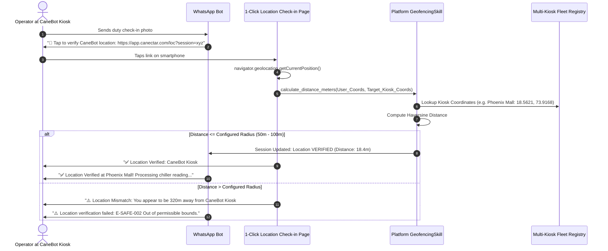
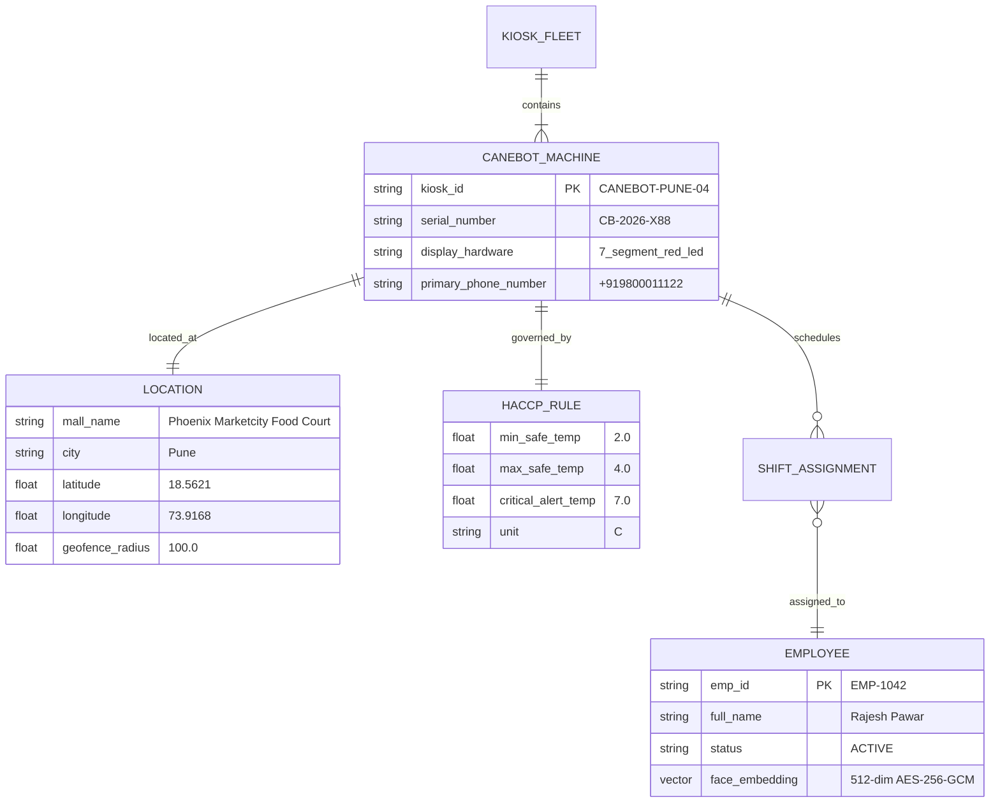
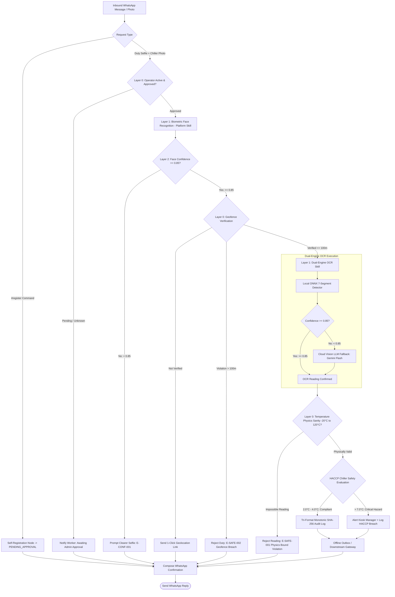
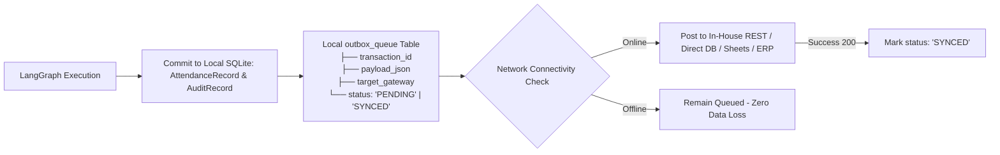

# APPLICATION SPECIFICATION: FOOD TEMPERATURE & ATTENDANCE MARKER
## Domain Application Cartridge (`Release100`)

**Document ID:** `03_app_temperature_marker`  
**Document Version:** `v1.3.0`  
**Date:** September 14, 2026  
**Status:** APPROVED FOR IMPLEMENTATION  
**Target Package:** `D:\Release100\apps\temperature_marker`  
**Master Plan Reference:** `D:\Release100\plans\01_master_platform_architecture_v1.4.md`  
**Core Orchestrator Reference:** `D:\Release100\plans\02_orchestrator_core_v1.3.md`  

---

## Document Revision History & Changelog

| Version | Date | Author | Description of Changes | Status |
| :--- | :--- | :--- | :--- | :--- |
| **v1.0.0** | 2026-09-13 | AI Architecture Team | Initial Domain Specification. | Superseded |
| **v1.1.0** | 2026-09-14 | AI Architecture Team | Grounded in Canectar CaneBot defaults, Option 4 Web Geolocation, Two-Track Registration. | Superseded |
| **v1.2.0** | 2026-09-14 | AI Architecture Team | Refactored to consume Platform Cognitive Skills (`core_platform/skills/`). | Superseded |
| **v1.3.0** | 2026-09-14 | AI Architecture Team | **Architectural Hardening & Multi-Kiosk Fleet Production**: <br>1. Aligned to **Layer 0 (Pre-Execution), Layer 1 (Stochastic AI), and Layer 2 (Post-Execution)** safety gates.<br>2. Implemented **Multi-Kiosk Fleet Architecture from Day 1** across retail malls, food courts, and transit stations.<br>3. Incorporated **Dual-Engine OCR**: Local ONNX 7-segment digit detector as primary edge engine with Cloud Vision LLM (Gemini Flash) fallback.<br>4. Added **Edge Resilience & Offline Outbox Pattern** (local SQLite cache for kiosk internet drops).<br>5. Pluggable face recognition engine aligned with **`ISSUE-001`** commercial compliance.<br>6. Structured error taxonomy with `PlatformErrorCode`. | **Current** |

---

## 1. Application Mission & Multi-Kiosk Fleet Context

The **Food Temperature & Attendance Marker** (`temperature_marker`) is an intelligent industrial automation cartridge that plugs into `Release100`.

### Operational Template (Canectar Foods & CaneBot Fleet):
* **The Mission-Critical Challenge**: Freshly crushed sugarcane juice oxidizes and ferments rapidly if not chilled immediately. Maintaining the juice chiller/dispenser temperature within **2.0°C to 4.0°C** (with alert at **> 7.0°C**) is mission-critical for food hygiene, FSSAI compliance, and beverage quality.
* **Multi-Kiosk Fleet Deployment from Day 1**: Canectar CaneBot machines are deployed across retail kiosks, malls (e.g. Phoenix Marketcity), metro stations, and food courts. Each machine has distinct GPS geofences, operator rosters, and hardware display profiles.
* **Edge Resilience**: Factory and mall retail kiosks frequently suffer 4G/WiFi drops. The cartridge must log temperatures, verify physical bounds, and queue downstream syncs **100% offline**, synchronizing automatically when connectivity recovers.

### Shared Platform Skills Consumed:
The application consumes cognitive capabilities OOTB from the Orchestrator via `ctx.get_skill()`:
- `FaceRecognizerSkill`: Identity verification (commercial-compliant model backend per `ISSUE-001`).
- `DisplayOCRSkill`: Dual-Engine 7-segment LED / LCD temperature extraction (Local ONNX primary + Cloud Vision fallback).
- `ImageEnhancerSkill`: CLAHE contrast & front-camera mirror auto-detection.
- `GeofencingSkill`: High-precision Haversine 50m–100m kiosk distance verification.

---

## 2. Application Plugin Contract (`plugin.py`)

```python
from pydantic import BaseModel, Field
from typing import Optional, List, Dict
from fastapi import APIRouter
from langgraph.graph import StateGraph
from core_platform.app.plugin_engine.base_plugin import BaseApplication
from .graph.state_graph import build_temperature_marker_graph
from .ui.routes import router as ui_router
from .downstream.mcp_tools import get_temperature_marker_mcp_tools

class TemperatureMarkerConfig(BaseModel):
    organization_name: str = "Canectar Foods Pvt Ltd"
    default_machine_type: str = "CaneBot Sugarcane Crushing Machine"
    
    # Temperature defaults (Canectar Chiller baseline)
    default_unit: str = "C"
    safe_min_temp: float = 2.0
    safe_max_temp: float = 4.0
    critical_alert_temp: float = 7.0
    
    # Layer 0 Physical sanity limits (reject physical anomalies before AI)
    physical_sanity_min: float = -20.0
    physical_sanity_max: float = 120.0
    
    # Geofence parameters
    default_geofence_radius_meters: float = 50.0
    indoor_tolerance_radius_meters: float = 100.0
    location_verification_method: str = "web_geolocation"  # Option 4
    
    # Dual-Engine OCR settings
    ocr_local_confidence_threshold: float = 0.85
    enable_cloud_ocr_fallback: bool = True
    
    # Downstream target strategy
    downstream_target_type: str = "in_house_rest"  # "in_house_rest" | "direct_db" | "google_sheets" | "erp_mcp"
    downstream_endpoint_url: Optional[str] = None
    enable_offline_outbox: bool = True
    
    # Admin approval flag
    require_admin_approval_for_onboarding: bool = True

class TemperatureMarkerApplication(BaseApplication):
    app_id: str = "temperature_marker"
    name: str = "Canectar CaneBot Multi-Kiosk Fleet Temperature & Attendance Marker"
    version: str = "1.3.0"
    config_schema = TemperatureMarkerConfig
    required_roles = ["operator", "supervisor", "admin"]
    supported_channels = ["whatsapp", "web_kiosk", "mcp_agent"]

    def get_workflow_graph(self) -> StateGraph:
        return build_temperature_marker_graph()

    def get_ui_router(self) -> APIRouter:
        return ui_router

    def get_mcp_tools(self) -> list:
        return get_temperature_marker_mcp_tools()
```

---

## 3. Location Verification & Geofencing (Option 4: 1-Click Web Geolocation)



---

## 4. Multi-Kiosk Knowledge Graph & Fleet Roster

Supports an arbitrary number of retail kiosks across geographic regions:



---

## 5. LangGraph Stateful Workflow Architecture (Aligned to Layer 0/1/2)



---

## 6. Edge Resilience & Offline Outbox Pattern



---

## 7. Package & Directory Layout (`apps/temperature_marker/`)

```text
D:\Release100\apps\temperature_marker/
├── plugin.py                          # BaseApplication implementation manifest
├── requirements.txt                   # App dependencies (geopy, jinja2)
│
├── graph/                             # LangGraph Stateful Workflow
│   ├── __init__.py
│   ├── state.py                       # TemperatureMarkerState TypedDict
│   ├── state_graph.py                 # Graph assembly & conditional edges
│   └── nodes/                         # Discrete execution nodes
│       ├── __init__.py
│       ├── ingest_node.py             # Calls ctx.get_skill("image_enhancer")
│       ├── layer0_auth_guard.py       # Layer 0: Verify ACTIVE operator
│       ├── layer1_face_node.py        # Layer 1: Face match via platform skill
│       ├── layer2_confidence_node.py  # Layer 2: Confidence < 85% review diversion
│       ├── layer0_location_node.py    # Layer 0: Haversine geofence check
│       ├── kg_inference_node.py       # Multi-kiosk fleet roster & rule lookup
│       ├── layer1_ocr_node.py         # Layer 1: Dual-Engine OCR (Local ONNX + Cloud fallback)
│       ├── layer0_sanity_node.py      # Layer 0: -20°C to 120°C physical sanity
│       ├── haccp_node.py              # CaneBot 2°C-4°C HACCP evaluation
│       ├── audit_node.py              # Emits tri-format monotonic SHA-256 log
│       ├── outbox_node.py             # Enqueues to local offline outbox table
│       └── reply_node.py              # WhatsApp notification composer
│
├── knowledge_graph/                   # Multi-Kiosk Fleet Rosters & HACCP Rules
│   ├── __init__.py
│   ├── schema.py                      # Kiosk, Machine, Shift, Rule models
│   ├── service.py                     # Multi-kiosk fleet lookup service
│   └── canebot_fleet_roster.json      # Roster of all Canectar retail kiosks
│
├── downstream/                        # Pluggable Downstream Gateway
│   ├── __init__.py
│   ├── base_connector.py              # Abstract DownstreamConnector interface
│   ├── in_house_rest.py               # In-House Webhook/REST JSON POST
│   ├── direct_database.py             # Direct PostgreSQL/MySQL insert
│   ├── google_sheets.py               # Google Sheets API append
│   ├── erp_connector.py               # Odoo/Zoho/SAP connector
│   └── mcp_tools.py                   # Standardized MCP tools
│
├── ui/                                # Progressive Stepper Admin Wizard
│   ├── __init__.py
│   ├── routes.py                      # FastAPI routes for /admin/apps/temperature-marker
│   ├── templates/                     # Jinja2 templates (Fleet Map, Kiosk Stepper, Approvals)
│   └── static/                        # CSS, CaneBot badges, Leaflet fleet maps, GPS scripts
│
└── database/                          # Local Storage & Biometric Vectors
    ├── __init__.py
    ├── models.py                      # SQLAlchemy models: Employee, CaneBotMachine, AttendanceRecord, OutboxItem
    └── db_service.py                  # CRUD operations, approvals & vector search
```

---

## 8. Next Steps

With **Plan 3 updated to `v1.3.0`**, we immediately update:
1. **Plan 05 (`05_deployment_and_packaging_hub_v1.2.md`)**: Add multi-kiosk Cloudflare Durable Object routing and Alembic migrations.
2. **Issue 001 (`issues/ISSUE-001_face_model_commercial_licensing.md`)**: Formalize Face Model Licensing ADR.
