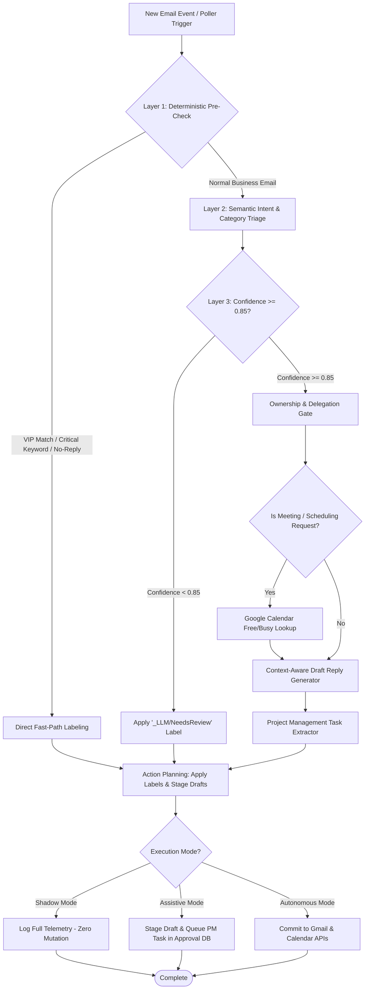
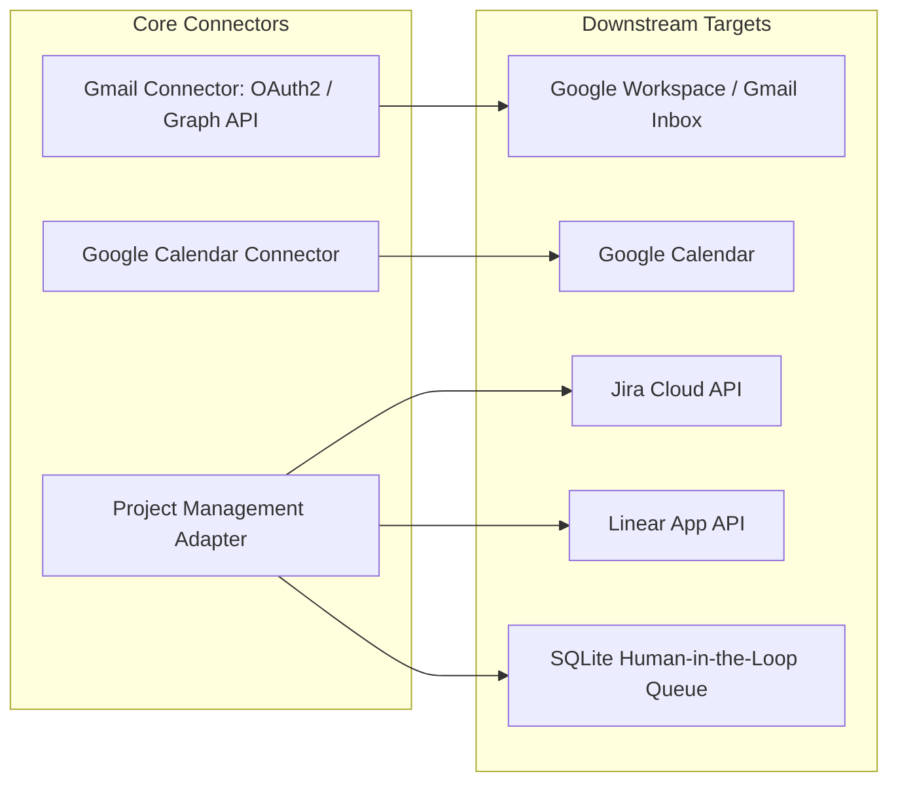

# APPLICATION SPECIFICATION: RE-ARCHITECTED MAIL ORGANIZER
## Domain Application Cartridge (`Release100`)

**Document ID:** `04_app_mail_organizer`  
**Document Version:** `v1.0.0`  
**Date:** September 14, 2026  
**Status:** DRAFT / UNDER REVIEW  
**Target Package:** `D:\Release100\apps\mail_organizer`  
**Master Plan Reference:** `D:\Release100\plans\01_master_platform_architecture_v1.3.md`  
**Core Orchestrator Reference:** `D:\Release100\plans\02_orchestrator_core_v1.2.md`  
**Source Code Baseline:** `D:\mailOrganizer`  

---

## Document Revision History & Changelog

| Version | Date | Author | Description of Changes | Status |
| :--- | :--- | :--- | :--- | :--- |
| **v1.0.0** | 2026-09-14 | AI Architecture Team | Initial Re-architected Mail Organizer Specification: Decoupled application cartridge, LangGraph triage state machine, Gmail & Calendar connectors, PM task queue, dynamic MCP tool export, and Admin UI. | Proposed |

---

## 1. Application Mission & Re-architecture Strategy

The **AI Mail & Calendar Organizer** (`mail_organizer`) is an intelligent executive triage and task automation cartridge that plugs into `Release100`.

### Background & Evolution:
In the original `D:\mailOrganizer` project, email business logic was bundled with low-level infrastructure (a standalone FastAPI server, custom SSE MCP server, safety engine, and telemetry generator).

In `Release100`:
* **Platform Services Offloaded to Core**: Telemetry (JSONL/CSV/HTML), 3-layer safety guardrails, enterprise Google OAuth2/SSO, pluggable LLM provider gateway, and native MCP hosting are now provided **Out-of-the-Box by `core_platform/`**.
* **Clean Application Cartridge**: `apps/mail_organizer/` is now an ultra-lean, pure domain cartridge that implements the `BaseApplication` interface.

### Core Business Capabilities:
1. **Intelligent Inbox Triage (Zero-Deletion Policy)**: Classifies unread messages into canonical categories (`@Action`, `@Urgent`, `@Meeting`, `@WaitingOn`, `@Promotions`, `@Financial`, `@ProjectTask`), applies labels, and safely archives low-priority marketing emails without deletion.
2. **Context-Aware Scheduling & Free/Busy Lookup**: Queries Google Calendar to inject real-time schedule availability into drafted meeting replies.
3. **Ownership & Delegation Gate**: Distinguishes whether the user is the `PRIMARY_ACTIONEE`, `OBSERVER_ONLY` (CC'd), or `DELEGATOR`.
4. **Human-in-the-Loop Project Management (PM) Tasks**: Extracts actionable tasks from email threads and queues them for 1-click export to Jira, Linear, or Trello.
5. **Conversational Multi-Channel Ingress**: Allows users to query their inbox and approve drafts via WhatsApp, web dashboard, or external AI agents (Cursor / Claude Desktop).

---

## 2. Application Plugin Contract (`plugin.py`)

The application integrates with the core platform via the standard plugin interface:

```python
from pydantic import BaseModel, Field
from typing import List, Optional
from fastapi import APIRouter
from langgraph.graph import StateGraph
from core_platform.app.plugin_engine.base_plugin import BaseApplication
from .graph.state_graph import build_mail_organizer_graph
from .ui.routes import router as ui_router
from .mcp.tools import get_mail_organizer_mcp_tools

class MailOrganizerConfig(BaseModel):
    # Gmail & Polling settings
    sync_interval_seconds: int = 60
    max_emails_per_batch: int = 25
    auto_archive_promotions: bool = True
    
    # Safety & Thresholds
    confidence_review_threshold: float = 0.85
    urgency_high_threshold: int = 8
    vip_senders: List[str] = Field(default_factory=list)
    whitelisted_domains: List[str] = Field(default_factory=list)
    critical_keywords: List[str] = Field(default_factory=lambda: ["urgent", "escalation", "critical", "sev1", "immediate"])
    
    # Operational execution mode
    execution_mode: str = "assistive"  # "shadow" | "assistive" | "autonomous"
    
    # PM Adapter destination
    pm_export_adapter: str = "sqlite_queue"  # "sqlite_queue" | "jira" | "linear"

class MailOrganizerApplication(BaseApplication):
    app_id: str = "mail_organizer"
    name: str = "AI Email & Calendar Organizer"
    version: str = "1.0.0"
    config_schema = MailOrganizerConfig
    required_roles = ["manager", "executive", "admin"]
    supported_channels = ["email", "whatsapp", "web_kiosk", "mcp_agent"]

    def get_workflow_graph(self) -> StateGraph:
        return build_mail_organizer_graph()

    def get_ui_router(self) -> APIRouter:
        return ui_router

    def get_mcp_tools(self) -> list:
        return get_mail_organizer_mcp_tools()
```

---

## 3. LangGraph Stateful Workflow Architecture

The triage engine is structured as a deterministic, state-driven workflow:



---

## 4. The `MailOrganizerState` (Streamlined TypedDict)

Carried through every node in the LangGraph state machine:

```python
from typing import TypedDict, Optional, List, Dict, Any

class MailOrganizerState(TypedDict):
    # Raw Email Input
    gmail_id: str
    thread_id: str
    subject: str
    sender: str
    body: str
    snippet: str
    to_recipients: List[str]
    cc_recipients: List[str]
    auto_reply_headers: Dict[str, str]
    
    # Layer 1: Deterministic Pre-Check Flags
    is_vip: bool
    is_no_reply: bool
    has_critical_subject: bool
    
    # Layer 2: LLM Classification Outputs
    category: str                      # "@Action", "@Urgent", "@Meeting", "@Promotions", etc.
    urgency_score: int                 # 1 (lowest) to 10 (critical)
    confidence_score: float            # 0.0 to 1.0 (self-evaluated confidence)
    reasoning: str
    context_tags: List[str]            # Taxonomy-guided tags (e.g., ["vendor", "contract", "legal"])
    is_reply_necessary: bool
    
    # Layer 3: Safety Guardrail Status
    safety_override: bool
    override_reason: Optional[str]
    
    # Calendar Context
    is_scheduling_request: bool
    calendar_availability: Optional[str]
    
    # Ownership & Delegation
    responsibility_role: str           # "PRIMARY_ACTIONEE" | "OBSERVER_ONLY" | "DELEGATOR"
    delegation_target: Optional[str]
    
    # Draft Generation & PM Tasks
    suggested_reply: Optional[str]
    pending_pm_tasks: List[Dict[str, Any]]
    gmail_actions: List[Dict[str, str]] # [{"action": "apply_label", "label": "@Urgent"}]
    
    # Execution & Telemetry
    execution_mode: str                # "shadow" | "assistive" | "autonomous"
    actions_taken: List[Dict[str, Any]]
    error_message: Optional[str]
```

---

## 5. Connectors & External Services



### 5.1. Gmail Connector (`connectors/gmail_connector.py`)
- Retrieves unread message threads with pagination.
- Resolves sender headers (`From`, `To`, `Cc`, `Message-ID`, `References`).
- Applies and creates hierarchical labels (`_LLM/NeedsReview`, `@Urgent`, `@Meeting`).
- Creates draft replies in Gmail (`service.users().drafts().create()`) without auto-sending.
- Implements the **Zero-Deletion Policy**: low-priority mail is stripped of `INBOX` label and assigned `_LLM/Promotions` so it remains searchable.

### 5.2. Google Calendar Connector (`connectors/calendar_connector.py`)
- Queries user's primary calendar using `freeBusy.query`.
- Identifies open 30-minute and 60-minute meeting slots within business hours (09:00–17:00).
- Synthesizes formatted availability strings directly for draft inclusion:
  > *"I am available this Wednesday at 10:00 AM or 2:30 PM EST, or Thursday anytime after 1:00 PM."*

### 5.3. Project Management (PM) Task Queue (`pm/task_manager.py`)
- Automatically detects actionable deliverables in emails (e.g., *"Rajesh, please update the CaneBot chiller maintenance spec by Friday"*).
- Extracts: `task_title`, `assignee`, `due_date`, `priority`, and source email snippet.
- Stages task in `pending_pm_tasks` table.
- Exports to Jira or Linear upon 1-click user confirmation in the Admin UI or via WhatsApp.

---

## 6. Native Model Context Protocol (MCP) Tool Suite

The application registers domain tools directly into the Core Orchestrator's native SSE MCP server (`/mcp/sse`), enabling external agents (Cursor, Claude Desktop) and the WhatsApp supervisor to execute email operations:

```python
# apps/mail_organizer/mcp/tools.py
from core_platform.app.mcp_server.tool_aggregator import register_tool

@register_tool(
    app_id="mail_organizer",
    name="mail_search_threads",
    description="Search Gmail threads matching a query (e.g. from:rajesh, is:unread, label:@Urgent)"
)
async def mail_search_threads(query: str, max_results: int = 10, ctx=None): ...

@register_tool(
    app_id="mail_organizer",
    name="mail_get_thread_context",
    description="Retrieve full message history and draft context for an email thread ID"
)
async def mail_get_thread_context(thread_id: str, ctx=None): ...

@register_tool(
    app_id="mail_organizer",
    name="mail_stage_draft_reply",
    description="Stage a contextual draft reply for an email thread"
)
async def mail_stage_draft_reply(thread_id: str, reply_body: str, ctx=None): ...

@register_tool(
    app_id="mail_organizer",
    name="mail_check_calendar_availability",
    description="Check free/busy slots on Google Calendar for proposed meeting dates"
)
async def mail_check_calendar_availability(start_date: str, end_date: str, ctx=None): ...

@register_tool(
    app_id="mail_organizer",
    name="mail_get_pending_pm_tasks",
    description="Retrieve pending project management tasks awaiting user approval"
)
async def mail_get_pending_pm_tasks(ctx=None): ...

@register_tool(
    app_id="mail_organizer",
    name="mail_approve_pm_task",
    description="Approve and export a pending PM task to Jira/Linear"
)
async def mail_approve_pm_task(task_id: str, destination: str = "jira", ctx=None): ...
```

---

## 7. Dynamic Admin UI Dashboard (`ui/`)

Mounted on `/admin/apps/mail-organizer/`:

```
http://localhost:8002/admin/apps/mail-organizer/
├── /dashboard        # Daily triage stats, category distribution, urgency breakdown
├── /accounts         # Google Account OAuth2 status, re-auth button, sync interval
├── /rules            # VIP Whitelist, Domain Whitelist, Critical Keywords manager
├── /pm-queue         # Human-in-the-Loop pending PM task review & approval table
└── /drafts           # Review staged drafts before sending
```

### Key UI Capabilities:
1. **Google Account 1-Click Re-Auth**: Seamless browser OAuth popup handling token refresh without manual JSON copying.
2. **Deterministic Rules Manager**: Add/remove VIP senders (e.g. `@canectar.com`, `ceo@partner.com`) with instant sync.
3. **Task Approval Grid**: Shows extracted tasks with source email quotes, editable title/due dates, and an `[Approve & Push to Jira]` button.
4. **Visual Audit Inspector**: Reuses the core platform's HTML audit generator to show node execution timelines and confidence scores.

---

## 8. Directory & Package Layout (`apps/mail_organizer/`)

```text
D:\Release100\apps\mail_organizer/
├── plugin.py                          # BaseApplication implementation manifest
├── requirements.txt                   # google-api-python-client, google-auth-oauthlib
│
├── graph/                             # LangGraph Triage Workflow
│   ├── __init__.py
│   ├── state.py                       # MailOrganizerState TypedDict
│   ├── state_graph.py                 # Graph assembly & conditional edges
│   └── nodes/                         # Discrete execution nodes
│       ├── __init__.py
│       ├── pre_check_node.py          # Layer 1: VIP, no-reply, critical keywords
│       ├── classify_node.py           # Layer 2: LLM semantic intent triage
│       ├── guardrail_node.py          # Layer 3: Confidence threshold check (< 85%)
│       ├── ownership_node.py          # Primary actionee vs delegator gate
│       ├── calendar_node.py           # Google Calendar free/busy injection
│       ├── draft_node.py              # Context-aware reply generator
│       ├── pm_extract_node.py         # PM task identification
│       ├── action_planner_node.py     # Label and draft staging planner
│       └── execution_node.py          # Gmail API committer / shadow logger
│
├── connectors/                        # Google API Integration Layer
│   ├── __init__.py
│   ├── gmail_connector.py             # Fetch threads, apply labels, create drafts
│   ├── calendar_connector.py          # Free/busy lookups & event creation
│   └── auth_manager.py                # OAuth2 token storage & refresh lifecycle
│
├── pm/                                # Project Management Integrations
│   ├── __init__.py
│   ├── task_manager.py                # Pending tasks queue & deduplication
│   ├── jira_adapter.py                # Jira Cloud REST exporter
│   └── linear_adapter.py              # Linear GraphQL exporter
│
├── mcp/                               # Domain MCP Tools Export
│   ├── __init__.py
│   └── tools.py                       # Tools registered to core MCP server
│
├── ui/                                # Admin Web Dashboard
│   ├── __init__.py
│   ├── routes.py                      # FastAPI routes for /admin/apps/mail-organizer
│   ├── templates/                     # Jinja2 templates (Inbox Dashboard, PM Queue)
│   └── static/                        # CSS, category badge icons, JS table filters
│
└── database/                          # Local State & Approval Storage
    ├── __init__.py
    ├── models.py                      # SQLAlchemy models: ProcessedEmail, PMTask, Rule
    └── db_service.py                  # CRUD operations & audit queries
```

---

## 9. Next Steps

With **Plan 4 (`04_app_mail_organizer_v1.0.md`)** established, both domain applications (`temperature_marker` and `mail_organizer`) are fully specified as clean, decoupled cartridges.

We will now proceed to the final document: **Plan 5: Deployment, Desktop Supervisor & Packaging Hub Specification** (`05_deployment_and_packaging_hub_v1.0.md`), detailing the process supervisor, system tray controller, outbound Cloud Relay, and zero-Python Windows installer build pipeline.
