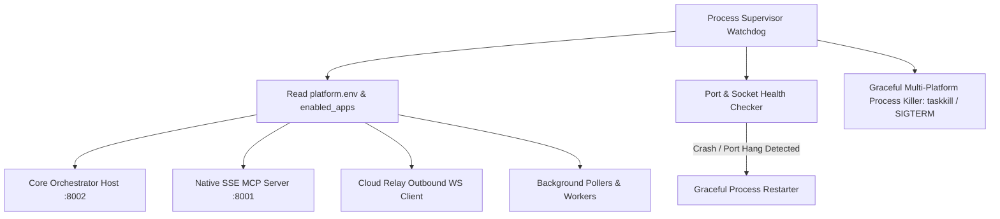
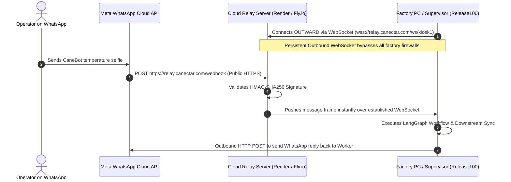
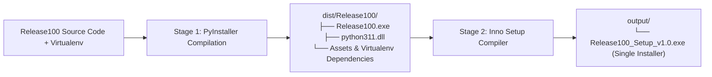

# DEPLOYMENT, DESKTOP SUPERVISOR & PACKAGING HUB SPECIFICATION
## Multi-Platform Distribution & Host Control Plane (`Release100`)

**Document ID:** `05_deployment_and_packaging_hub`  
**Document Version:** `v1.0.0`  
**Date:** September 14, 2026  
**Status:** DRAFT / UNDER REVIEW  
**Target Package:** `D:\Release100\deployment`  
**Master Plan Reference:** `D:\Release100\plans\01_master_platform_architecture_v1.3.md`  
**Core Orchestrator Reference:** `D:\Release100\plans\02_orchestrator_core_v1.2.md`  
**Source Code Baseline:** `D:\AI-ProjectManager`  

---

## Document Revision History & Changelog

| Version | Date | Author | Description of Changes | Status |
| :--- | :--- | :--- | :--- | :--- |
| **v1.0.0** | 2026-09-14 | AI Architecture Team | Initial Deployment & Packaging Hub Specification: Pluggable Process Supervisor, Windows System Tray controller, outbound WebSocket Cloud Relay, zero-Python Inno Setup `.exe` builder, Linux `systemd` daemon, Docker containerization, and unified developer CLI (`manage.py`). | Proposed |

---

## 1. Subsystem Mission & Multi-Platform Strategy

The **Deployment & Packaging Hub** (`deployment/`) is the host control plane and distribution engine of `Release100`. It bridges the gap between development code and real-world deployment across three distinct customer environments:

1. **Windows Desktop & Kiosk Target**:
   - Factory supervisor PCs, shop-floor Windows kiosk terminals, and office workstations.
   - Sits silently in the taskbar notification area via **Windows System Tray App (`desktop_tray/`)**.
   - Distributed as a 1-click **Zero-Python Windows Installer (`.exe`)** requiring no Python installation or terminal commands from client staff.
2. **Linux Edge & Factory Server Target**:
   - Factory rackmount servers, fanless industrial box PCs, and Raspberry Pi / edge gateways.
   - Supervised headlessly via a **Linux `systemd` Daemon (`linux_systemd/`)**.
3. **Cloud Container Target**:
   - Scalable SaaS hosting, central enterprise servers (AWS, GCP, Render, Fly.io, Kubernetes).
   - Multi-stage **Docker Container (`docker/`)** with automated health checks.
4. **Outbound Cloud Relay (`cloud_relay/`)**:
   - Solves the enterprise factory firewall / NAT / port-forwarding dilemma. Allows factory machines behind strict corporate firewalls to receive public WhatsApp webhooks with zero network configuration.

---

## 2. Pluggable Process Supervisor (`deployment/supervisor/`)

Borrowed and elevated from `AI-ProjectManager/tray_app/process_supervisor.py`, the **Process Supervisor** is the central watchdog managing the lifecycle of all background services.



### Key Technical Capabilities:
- **Dynamic Service Activation**: Inspects `enabled_applications` in `platform.env`. If only `temperature_marker` is active, it only launches the CaneBot listeners and suppresses email workers.
- **Port Collision Prevention**: Verifies ports `:8001` and `:8002` are free before spawning subprocesses; cleanly terminates orphaned zombie processes from prior crashes.
- **Cross-Platform Termination**:
  - Windows: Uses `taskkill /F /T /PID <pid>` with `CREATE_NO_WINDOW` flags to suppress ugly command prompt popups.
  - Linux/POSIX: Uses `os.killpg(os.getpgid(proc.pid), signal.SIGTERM)` for graceful tree cleanup.
- **Dedicated UTF-8 Logging**: Pipes `stdout` and `stderr` of all child processes into dedicated rolling log files in `logs/services/`.

---

## 3. Windows System Tray Application (`deployment/desktop_tray/`)

Built with `pystray`, the system tray application provides factory supervisors and office managers with a friendly, non-technical control center in the bottom-right taskbar area.

```
[System Tray Icon - Dynamic Colors]
  🟢 Green: All services healthy & listening
  🟡 Yellow: Syncing / Processing payload
  🔴 Red: Port collision or network disconnect
```

### Context Menu Actions:
```
Right-Click Tray Menu:
├── 📊 Canectar CaneBot: Kiosk #04 (Healthy)
├── 📧 Email Organizer: Polling Active
├── ───────────────
├── [🔘] Toggle Background Email Polling (ON/OFF)
├── [🔘] Toggle CaneBot Simulator Mode
├── ───────────────
├── 🌐 Open Central Admin Dashboard (Browser)
├── 📋 View Visual Compliance Audit Report (HTML)
├── 📦 1-Click Export Audit Package to Desktop (ZIP)
├── 🔑 Re-authenticate Google / Enterprise Account
├── ───────────────
└── ❌ Shutdown All Services & Exit
```

### 1-Click Audit Package Exporter (`desktop_tray/exporter.py`):
- Food safety inspectors (FSSAI, FDA, ISO) frequently request immediate compliance dumps.
- Clicking **"Export Audit Package to Desktop"** automatically zips:
  1. `logs/audit_partitions/*.jsonl` (Machine-readable audit stream)
  2. `logs/audit_log.csv` (Tabular spreadsheet view)
  3. `logs/audit_partitions/html/*.html` (Visual dashboards)
  4. Active configuration snapshots
- Places a timestamped zip file directly onto the user's Windows Desktop: `Canectar_Audit_Dump_YYYY-MM-DD.zip`.

---

## 4. Outbound WebSocket Cloud Relay (`deployment/cloud_relay/`)

### The Enterprise Factory Firewall Dilemma:
* Meta’s WhatsApp Cloud API requires a public HTTPS URL with a valid SSL certificate to deliver webhook events.
* Factory PCs running at CaneBot kiosks, retail malls, or plant floors are behind **strict NATs, dynamic IPs, and corporate firewalls**. Opening inbound port 80/443 or installing ngrok is forbidden by plant IT security.

### The Cloud Relay Solution:
The **Cloud Relay** is a lightweight FastAPI / WebSocket service hosted on a public cloud server (e.g. Render, Fly.io, or AWS).



### Cloud Relay Deployment Files (`deployment/cloud_relay/`):
- `server.py`: Ultra-lean (150 lines) webhook receiver and WebSocket broadcaster.
- `Dockerfile`: Minimal multi-stage alpine image (< 50MB).
- `render.yaml`: 1-click cloud blueprint for deployment to Render.com free/starter tier.

---

## 5. Zero-Python Windows Packaging Pipeline (`deployment/packaging_windows/`)

To distribute `Release100` to non-technical factory managers, the system provides a **2-Stage Automated Build Pipeline**:



### Stage 1: PyInstaller Recipe (`packaging_windows/Release100.spec`)
- Embeds the Python 3.11 runtime, dependencies (FastAPI, Uvicorn, LangGraph, InsightFace, OpenCV, PyTorch/ONNX, Pystray), and Jinja2 templates.
- Configures `hiddenimports` for dynamic application cartridges.
- Strips unnecessary development debug symbols to minimize executable size.

### Stage 2: Inno Setup Windows Installer Script (`packaging_windows/installer.iss`)
- Produces `Release100_Setup_v1.0.exe`:
  - Installs cleanly to `C:\Program Files\Release100` or `%LOCALAPPDATA%\Release100`.
  - Creates Desktop Shortcut and Start Menu entry.
  - Option to **"Launch on Windows Startup"** so kiosk monitoring restarts automatically after PC reboots.
  - Includes clean Windows Control Panel Uninstaller.
- **Portable Fallback**: If Inno Setup is not installed on the build machine, the pipeline automatically packages `dist/Release100/` into `output/Release100_Portable.zip`.

---

## 6. Linux Edge Server Deployment (`deployment/linux_systemd/`)

For installation on factory rack servers, industrial fanless box PCs, or edge gateways running Ubuntu/Debian:

### Systemd Unit File (`deployment/linux_systemd/release100.service`):
```ini
[Unit]
Description=Release100 Enterprise Agentic Platform & Ingress Gateway
After=network.target

[Service]
Type=simple
User=release100
WorkingDirectory=/opt/release100
ExecStart=/opt/release100/.venv/bin/python manage.py run --mode headless
Restart=always
RestartSec=10
EnvironmentFile=/opt/release100/config/platform.env
StandardOutput=journal
StandardError=journal

[Install]
WantedBy=multi-user.target
```

### 1-Click Linux Installer Script (`deployment/linux_systemd/install.sh`):
- Creates system user `release100`.
- Sets up Python 3.11 virtual environment and installs dependencies.
- Configures directory permissions for `/var/log/release100/`.
- Enables and starts `systemd` daemon: `systemctl enable --now release100`.

---

## 7. Cloud & Container Deployment (`deployment/docker/`)

For centralized cloud hosting (Render, Fly.io, AWS ECS, GCP Cloud Run, Kubernetes):

### Multi-Stage `Dockerfile`:
```dockerfile
# Stage 1: Build & Dependencies
FROM python:3.11-slim as builder
WORKDIR /app
RUN apt-get update && apt-get install -y --no-install-recommends build-essential libgl1 libglib2.0-0
COPY requirements.txt .
RUN pip install --no-cache-dir --user -r requirements.txt

# Stage 2: Minimal Runtime Image
FROM python:3.11-slim
WORKDIR /app
RUN apt-get update && apt-get install -y --no-install-recommends libgl1 libglib2.0-0 curl && rm -rf /var/lib/apt/lists/*
COPY --from=builder /root/.local /root/.local
ENV PATH=/root/.local/bin:$PATH

COPY . .
EXPOSE 8001 8002
HEALTHCHECK --interval=30s --timeout=5s --start-period=10s --retries=3 \
  CMD curl -f http://localhost:8002/health || exit 1

CMD ["python", "manage.py", "run", "--mode", "headless"]
```

### Docker Compose (`deployment/docker/docker-compose.yml`):
Spawns the complete stack (Core Platform + Cloud Relay + Local PostgreSQL / Redis) with a single command: `docker-compose up -d`.

---

## 8. Developer & Operations CLI (`manage.py`)

A unified developer CLI managing all operational modes and build tasks:

```python
# Usage examples:
python manage.py run --mode tray         # Boots with Windows System Tray
python manage.py run --mode headless     # Boots background services only (Linux/Docker)
python manage.py status                  # Inspects listening ports (:8001, :8002) and process health
python manage.py export-audit            # Zips all JSONL/CSV/HTML audit partitions to Desktop
python manage.py build --target windows  # Triggers PyInstaller + Inno Setup .exe builder
python manage.py build --target docker   # Compiles production Docker container
```

---

## 9. Package & Directory Layout (`deployment/`)

```text
D:\Release100\deployment/
├── supervisor/                        # Watchdog & Process Lifecycle Manager
│   ├── __init__.py
│   ├── process_supervisor.py          # Dynamic process launcher, restarter & port watchdog
│   ├── port_checker.py                # TCP socket scanner (:8001, :8002)
│   └── process_killer.py              # Cross-platform clean tree termination
│
├── desktop_tray/                      # Windows Taskbar System Tray Application
│   ├── __init__.py
│   ├── main_tray.py                   # Pystray event loop & dynamic menu builder
│   ├── exporter.py                    # 1-Click Desktop audit log packager
│   └── assets/                        # High-DPI tray icons (icon_green.ico, icon_red.ico)
│
├── cloud_relay/                       # Standalone Public Webhook Relay Server
│   ├── server.py                      # FastAPI HTTPS webhook receiver & WS streamer
│   ├── requirements.txt               # websockets, fastapi, uvicorn
│   ├── Dockerfile                     # Cloud container recipe
│   └── render.yaml                    # 1-Click Render.com deployment blueprint
│
├── packaging_windows/                 # Windows Installer Build Hub
│   ├── Release100.spec                # PyInstaller multi-binary bundling recipe
│   ├── installer.iss                  # Inno Setup Windows setup compiler script
│   └── build_installer.py             # Automated 2-stage build script
│
├── linux_systemd/                     # Linux Server Deployment
│   ├── release100.service             # systemd service unit definition
│   └── install.sh                     # Automated Ubuntu/Debian installation script
│
└── docker/                            # Cloud Containerization
    ├── Dockerfile                     # Production multi-stage container
    ├── docker-compose.yml             # Orchestrator + DB + Relay stack
    └── entrypoint.sh                  # Container startup script
```

---

## 10. Complete Suite Review & Next Steps

With **Plan 5 (`05_deployment_and_packaging_hub_v1.0.md`)** established, the entire **`Release100` Architectural Suite (Plans 1 through 5)** is complete:

| Plan Document | Subsystem / Scope | Status |
| :--- | :--- | :--- |
| **01_master_platform_architecture_v1.3.md** | Master Platform Architecture, Ecosystem Topology & Directory Tree | ✅ Approved Master |
| **02_orchestrator_core_v1.2.md** | Universal Host Gateway, Skills Library, Auth, Safety & Telemetry | ✅ Approved Core |
| **03_app_temperature_marker_v1.2.md** | Canectar CaneBot Sugarcane Juice Chiller & Attendance Cartridge | ✅ Approved App |
| **04_app_mail_organizer_v1.0.md** | Decoupled AI Email & Calendar Triage Cartridge | ✅ Approved App |
| **05_deployment_and_packaging_hub_v1.0.md** | Multi-Platform Supervisor, Tray App, Cloud Relay & Packaging Hub | ✅ Complete |

Every single architectural decision, operational insight, and real-world constraint has been meticulously documented with versioning across `D:\Release100\plans\`.
