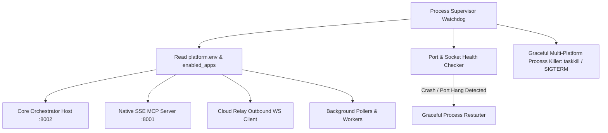
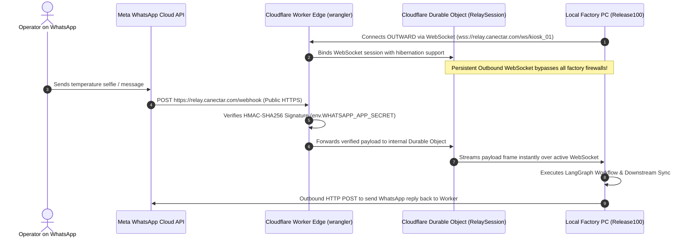
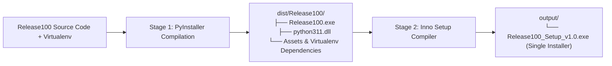

# DEPLOYMENT, DESKTOP SUPERVISOR & PACKAGING HUB SPECIFICATION
## Multi-Platform Distribution & Host Control Plane (`Release100`)

**Document ID:** `05_deployment_and_packaging_hub`  
**Document Version:** `v1.1.0`  
**Date:** September 14, 2026  
**Status:** DRAFT / UNDER REVIEW  
**Target Package:** `D:\Release100\deployment`  
**Master Plan Reference:** `D:\Release100\plans\01_master_platform_architecture_v1.3.md`  
**Core Orchestrator Reference:** `D:\Release100\plans\02_orchestrator_core_v1.2.md`  
**Source Code Baseline:** `D:\AI-ProjectManager`  

---

## Document Revision History & Changelog

| Version | Date | Author | Description of Changes | Status |
| :--- | :--- | :--- | :--- | :--- |
| **v1.0.0** | 2026-09-14 | AI Architecture Team | Initial Deployment & Packaging Hub Specification: Pluggable Process Supervisor, Windows System Tray controller, Cloud Relay, Inno Setup builder, Linux `systemd`, Docker containers, and developer CLI. | Superseded |
| **v1.1.0** | 2026-09-14 | AI Architecture Team | **Incorporated User Feedback**: <br>1. **Dynamic Tray UI (No Hardcoding)**: Replaced hardcoded "CaneBot" references in the Windows System Tray menu with dynamic resolution from active deployment configuration (`ORGANIZATION_NAME`, `STATION_NAME`, and active app status hooks).<br>2. **Cloudflare Worker Relay (Primary)**: Added **Cloudflare Workers with Durable Objects (`RelaySession`)** as the primary, production-grade edge relay alongside the alternative Python container relay. | **Current** |

---

## 1. Subsystem Mission & Multi-Platform Strategy

The **Deployment & Packaging Hub** (`deployment/`) is the host control plane and distribution engine of `Release100`. It bridges the gap between development code and real-world deployment across three distinct customer environments:

1. **Windows Desktop & Kiosk Target**:
   - Factory supervisor PCs, shop-floor Windows kiosk terminals, and office workstations.
   - Sits silently in the taskbar notification area via the **Dynamic Windows System Tray App (`desktop_tray/`)**.
   - Distributed as a 1-click **Zero-Python Windows Installer (`.exe`)** requiring no Python installation or terminal commands from client staff.
2. **Linux Edge & Factory Server Target**:
   - Factory rackmount servers, fanless industrial box PCs, and Raspberry Pi / edge gateways.
   - Supervised headlessly via a **Linux `systemd` Daemon (`linux_systemd/`)**.
3. **Cloud Container Target**:
   - Scalable SaaS hosting, central enterprise servers (AWS, GCP, Render, Fly.io, Kubernetes).
   - Multi-stage **Docker Container (`docker/`)** with automated health checks.
4. **Outbound WebSocket Cloud Relay (`cloud_relay/`)**:
   - Powered primarily by **Cloudflare Workers & Durable Objects**, with a containerized Python fallback.
   - Solves the enterprise factory firewall / NAT / port-forwarding dilemma. Allows factory machines behind strict corporate firewalls to receive public WhatsApp webhooks with zero network configuration.

---

## 2. Pluggable Process Supervisor (`deployment/supervisor/`)

Borrowed and elevated from `AI-ProjectManager/tray_app/process_supervisor.py`, the **Process Supervisor** is the central watchdog managing the lifecycle of all background services.



### Key Technical Capabilities:
- **Dynamic Service Activation**: Inspects `enabled_applications` in `platform.env`. If only `temperature_marker` is active, it only launches the kiosk listeners and suppresses email workers.
- **Port Collision Prevention**: Verifies ports `:8001` and `:8002` are free before spawning subprocesses; cleanly terminates orphaned zombie processes from prior crashes.
- **Cross-Platform Termination**:
  - Windows: Uses `taskkill /F /T /PID <pid>` with `CREATE_NO_WINDOW` flags to suppress command prompt popups.
  - Linux/POSIX: Uses `os.killpg(os.getpgid(proc.pid), signal.SIGTERM)` for graceful tree cleanup.
- **Dedicated UTF-8 Logging**: Pipes `stdout` and `stderr` of all child processes into dedicated rolling log files in `logs/services/`.

---

## 3. Dynamic Windows System Tray Application (`deployment/desktop_tray/`)

Built with `pystray`, the system tray application provides a friendly, non-technical control center in the bottom-right taskbar area. 

### Completely Dynamic Menu Resolution (No Hardcoding):
The tray app queries the active deployment context at boot:
* `ORGANIZATION_NAME`: e.g. `"Canectar Foods Pvt Ltd"` (default), or any client organization.
* `STATION_NAME` / `STATION_LOCATION`: e.g. `"Kiosk #04 (Phoenix Mall)"`, or `"Plant Boiler #01"`.
* Active Application Status Hooks: Each enabled cartridge exports its dynamic tray status line and custom menu toggles.

```
[System Tray Icon - Dynamic Colors]
  🟢 Green: All services healthy & listening
  🟡 Yellow: Syncing / Processing payload
  🔴 Red: Port collision or network disconnect
```

### Dynamic Context Menu:
```
Right-Click Tray Menu:
├── 🏢 Organization: [config.ORGANIZATION_NAME]
├── 📍 Station: [config.STATION_NAME]
├── ───────────────
├── 📊 [App 1 Display Name]: [App 1 Dynamic Status]
├── 📧 [App 2 Display Name]: [App 2 Dynamic Status]
├── ───────────────
├── [🔘] [App 1 Custom Toggle Action] (e.g. Toggle Simulator Mode)
├── [🔘] [App 2 Custom Toggle Action] (e.g. Toggle Background Poller)
├── ───────────────
├── 🌐 Open Central Admin Dashboard (Browser)
├── 📋 View Visual Compliance Audit Report (HTML)
├── 📦 1-Click Export Audit Package to Desktop (ZIP)
├── 🔑 Re-authenticate Google / Enterprise Account
├── ───────────────
└── ❌ Shutdown All Services & Exit
```

### Dynamic 1-Click Audit Package Exporter (`desktop_tray/exporter.py`):
- Clicking **"Export Audit Package to Desktop"** automatically zips:
  1. `logs/audit_partitions/*.jsonl` (Machine-readable audit stream)
  2. `logs/audit_log.csv` (Tabular spreadsheet view)
  3. `logs/audit_partitions/html/*.html` (Visual dashboards)
  4. Active configuration snapshots
- Generates a clean, dynamically-named file: `[ORGANIZATION_SLUG]_[STATION_SLUG]_Audit_Dump_YYYY-MM-DD.zip`.

---

## 4. Outbound WebSocket Cloud Relay (`deployment/cloud_relay/`)

### The Enterprise Factory Firewall Dilemma:
* Meta’s WhatsApp Cloud API requires a public HTTPS URL with a valid SSL certificate to deliver webhook events.
* Factory PCs running at kiosks, retail outlets, or plant floors are behind **strict NATs, dynamic IPs, and corporate firewalls**. Opening inbound ports or using temporary tunnels (ngrok) is prohibited by enterprise security.

### 4.1. Primary Edge Relay: Cloudflare Workers with Durable Objects
The primary, battle-tested relay implementation runs on **Cloudflare Workers** using **Durable Objects (`RelaySession`)**:



#### Why Cloudflare Workers & Durable Objects are Superior:
1. **Serverless & Zero Cold Starts**: Runs on Cloudflare's global edge network across 300+ cities with near-zero latency.
2. **WebSocket Hibernation API**: Durable Objects hibernate when idle, maintaining millions of open WebSockets at negligible cost without keeping expensive servers running.
3. **Automated SSL & DDoS Defense**: Built-in enterprise SSL certificates and Cloudflare DDoS protection against webhook spoofing.
4. **Configuration (`deployment/cloud_relay/cloudflare/wrangler.toml`)**:
   ```toml
   name = "whatsapp-cloud-relay"
   main = "src/index.ts"
   compatibility_date = "2026-09-01"

   [durable_objects]
   bindings = [
     { name = "RELAY_SESSIONS", class_name = "RelaySession" }
   ]
   ```

### 4.2. Alternative Containerized Relay: Python FastAPI (`cloud_relay/python_server/`)
For customers who cannot use Cloudflare and prefer a traditional container on Render, Fly.io, or AWS ECS:
- `server.py`: Lightweight FastAPI webhook receiver + WebSocket streamer.
- `render.yaml` & `Dockerfile`: 1-click deployment blueprint.

---

## 5. Zero-Python Windows Packaging Pipeline (`deployment/packaging_windows/`)

To distribute `Release100` to non-technical managers and factory operators:



### Stage 1: PyInstaller Recipe (`packaging_windows/Release100.spec`)
- Embeds the Python 3.11 runtime, dependencies (FastAPI, Uvicorn, LangGraph, InsightFace, OpenCV, PyTorch/ONNX, Pystray), and Jinja2 templates.
- Dynamically resolves enabled application packages via `hiddenimports`.

### Stage 2: Inno Setup Windows Installer Script (`packaging_windows/installer.iss`)
- Produces `Release100_Setup_v1.0.exe`:
  - Installs cleanly to `C:\Program Files\Release100` or `%LOCALAPPDATA%\Release100`.
  - Creates Desktop Shortcut and Start Menu entry.
  - Option to **"Launch on Windows Startup"** so monitoring restarts automatically after PC reboots.
  - Clean Windows Control Panel Uninstaller.
- **Portable Fallback**: If Inno Setup is not installed, produces portable `output/Release100_Portable.zip`.

---

## 6. Linux Edge Server Deployment (`deployment/linux_systemd/`)

For installation on factory rack servers, industrial fanless box PCs, or edge gateways running Ubuntu/Debian:

### Systemd Unit File (`deployment/linux_systemd/release100.service`):
```ini
[Unit]
Description=Release100 Enterprise Agentic Platform & Ingress Gateway
After=network.target

[Service]
Type=simple
User=release100
WorkingDirectory=/opt/release100
ExecStart=/opt/release100/.venv/bin/python manage.py run --mode headless
Restart=always
RestartSec=10
EnvironmentFile=/opt/release100/config/platform.env
StandardOutput=journal
StandardError=journal

[Install]
WantedBy=multi-user.target
```

### 1-Click Linux Installer Script (`deployment/linux_systemd/install.sh`):
- Sets up Python 3.11 virtual environment and permissions.
- Enables and starts `systemd` daemon: `systemctl enable --now release100`.

---

## 7. Cloud & Container Deployment (`deployment/docker/`)

For centralized cloud hosting (Render, Fly.io, AWS ECS, GCP Cloud Run, Kubernetes):

### Multi-Stage `Dockerfile`:
```dockerfile
FROM python:3.11-slim as builder
WORKDIR /app
RUN apt-get update && apt-get install -y --no-install-recommends build-essential libgl1 libglib2.0-0
COPY requirements.txt .
RUN pip install --no-cache-dir --user -r requirements.txt

FROM python:3.11-slim
WORKDIR /app
RUN apt-get update && apt-get install -y --no-install-recommends libgl1 libglib2.0-0 curl && rm -rf /var/lib/apt/lists/*
COPY --from=builder /root/.local /root/.local
ENV PATH=/root/.local/bin:$PATH

COPY . .
EXPOSE 8001 8002
HEALTHCHECK --interval=30s --timeout=5s --start-period=10s --retries=3 \
  CMD curl -f http://localhost:8002/health || exit 1

CMD ["python", "manage.py", "run", "--mode", "headless"]
```

---

## 8. Developer & Operations CLI (`manage.py`)

```python
# Usage examples:
python manage.py run --mode tray         # Boots with Windows System Tray
python manage.py run --mode headless     # Boots background services only (Linux/Docker)
python manage.py status                  # Inspects listening ports (:8001, :8002) and process health
python manage.py export-audit            # Zips all JSONL/CSV/HTML audit partitions to Desktop
python manage.py build --target windows  # Triggers PyInstaller + Inno Setup .exe builder
python manage.py build --target docker   # Compiles production Docker container
```

---

## 9. Package & Directory Layout (`deployment/`)

```text
D:\Release100\deployment/
├── supervisor/                        # Watchdog & Process Lifecycle Manager
│   ├── __init__.py
│   ├── process_supervisor.py          # Dynamic process launcher, restarter & port watchdog
│   ├── port_checker.py                # TCP socket scanner (:8001, :8002)
│   └── process_killer.py              # Cross-platform clean tree termination
│
├── desktop_tray/                      # Windows Taskbar System Tray Application
│   ├── __init__.py
│   ├── main_tray.py                   # Pystray event loop & dynamic menu builder
│   ├── exporter.py                    # Dynamic 1-Click Desktop audit log packager
│   └── assets/                        # High-DPI tray icons (icon_green.ico, icon_red.ico)
│
├── cloud_relay/                       # Multi-Target Public Webhook Relay Hub
│   ├── cloudflare/                    # Primary: Edge Cloudflare Worker + Durable Objects
│   │   ├── wrangler.toml              # Cloudflare configuration with Durable Object bindings
│   │   ├── package.json               # Node/TypeScript dependencies (@cloudflare/workers-types)
│   │   ├── tsconfig.json
│   │   └── src/
│   │       ├── index.ts               # Webhook receiver & WebSocket upgrade router
│   │       └── relay_session.ts       # Durable Object managing WebSocket client sessions
│   │
│   └── python_server/                 # Alternative: Containerized FastAPI Relay
│       ├── server.py                  # Standalone FastAPI WebSocket relay
│       ├── requirements.txt
│       ├── Dockerfile
│       └── render.yaml
│
├── packaging_windows/                 # Windows Installer Build Hub
│   ├── Release100.spec                # PyInstaller multi-binary bundling recipe
│   ├── installer.iss                  # Inno Setup Windows setup compiler script
│   └── build_installer.py             # Automated 2-stage build script
│
├── linux_systemd/                     # Linux Server Deployment
│   ├── release100.service             # systemd service unit definition
│   └── install.sh                     # Automated Ubuntu/Debian installation script
│
└── docker/                            # Cloud Containerization
    ├── Dockerfile                     # Production multi-stage container
    ├── docker-compose.yml             # Orchestrator + DB + Relay stack
    └── entrypoint.sh                  # Container startup script
```

---

## 10. Complete Suite Verification

With **Plan 5 updated to `v1.1.0`**, the deployment architecture provides:
1. **Dynamic Taskbar Tray**: Zero hardcoded application strings; dynamically reflects active deployment organization, station, and application statuses.
2. **Cloudflare Worker Edge Relay (Primary)**: Global serverless WebSocket streaming with Durable Objects, eliminating local port-forwarding and server maintenance.
3. **Alternative Python Container Relay**: Ready for Render, Fly.io, or AWS.
4. **Zero-Python Windows Packaging**: Standalone `.exe` installer.
5. **Headless Linux `systemd` & Docker Cloud Containerization**.
