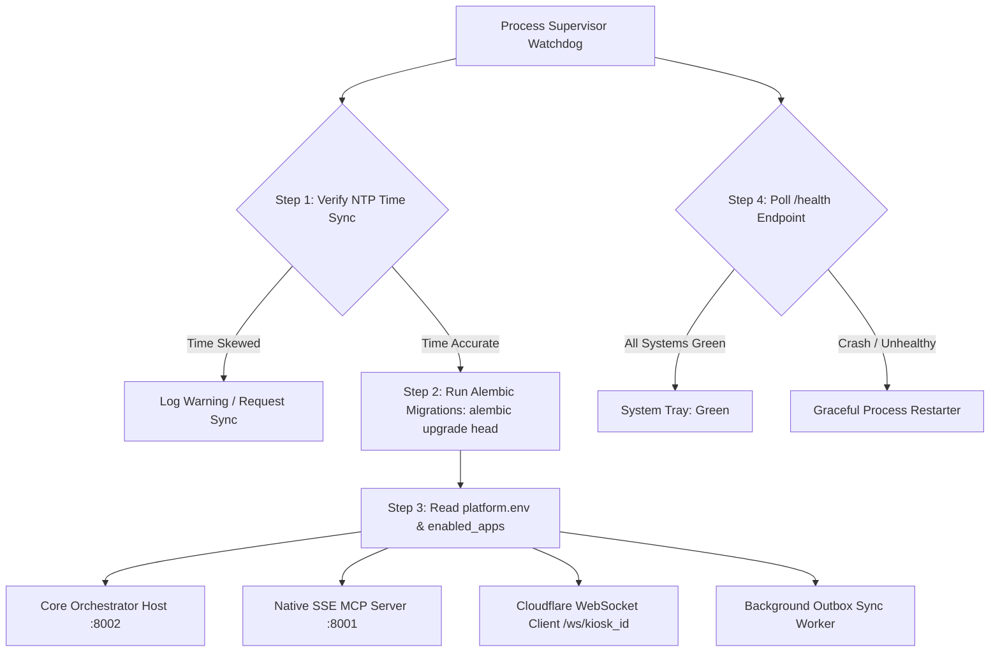
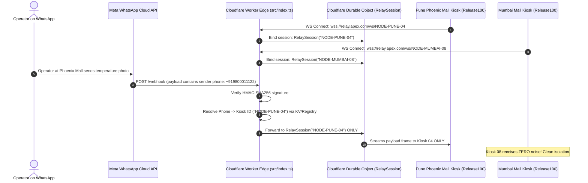

# DEPLOYMENT, DESKTOP SUPERVISOR & PACKAGING HUB SPECIFICATION
## Multi-Platform Distribution & Host Control Plane (`Release100`)

**Document ID:** `05_deployment_and_packaging_hub`  
**Document Version:** `v1.2.0`  
**Date:** September 14, 2026  
**Status:** APPROVED FOR IMPLEMENTATION  
**Target Package:** `D:\Release100\deployment`  
**Master Plan Reference:** `D:\Release100\plans\01_master_platform_architecture_v1.4.md`  
**Core Orchestrator Reference:** `D:\Release100\plans\02_orchestrator_core_v1.3.md`  
**Source Code Baseline:** `D:\AI-ProjectManager`  

---

## Document Revision History & Changelog

| Version | Date | Author | Description of Changes | Status |
| :--- | :--- | :--- | :--- | :--- |
| **v1.0.0** | 2026-09-14 | AI Architecture Team | Initial Deployment & Packaging Hub Specification. | Superseded |
| **v1.1.0** | 2026-09-14 | AI Architecture Team | Dynamic Tray UI (No Hardcoding) & Cloudflare Worker Relay (Primary). | Superseded |
| **v1.2.0** | 2026-09-14 | AI Architecture Team | **Architectural Hardening & Multi-Kiosk Production**: <br>1. **Multi-Kiosk Cloudflare Relay Fix**: Eliminated hardcoded `"default_client"`; implemented dynamic session routing via `/ws/{kiosk_id}` and webhook phone-to-kiosk mapping.<br>2. **Process Supervisor Hardening**: Integrated **Alembic DB migrations (`alembic upgrade head`)** and application `/health` heartbeat polling.<br>3. **NTP Time Synchronization**: Enforced boot-time time sync check for non-repudiation audit logs.<br>4. **Developer CLI Ergonomics**: Added `manage.py build --dry-run` flag. | **Current** |

---

## 1. Subsystem Mission & Multi-Platform Strategy

The **Deployment & Packaging Hub** (`deployment/`) is the host control plane and distribution engine of `Release100`. It bridges the gap between development code and real-world deployment across three distinct customer environments:

1. **Windows Desktop & Multi-Kiosk Target**:
   - Factory supervisor PCs, shop-floor Windows kiosk terminals, and office workstations.
   - Sits silently in the taskbar notification area via the **Dynamic Windows System Tray App (`desktop_tray/`)**.
   - Distributed as a 1-click **Zero-Python Windows Installer (`.exe`)** requiring no Python installation or terminal commands from client staff.
2. **Linux Edge & Factory Server Target**:
   - Factory rackmount servers, fanless industrial box PCs, and Raspberry Pi / edge gateways.
   - Supervised headlessly via a **Linux `systemd` Daemon (`linux_systemd/`)**.
3. **Cloud Container Target**:
   - Scalable SaaS hosting, central enterprise servers (AWS, GCP, Render, Fly.io, Kubernetes).
   - Multi-stage **Docker Container (`docker/`)** with automated health checks.
4. **Outbound Multi-Kiosk Cloud Relay (`cloud_relay/`)**:
   - Powered by **Cloudflare Workers & Durable Objects**, routing incoming WhatsApp traffic to specific kiosk instances (`/ws/{kiosk_id}`).
   - Solves the enterprise factory firewall / NAT / port-forwarding dilemma with zero open inbound ports.

---

## 2. Pluggable Process Supervisor (`deployment/supervisor/`)

Elevated from `AI-ProjectManager/tray_app/process_supervisor.py`, the **Process Supervisor** is the central watchdog managing lifecycle, database migrations, and health.



### Key Technical Capabilities:
- **Alembic Database Migration Runner**: Executes `alembic upgrade head` synchronously *before* launching child processes, ensuring the local SQLite database schema is always up to date.
- **Application Health Polling**: Polls `http://localhost:8002/health` every 15 seconds to monitor actual application state (skill availability, LLM reachability, audit chain length), rather than just raw TCP port presence.
- **NTP Time Synchronization Check**: Verifies that the host machine clock is synchronized with standard time servers, protecting the monotonic SHA-256 audit log against clock drift.
- **Cross-Platform Termination**:
  - Windows: Uses `taskkill /F /T /PID <pid>` with `CREATE_NO_WINDOW` flags to suppress command prompt popups.
  - Linux/POSIX: Uses `os.killpg(os.getpgid(proc.pid), signal.SIGTERM)` for clean tree cleanup.

---

## 3. Dynamic Windows System Tray Application (`deployment/desktop_tray/`)

Built with `pystray`, the system tray application provides a friendly, non-technical control center:

```
[System Tray Icon - Dynamic Health State]
  🟢 Green: All services healthy & /health API reporting OK
  🟡 Yellow: Syncing / Offline Outbox queue processing / Degraded LLM
  🔴 Red: Process crash, port collision, or critical health failure
```

### Completely Dynamic Context Menu:
```
Right-Click Tray Menu:
├── 🏢 Organization: [config.ORGANIZATION_NAME]
├── 📍 Station: [config.STATION_NAME] ([config.KIOSK_ID])
├── ───────────────
├── 📊 KioskNode Chiller: 3.2°C (Compliant: 2°C-4°C)
├── 📦 Outbox Sync: 0 pending items (Online)
├── ───────────────
├── 🌐 Open Central Admin Dashboard (Browser)
├── 📋 View Visual Compliance Audit Report (HTML)
├── 📦 1-Click Export Audit Package to Desktop (ZIP)
├── ───────────────
└── ❌ Shutdown All Services & Exit
```

---

## 4. Multi-Kiosk Cloudflare Edge Relay (`deployment/cloud_relay/cloudflare/`)

### 4.1. Resolving the Multi-Kiosk Routing Problem
The previous prototype hardcoded `env.RELAY_SESSIONS.idFromName("default_client")`. In `Release100`, the Cloudflare Worker implements **Dynamic Multi-Kiosk Routing**:



### 4.2. Updated Cloudflare Relay Source (`deployment/cloud_relay/cloudflare/src/index.ts`)
```typescript
export interface Env {
  RELAY_SESSIONS: DurableObjectNamespace;
  WHATSAPP_VERIFY_TOKEN: string;
  WHATSAPP_APP_SECRET: string;
  KIOSK_REGISTRY_KV?: KVNamespace;
}

export default {
  async fetch(request: Request, env: Env): Promise<Response> {
    const url = new URL(request.url);

    // 1. Meta Webhook Verification (GET /webhook)
    if (request.method === "GET" && url.pathname === "/webhook") {
      const mode = url.searchParams.get("hub.mode");
      const token = url.searchParams.get("hub.verify_token");
      const challenge = url.searchParams.get("hub.challenge");

      if (mode === "subscribe" && token === env.WHATSAPP_VERIFY_TOKEN) {
        return new Response(challenge, { status: 200 });
      }
      return new Response("Forbidden", { status: 403 });
    }

    // 2. Incoming WhatsApp Message (POST /webhook)
    if (request.method === "POST" && url.pathname === "/webhook") {
      const signature = request.headers.get("X-Hub-Signature-256") || "";
      const bodyText = await request.text();

      // HMAC-SHA256 Verification
      if (env.WHATSAPP_APP_SECRET) {
        const isValid = await verifyHmacSignature(bodyText, signature, env.WHATSAPP_APP_SECRET);
        if (!isValid) return new Response("Invalid Signature", { status: 401 });
      }

      let payload;
      try {
        payload = JSON.parse(bodyText);
      } catch {
        return new Response("Invalid JSON", { status: 400 });
      }

      // Extract sender phone number and resolve target kiosk_id
      const senderPhone = extractSenderPhone(payload);
      const targetKioskId = await resolveKioskForSender(senderPhone, env);

      // Route message into specific Kiosk Durable Object session
      const doId = env.RELAY_SESSIONS.idFromName(targetKioskId);
      const stub = env.RELAY_SESSIONS.get(doId);
      await stub.fetch("http://internal/broadcast", {
        method: "POST",
        body: JSON.stringify({ kiosk_id: targetKioskId, payload }),
      });

      return new Response("EVENT_RECEIVED", { status: 200 });
    }

    // 3. Desktop Kiosk WebSocket Connection (GET /ws/:kioskId)
    if (url.pathname.startsWith("/ws/")) {
      const kioskId = url.pathname.replace("/ws/", "").trim();
      if (!kioskId) return new Response("Missing Kiosk ID in URL path", { status: 400 });

      const doId = env.RELAY_SESSIONS.idFromName(kioskId);
      const stub = env.RELAY_SESSIONS.get(doId);
      return stub.fetch(request);
    }

    return new Response(JSON.stringify({ status: "running", service: "Release100 Multi-Kiosk Cloud Relay" }), {
      headers: { "Content-Type": "application/json" }
    });
  }
};
```

---

## 5. Developer & Operations CLI (`manage.py`)

```python
# Usage examples:
python manage.py run --mode tray         # Boots with Windows System Tray
python manage.py run --mode headless     # Boots background services only (Linux/Docker)
python manage.py migrate                 # Runs alembic upgrade head
python manage.py health                  # Queries /health API and displays formatted table
python manage.py export-audit            # Zips all JSONL/CSV/HTML audit partitions to Desktop
python manage.py build --target windows --dry-run  # Validates dependencies & spec without compiling
python manage.py build --target windows            # Triggers PyInstaller + Inno Setup .exe builder
python manage.py build --target docker             # Compiles production Docker container
```

---

## 6. Directory & Package Layout (`deployment/`)

```text
D:\Release100\deployment/
├── supervisor/                        # Watchdog & Process Lifecycle Manager
│   ├── __init__.py
│   ├── process_supervisor.py          # Dynamic launcher, Alembic migrator & health watchdog
│   ├── port_checker.py                # TCP socket scanner (:8001, :8002)
│   ├── ntp_checker.py                 # Host time synchronization validator
│   └── process_killer.py              # Cross-platform clean tree termination
│
├── desktop_tray/                      # Windows Taskbar System Tray Application
│   ├── __init__.py
│   ├── main_tray.py                   # Pystray event loop & dynamic menu builder
│   ├── exporter.py                    # Dynamic 1-Click Desktop audit log packager
│   └── assets/                        # High-DPI tray icons (icon_green.ico, icon_red.ico)
│
├── cloud_relay/                       # Multi-Kiosk Public Webhook Relay Hub
│   ├── cloudflare/                    # Primary: Edge Cloudflare Worker + Durable Objects
│   │   ├── wrangler.toml              # Cloudflare configuration with Durable Object bindings
│   │   ├── package.json               # Node/TypeScript dependencies
│   │   ├── tsconfig.json
│   │   └── src/
│   │       ├── index.ts               # Multi-kiosk router (/ws/:kioskId) & HMAC verifier
│   │       └── relay_session.ts       # Durable Object managing per-kiosk WebSocket clients
│   │
│   └── python_server/                 # Alternative: Containerized FastAPI Relay
│       ├── server.py                  # Standalone FastAPI WebSocket relay
│       └── Dockerfile
│
├── packaging_windows/                 # Windows Installer Build Hub
│   ├── Release100.spec                # PyInstaller multi-binary bundling recipe
│   ├── installer.iss                  # Inno Setup Windows setup compiler script
│   └── build_installer.py             # Automated 2-stage build script with --dry-run
│
├── linux_systemd/                     # Linux Server Deployment
│   ├── release100.service             # systemd service unit definition
│   └── install.sh                     # Automated Ubuntu/Debian installation script
│
└── docker/                            # Cloud Containerization
    ├── Dockerfile                     # Production multi-stage container
    ├── docker-compose.yml             # Orchestrator + DB + Relay stack
    └── entrypoint.sh                  # Container startup script
```
