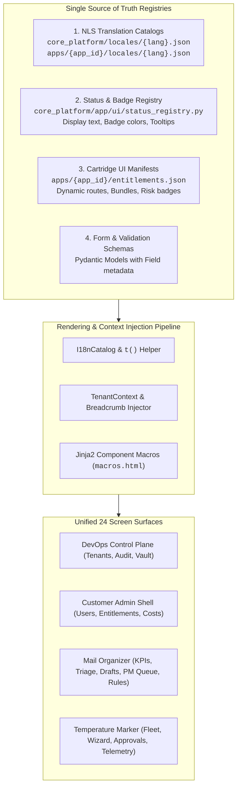
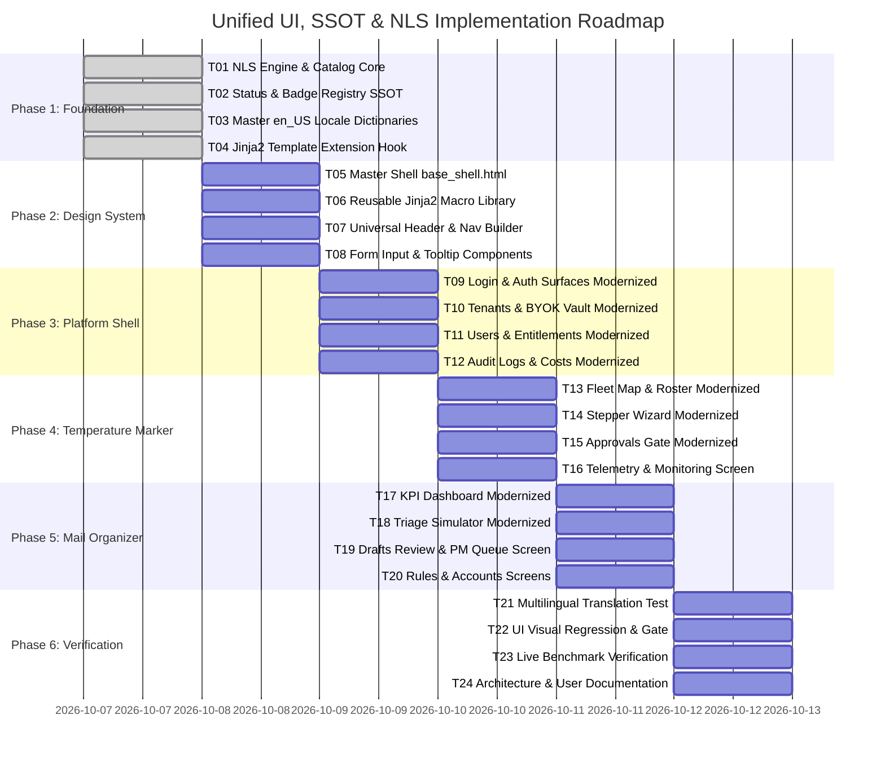

# Plan 11: Unified UI Design System, Content SSOT & NLS Architecture (v1.0)

> **Document Status:** PROPOSED & READY FOR IMPLEMENTATION  
> **Target Release:** Release100 Enterprise Multi-Tenant Host  
> **Governing Standards:** [GEES v2.0 (ENGINEERING_EXCELLENCE_STANDARD_v2.0.md)](../ENGINEERING_EXCELLENCE_STANDARD_v2.0.md) & [Master Architecture v1.4](01_master_platform_architecture_v1.4.md)  
> **Author:** Antigravity AI (Pair Programming with Mahendra GURAV)  
> **Date:** October 2026  

---

## 1. Executive Summary & Objective

The Release100 platform has grown into a multi-tenant enterprise operating host supporting distinct user personas across DevOps control planes, customer admin workspaces, and business domain cartridges (`apps.temperature_marker`, `apps.mail_organizer`). 

A comprehensive visual and technical audit of all **24 interactive screens** revealed three critical architectural challenges:
1. **UI Discrepancies & Navigation Fragmentation:** Screens across `core_platform`, `ops_control_plane`, and domain cartridges use disparate layout frames, conflicting CSS color palettes (Tailwind vs. bespoke vanilla hex codes), and inconsistent tenant context headers.
2. **Missing Content Single Source of Truth (SSOT):** Field labels, table column headers, error messages, and status badges are hardcoded across Jinja2 templates rather than referencing structured backend schemas, status registries, and cartridge manifests.
3. **Hyper-Technical Jargon:** User-facing surfaces frequently display internal developer/cryptographic terminology (e.g., `Layer 0 Deterministic Pre-Execution Filter`, `Entropy Vector`, `Stochastic Clamping`, `Haversine Geofence Pre-flight`, `Sub-threshold Diversion Gate`), causing confusion and user anxiety during data entry.

### Core Objectives
* **Unified Master Shell & Macro Library:** Create a universal, responsive master shell (`base_shell.html`) and shared Jinja2 component macro library (`macros.html`) ensuring visual and structural consistency across all 24 screens.
* **4-Tier Content SSOT:** Establish structured registries for (1) Localized text catalogs, (2) Status badges & lifecycles, (3) Cartridge UI specifications, and (4) Form validation schemas.
* **Elevated, Persona-Calibrated Terminology:** Replace developer jargon with professional, clear, confidence-inspiring enterprise copy tailored for DevOps, Customer Admins, and Frontline Operators.
* **Future-Proof National Language Support (NLS / i18n):** Build a zero-dependency, high-performance localization catalog system with dynamic language switching, fallback hierarchies, and parameter interpolation.

---

## 2. Locked Architectural Decisions

* **D1 (Strict Microkernel Separation):** The NLS engine in `core_platform/app/i18n/` must contain zero domain concepts. Cartridges declare their own translation catalogs in `apps/<app_id>/locales/{lang}.json` and register UI menu items via `app.get_ui_manifest()`. Core never imports from `apps/`.
* **D2 (Zero-Hardcoding of UI Strings):** No user-facing text, error messages, or table headers may be hardcoded in Jinja2 templates or FastAPI route handlers. All strings must be resolved via the translation helper `t('namespace.key', **kwargs)`.
* **D3 (Master Layout Inheritance):** Every screen must inherit from `core_platform/app/admin_shell/templates/base_shell.html`, which provides the persistent sidebar, top context header (tenant badge, environment mode, user profile), and breadcrumb navigation.
* **D4 (Shared Jinja2 Component Macros):** All UI primitives (KPI stat cards, data tables, modal dialogs, status badges, alerts, and form fields) must be rendered using standardized macros from `templates/components/macros.html`.
* **D5 (Canonical Status Registry SSOT):** All system and entity lifecycle statuses (e.g., `ACTIVE`, `PENDING_REVIEW`, `SUSPENDED`, `SHADOW`, `ENFORCE`) must be resolved from `core_platform.app.ui.status_registry.StatusRegistry`, which provides localized labels, CSS classes, and icon tokens.
* **D6 (Pydantic Schema as Form SSOT):** Dynamic forms and validation rules must derive their field definitions, placeholders, input types, and tooltips directly from typed Pydantic models using `Field(title=..., description=..., json_schema_extra={...})`.
* **D7 (Deterministic Locale Resolution):** User locale is negotiated at runtime via: (1) Explicit query parameter (`?lang=`), (2) User session/cookie preference, (3) `Accept-Language` HTTP header, falling back gracefully to `en_US`.
* **D8 (Type Completeness & Strict Discipline):** 100% type annotations under `mypy --strict` on all newly created or refactored Python modules. Zero bare `Any` escapes.

---

## 3. UI Content & Data SSOT Architecture



---

## 4. Master Terminology Transformation Dictionary

| Category / Component | Current Hyper-Technical / Developer Jargon | Recommended Professional Enterprise Copy | Target Persona & Context |
| :--- | :--- | :--- | :--- |
| **Safety & Routing** | `Layer 0 Deterministic Pre-Execution Filter` | **Automated Pre-Screening & Safety Rules** | *Admins/DevOps:* Shows rules execute safely before AI invocation. |
| **AI Processing** | `Stochastic Clamping (Temp 0.0)` | **Strict High-Precision AI Processing** | *Admins:* Explains exact, reproducible categorization. |
| **Human Review Gate** | `Layer 2 Sub-threshold Safety Diversion (< 85%)` | **Requires Human Review** *(or **Pending Review**)* | *Operators/Admins:* Clear, actionable status badge. |
| **Compliance Audit** | `Non-Repudiation SHA-256 Hash Chaining` | **Tamper-Proof Audit Trail** *(or **Verified Compliance Record**)* | *Auditors/Admins:* Inspires regulatory confidence (FDA/ISO). |
| **Location Verification**| `Haversine GPS Geofence Check` | **On-Site Location Verification** | *Operators:* Explains why GPS coordinates are verified. |
| **Biometrics** | `Face Recognition Confidence Euclidean Distance` | **Biometric Match Score** (e.g., `98% Verified`) | *Operators:* Simple percentage badge. |
| **OCR Reading** | `OCR Bounding Box Levenshtein Distance` | **Display Reading Match** | *Operators:* Confirms instrument digit recognition. |
| **Entitlement Mode** | `Enforcement Mode: SHADOW` | **Preview Mode (Safe Evaluation)** | *Admins:* Clarifies changes are tested safely without blocking. |
| **Entitlement Mode** | `Enforcement Mode: ENFORCE` | **Active Enforcement Mode** | *Admins:* Indicates live access enforcement. |
| **Security & Keys** | `Envelope Encryption AES-256-GCM Vault` | **Encrypted Credential Vault** | *Admins/DevOps:* Standard enterprise security phrasing. |
| **Message Delivery** | `Dead-Letter Outbox Queue` | **Pending Delivery / Retry Queue** | *DevOps:* Clear queue management indicator. |
| **Privileged Access** | `HIGH_RISK_CONFIRMATION_REQUIRED` | **Privileged Role — Requires Admin Confirmation** | *Admins:* Clear explanation for extra confirmation checkbox. |
| **API Account Limit** | `SERVICE_GROUP_CANNOT_HOLD_HIGH_RISK` | **System/API accounts cannot hold privileged admin roles** | *Admins:* Polite, self-explanatory error message. |
| **Unregistered Devices**| `Ghost Operator / Ghost Kiosk Anomaly` | **Unregistered Device or Unassigned Staff Member** | *Admins:* Clear operational issue description. |
| **State Machine** | `MemorySaver StateGraph Checkpointer` | **Session History & Workflow Progress** | *DevOps:* Clear execution tracking. |
| **Draft Suppression** | `OBSERVER_ONLY Role Draft Suppression` | **CC / Observer Only (No Reply Needed)** | *Business Users:* Explains why auto-drafting was suppressed. |
| **Outbound Tunnel** | `Reverse Tunnel Hibernation Relay` | **Secure Cloud Gateway Connection** | *DevOps:* Reassures outbound-only secure connectivity. |

---

## 5. National Language Support (NLS) Architecture

### 5.1 Hierarchical Key Notation
Translation keys follow semantic namespaces:
* `common.<action_or_state>`: `common.save`, `common.cancel`, `common.search`, `common.filter`, `common.refresh`
* `status.<state>`: `status.active`, `status.pending_review`, `status.suspended`, `status.preview_mode`
* `admin.<section>.<element>`: `admin.entitlements.title`, `admin.users.form_name_label`, `admin.tenants.byok_help`
* `apps.<app_id>.<view>.<element>`: `apps.temperature.monitoring.kpi_active_kiosks`, `apps.mail.drafts.approve_btn`
* `errors.<code_or_reason>`: `errors.required_field`, `errors.high_risk_confirm`, `errors.unauthorized`

### 5.2 Dynamic Language Negotiation
```python
# core_platform/app/i18n/catalog.py
class I18nCatalog:
    """Zero-dependency, thread-safe NLS catalog loader and string translator."""

    def translate(
        self,
        key: str,
        locale: str = "en_US",
        fallback: str = "en_US",
        **kwargs: Any,
    ) -> str:
        """Resolve a localized string with parameter interpolation and fallback hierarchy."""
        ...
```

### 5.3 Jinja2 Global Filter Integration
```html
<!-- Example Jinja2 Usage with Dynamic Parameters -->
<h1 class="text-xl font-bold text-slate-100">
    {{ t('admin.entitlements.page_title') }}
</h1>
<p class="text-sm text-slate-400">
    {{ t('admin.entitlements.page_description') }}
</p>

<!-- Form Field with Localized Placeholder & Help Tooltip -->
<div class="space-y-1">
    <label class="text-sm font-medium text-slate-300">
        {{ t('admin.groups.name_label') }}
    </label>
    <input type="text" 
           name="name" 
           placeholder="{{ t('admin.groups.name_placeholder') }}" 
           class="form-input" />
    <span class="text-xs text-slate-500">
        {{ t('admin.groups.name_help') }}
    </span>
</div>
```

---

## 6. Phased Step-by-Step Implementation Roadmap



---

### Phase 1: Foundation — Core NLS Engine & Status Registry SSOT
* **T01 (NLS Engine Core):** Implement `core_platform/app/i18n/catalog.py` with hierarchical JSON loading, thread-safe caching, parameter interpolation, and locale negotiation middleware.
* **T02 (Status & Badge Registry SSOT):** Implement `core_platform/app/ui/status_registry.py` defining canonical status codes, theme colors (`slate`, `emerald`, `amber`, `rose`, `indigo`), icon classes, and localized string keys.
* **T03 (Master `en_US` Catalogs):** Create baseline `core_platform/locales/en_US.json`, `apps/temperature_marker/locales/en_US.json`, and `apps/mail_organizer/locales/en_US.json` with professional enterprise copy.
* **T04 (Jinja2 Template Integration):** Wire `t()` filter and `status_badge()` helper into FastAPI `Jinja2Templates` instance in `core_platform/main.py`.

### Phase 2: Design System — Master Shell & Reusable Macro Library
* **T05 (Unified Master Shell):** Create `core_platform/app/admin_shell/templates/base_shell.html` featuring responsive collapsible sidebar, universal top context header, and dynamic breadcrumbs.
* **T06 (Shared Jinja2 Macro Library):** Create `core_platform/app/admin_shell/templates/components/macros.html` providing:
  * `render_kpi_card(title, value, subtitle, icon, trend)`
  * `render_data_table(columns, rows, actions, empty_state)`
  * `render_modal(id, title, form_action, fields)`
  * `render_badge(status, custom_label)`
  * `render_form_input(name, label, type, placeholder, help_text, required)`
* **T07 (Dynamic Nav & Tenant Context Injector):** Build `core_platform/app/ui/nav_builder.py` resolving active tenant entitlements and injecting enabled cartridge submenu routes dynamically into the sidebar.
* **T08 (Confidence-Elevating Input Components):** Implement accessible tooltips, inline field validations, and clear example placeholders across macro form elements.

### Phase 3: Platform Shell & DevOps Modernization (Screens 1–8)
* **T09 (Authentication & Gateway):** Refactor `login.html` (Platform Super Admin & Tenant Login) to inherit `base_shell` with elevated branding and localized labels.
* **T10 (Tenants & BYOK Credential Vault):** Refactor `tenants.html` to consume `render_data_table` and `render_modal` with professional security guidance.
* **T11 (Users & Entitlements Management):** Refactor `users.html` and `entitlements.html` with unified group badges, risk indicators, and clear plain-language bundle summaries.
* **T12 (Audit Logs & LLM Cost Analytics):** Refactor `logs.html` and `llm_costs.html` to display verified compliance indicators and token usage metrics cleanly.

### Phase 4: Temperature Marker Cartridge Harmonization (Screens 9–14)
* **T13 (Fleet Map & Operator Roster):** Update `apps/temperature_marker/ui/templates/fleet.html` to inherit `base_shell` and consume SSOT status badges.
* **T14 (5-Step Stepper Wizard Simulator):** Modernize `wizard.html` with intuitive step navigation, clear photo capture hints, and positive verification feedback.
* **T15 (Operator Approvals Gate):** Refactor `approvals.html` with explicit human-in-the-loop review actions and clear audit context.
* **T16 (Line-of-Sight Location & Monitoring Telemetry):** Modernize `loc.html` and `monitoring.html` with clean site location verification and sensor status grids.

### Phase 5: Mail Organizer Cartridge Harmonization (Screens 15–20)
* **T17 (KPI Dashboard & Queue Overview):** Update `apps/mail_organizer/ui/templates/dashboard.html` to inherit `base_shell` and use unified KPI cards.
* **T18 (Interactive Triage Simulator):** Refactor `triage.html` with clear category chips, urgency scores, and plain-language reasoning cards.
* **T19 (Contextual Drafts Review & PM Queue):** Refactor `drafts.html` and `pm_queue.html` with intuitive draft approval buttons and staging queues.
* **T20 (Rules Engine & OAuth Accounts):** Modernize `rules.html` and `accounts.html` with simple whitelist creation modals and secure account connection badges.

### Phase 6: End-to-End Verification, Live Benchmark & Quality Gate
* **T21 (Multilingual & Fallback Unit Tests):** Write `tests/unit/test_ui_i18n_and_ssot.py` verifying string key resolution, fallback hierarchy, parameter interpolation, and missing key detection.
* **T22 (Visual & Boundary Verification):** Verify all 24 web routes boot cleanly (200 OK), contain zero raw developer exceptions, and maintain strict microkernel AST boundaries.
* **T23 (Dual-Engine Live Benchmark Suite):** Execute `run_live_benchmark.py --quality-gate` across all domains (`entitlements`, `temperature_marker`, `mail_organizer`), verifying 100.0% Hard Safety and >= 80.0% Functional pass rates.
* **T24 (Architecture & Operations Documentation):** Update `ARCHITECTURE.md`, `USER_MANUAL.md`, and `OPERATIONS_MANUAL.md` documenting the UI SSOT, translation workflows, and master layout guidelines.

---

## 7. Dual-Engine Verification Regime & Quality Gate

Every task in the implementation plan is verified against the strict **GEES v2.0 Quality Gate**:

1. **Fast Synthetic Unit Suite (Engine A):**
   * $\ge 80\%$ Line and Branch Code Coverage on new UI and I18n modules.
   * `mypy --strict core_platform/app/i18n core_platform/app/ui` reports **0 errors**.
   * `test_architectural_boundaries.py` and `test_zero_secret_leak_guard.py` pass cleanly.
2. **High-Fidelity Live Benchmark Suite (Engine B):**
   * **100.0% Hard Safety Pass Rate** across all catalogs.
   * $\ge 80.0\%$ Functional Pass Rate across all catalogs.
   * Interactive HTML dashboard (`reports/live_benchmark.html`) and JSON report generated.
3. **Clean-Slate Resilience:**
   * System boots cleanly from 0 tenants, 0 users, and 0 configured cartridges without unhandled 500 errors.

---

## 8. Commit & Execution Protocol

* **Single Task / Single Commit:** Every task (T01 through T24) is implemented, verified, and committed locally with a descriptive conventional commit message (e.g., `feat(ui): T01 implement i18n catalog and translation helper`).
* **Explicit Consent for Remote Push:** Per GEES v2.0 Rule 11, **zero remote pushes (`git push`)** will occur without explicit user confirmation ("Go" / approval) after presenting the verified commit log.
